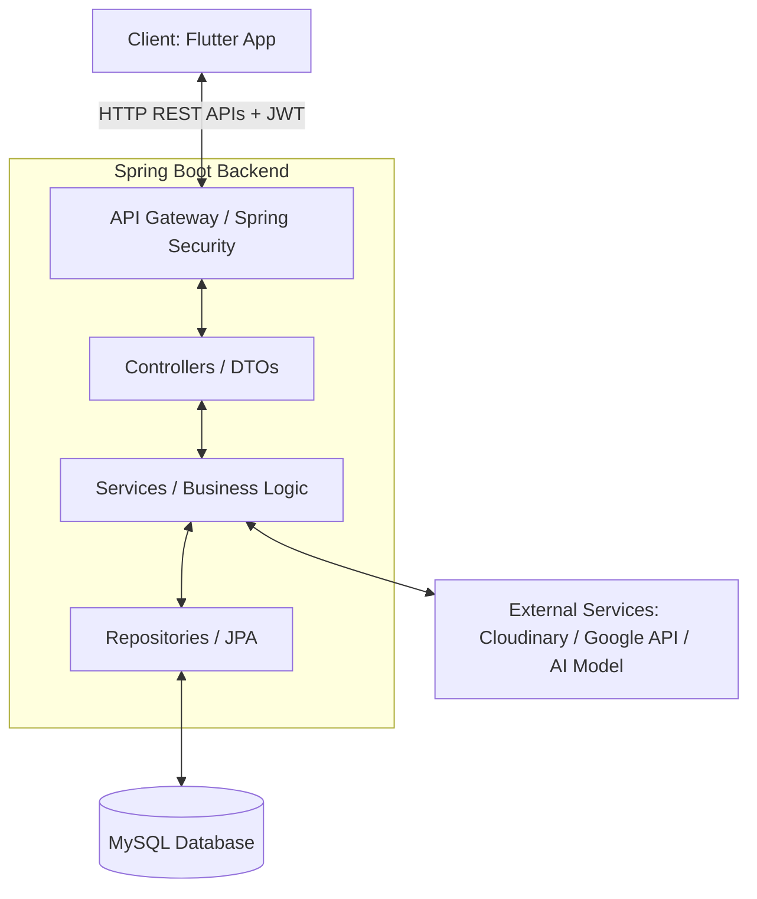

# 🎓 HanGo - Smart Language Self-Study Platform

HanGo is a modern client-server educational technology platform focusing on personalizing learning experiences, assessing language proficiency, and leveraging Artificial Intelligence (AI) to create optimal learning paths. The system operates on an independent client-server architecture, communicating via secure, high-performance RESTful APIs.

---

## 📌 Table of Contents

- [🚀 Overview & Core Features](#-overview--core-features)
- [🛠️ Tech Stack](#️-tech-stack)
- [📐 System Architecture](#-system-architecture)
- [📁 Folder Structure](#-folder-structure)
- [⚙️ Setup & Installation](#️-setup--installation)
- [🧪 Testing Guide](#-testing-guide)
- [🤖 Multi-Agent Collaboration Protocol](#-multi-agent-collaboration-protocol)
- [📜 Constitution & Git Conventions](#-constitution--git-conventions)

---

## 🚀 Overview & Core Features

The HanGo system manages 14 core feature modules serving multiple user roles: **Learner**, **Trainer** (Instructor/Content Creator), **Lead** (Training Program Lead), and **Admin** (Administrator).

| Feature Module                        | Description                                                                                   | Primary Roles                 |
| :------------------------------------ | :-------------------------------------------------------------------------------------------- | :---------------------------- |
| **[FT-01] Authentication**            | Login and Registration, Google OAuth2 integration, and JWT security filter.                   | All                           |
| **[FT-02] Account Management**        | Personal profile management, avatar uploads via Cloudinary, and account locking.              | Learner, Trainer, Admin       |
| **[FT-03] Course Management**         | Course creation, curriculum structure design, and course approval workflows.                  | Trainer, Lead                 |
| **[FT-04] Course Content Management** | Markdown/HTML rich text editor, curriculum drag-and-drop, and large video/media uploads.      | Trainer                       |
| **[FT-05] Question Bank Management**  | Question bank management, Excel import support via Apache POI library.                        | Trainer                       |
| **[FT-06] Exam Management**           | Online quizzes and mock exams with countdown timers, scoring algorithms, and attempt locking. | Learner, Trainer              |
| **[FT-07] Recommendation System**     | Rule-based recommendation engine suggesting courses based on learner exam results.            | Learner                       |
| **[FT-08] AI Learning Assistant**     | Interactive AI assistant supporting real-time streaming text (SSE/chunks) and lesson context. | Learner                       |
| **[FT-09] Learning Progress**         | Course enrollment, progress tracking, and automated completion percentage calculations.       | Learner                       |
| **[FT-10] Flashcard Management**      | Flip and swipe interactive flashcards for effective vocabulary learning.                      | Learner                       |
| **[FT-11] Comment Management**        | Hierarchical/nested comments under lessons with bad-word filtering and XSS prevention.        | Learner, Trainer              |
| **[FT-12] Task Management**           | Task assignment from Lead to Trainers with Kanban status tracking.                            | Trainer, Lead                 |
| **[FT-13] Analytics Dashboard**       | Visual statistics and analytics charts (Bar, Pie charts) on learning performance.             | Learner, Trainer, Lead, Admin |
| **[FT-14] Notification**              | Asynchronous system-wide notifications triggered by important events.                         | All                           |

---

## 🛠️ Tech Stack

### 💻 Frontend (Client Side)

- **Framework:** Flutter (using Dart SDK `^3.12.0`).
- **State Management & DI:** Riverpod (separating business logic from UI).
- **Navigation:** `go_router` supporting deep linking and role-based screen routing.
- **Networking:** `dio` HTTP client with custom interceptors for automatic JWT injection.
- **UI & Animation:** Responsive design layouts for Mobile, Tablet, and Desktop using `LayoutBuilder` & `MediaQuery`. Brand primary color: Teal Green (`#20B486`).

### ⚙️ Backend (Server Side)

- **Language:** Java 21.
- **Core Framework:** Spring Boot 3.x (managed via Maven).
- **Security:** Spring Security & `jjwt` (stateless auth, RBAC using `@PreAuthorize`).
- **Data Access:** Spring Data JPA, Hibernate ORM.
- **Database:** MySQL.
- **Integrations:** Cloudinary (media hosting), Google Client API (OAuth2 login).

---

## 📐 System Architecture

The HanGo project adheres to strict architectural guidelines to ensure scalability and maintainability:



### 🔒 Design Constraints:

- **N-Tier Architecture (Backend):** One-way data flow: `Controller` -> `Service` -> `Repository`. No business logic in Controllers. Never expose `@Entity` directly; always map to DTOs.
- **Clean Architecture & Widget Segregation (Frontend):** Split UI elements into small, reusable widgets. Business logic and UI components must remain completely separate (no API calls within `build()`).

---

## 📁 Folder Structure

```text
HanGo/
├── hango-backend/               # Spring Boot Application (Java 21)
│   ├── src/main/java/com/.../
│   │   ├── config/              # Security configurations, CORS, beans
│   │   ├── controller/          # REST Endpoints receiving/returning DTOs
│   │   ├── dto/                 # Data Transfer Objects
│   │   ├── entity/              # JPA models mapping to MySQL (snake_case)
│   │   ├── exception/           # Global exception handling (@ControllerAdvice)
│   │   ├── repository/          # JPA database query interfaces
│   │   ├── security/            # JWT filters and authorization
│   │   └── service/             # Core business logic implementation
│   └── pom.xml                  # Maven dependencies configuration
│
├── hango-frontend/              # Flutter Project (Dart)
│   ├── lib/
│   │   ├── data/                # Remote API services, local caching, and models
│   │   ├── domain/              # Core business layers, entity schemas, repos interfaces
│   │   ├── presentation/        # User interface (pages/ and widgets/)
│   │   └── utils/               # App helper utilities & design colors (#20B486)
│   └── pubspec.yaml             # Flutter dependencies configuration
│
├── doc/                         # Business Requirements & Specs (SRS, Vision, Specs)
├── AGENTS.md                    # Multi-Agent Coordination Protocol
├── ARCHITECTURE.md              # System Architecture Details
├── CONSTITUTION.md              # Project Constitution & Guidelines
├── TESTING.md                   # QA & Testing Strategy
└── TODO.md                      # Feature Implementation Status
```

---

## ⚙️ Setup & Installation

### 1. Prerequisites

- Install Java 21 JDK and Maven.
- Install Flutter SDK (recommended Dart SDK `^3.12.0`).
- Install and start a MySQL Server instance.

### 2. Backend Configuration (Spring Boot)

1. Create a MySQL database named `hango_db`.
2. Navigate to [hango-backend/src/main/resources](file:///d:/FPT-All-Semester/kì_9_su2026/DOAN/HangoTT/HanGo/hango-backend/src/main/resources).
3. Copy [application.properties.example](file:///d:/FPT-All-Semester/kì_9_su2026/DOAN/HangoTT/HanGo/hango-backend/src/main/resources/application.properties.example) to create `application.properties`:
   ```bash
   cp application.properties.example application.properties
   ```
4. Update credentials for MySQL datasource, JWT secrets, Cloudinary keys, and Google client ID in `application.properties`.
5. Run the Spring Boot application:
   ```bash
   cd hango-backend
   mvnw spring-boot:run
   ```

### 3. Frontend Configuration (Flutter)

1. Navigate to the `hango-frontend` directory.
2. Install the required Dart packages defined in [pubspec.yaml](file:///d:/FPT-All-Semester/kì_9_su2026/DOAN/HangoTT/HanGo/hango-frontend/pubspec.yaml):
   ```bash
   cd hango-frontend
   flutter pub get
   ```
3. Launch the application (supporting Web, Mobile, and Tablet):
   ```bash
   flutter run
   ```

---

## 🧪 Testing Guide

For detailed information about testing workflows and scripts, see [TESTING.md](file:///d:/FPT-All-Semester/kì_9_su2026/DOAN/HangoTT/HanGo/TESTING.md).

- **Running Backend Tests:**
  - Run Unit and Integration tests:
    ```bash
    cd hango-backend
    mvnw test
    ```
- **Running Frontend Tests:**
  - Execute Flutter tests:
    ```bash
    cd hango-frontend
    flutter test
    ```
  - Run static analyzer to check code quality:
    ```bash
    flutter analyze
    ```

---

## 🤖 Multi-Agent Collaboration Protocol

This project utilizes an autonomous multi-agent development workflow (detailed in [AGENTS.md](file:///d:/FPT-All-Semester/kì_9_su2026/DOAN/HangoTT/HanGo/AGENTS.md)):

1. **Phase 1 - Frontend UI & Mock Data (Frontend Agent):** Builds screens based on Figma mockups, using mock repositories to ensure high UI interactivity before any API is implemented.
2. **Phase 2 - Backend Execution & API Design (Backend Agent):** Maps schemas, creates Spring Boot DTOs, and writes API controllers satisfying frontend JSON formats.
3. **Phase 3 - Integration (Frontend Agent):** Connects the screens to backend REST endpoints via `dio` network layers.
4. **Phase 4 - Quality Assurance (QA Agent):** Runs and expands tests on both codebases to verify requirements.

> [!IMPORTANT]
> Any feature progress or updates must be logged in [TODO.md](file:///d:/FPT-All-Semester/kì_9_su2026/DOAN/HangoTT/HanGo/TODO.md).

---

## 📜 Constitution & Git Conventions

### 🛡️ Security Constitution

For a complete list of rules, consult [CONSTITUTION.md](file:///d:/FPT-All-Semester/kì_9_su2026/DOAN/HangoTT/HanGo/CONSTITUTION.md).

- **Passwords & PII:** Must be hashed using BCrypt prior to database persistence. Never write passwords or tokens into logs.
- **SQL Injection Prevention:** Only parameterized JPA queries are allowed; raw string concatenations are strictly forbidden.
- **API Security:** All resource access must pass JWT validation and comply with RBAC authorizations.

### 🌿 Git Commit Conventions (Conventional Commits)

- `feat: [description]` (new feature)
- `fix: [description]` (bug fix)
- `docs: [description]` (documentation updates)
- `refactor: [description]` (restructuring existing code)
- `test: [description]` (adding/editing tests)
