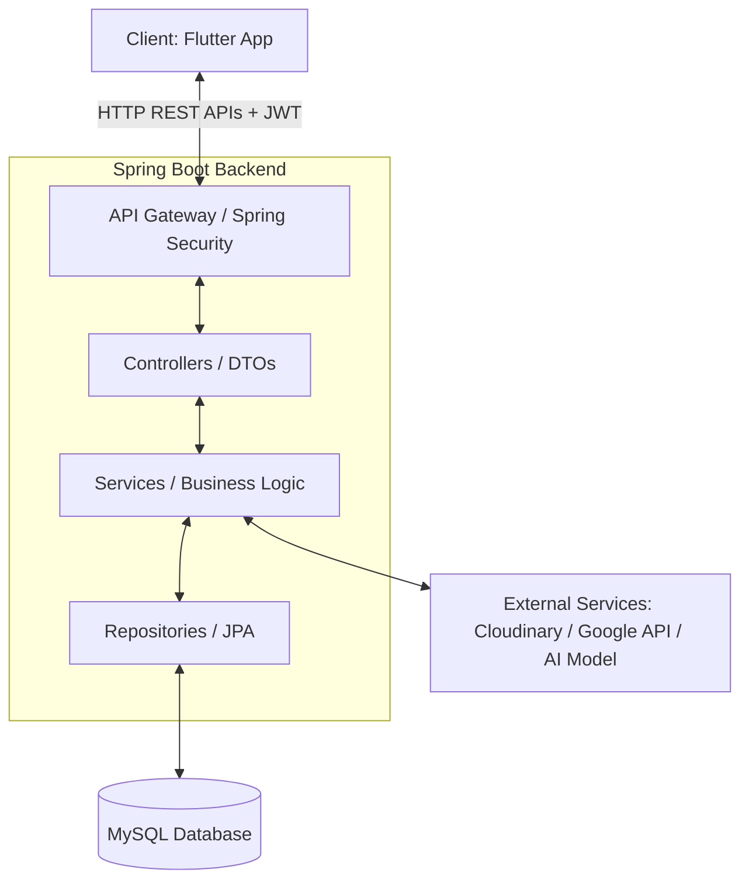

# 🎓 HanGo - Smart Language Self-Study Platform

HanGo is a modern client-server educational technology platform focusing on personalizing learning experiences, assessing language proficiency, and leveraging Artificial Intelligence (AI) to create optimal learning paths. The system operates on an independent client-server architecture, communicating via secure, high-performance RESTful APIs.

---

## 📌 Table of Contents

- [🚀 Overview & Core Features](#-overview--core-features)
- [🛠️ Tech Stack](#️-tech-stack)
- [📐 System Architecture](#-system-architecture)
- [📁 Folder Structure](#-folder-structure)
- [⚙️ Setup & Installation](#️-setup--installation)
- [🧪 Testing Guide](#-testing-guide)
- [🤖 Multi-Agent Collaboration Protocol](#-multi-agent-collaboration-protocol)
- [📜 Constitution & Git Conventions](#-constitution--git-conventions)

---

## 🚀 Overview & Core Features

The HanGo system manages 14 core feature modules serving multiple user roles: **Learner**, **Trainer** (Instructor/Content Creator), **Course Manager** (Content Reviewer), and **Admin** (Administrator).

| Feature Module                        | Description                                                                                   | Primary Roles                 |
| :------------------------------------ | :-------------------------------------------------------------------------------------------- | :---------------------------- |
| **[FE-01] Authentication**            | Login and Registration, Google OAuth2 integration, and JWT security filter.                   | All                           |
| **[FE-02] Profile Management**        | Personal profile management and avatar uploads via Cloudinary.                                | All                           |
| **[FE-03] Role & Permission**         | Account list management, locking/unlocking, platform dashboards, AI monitoring & audit logs.  | Admin                         |
| **[FE-04] Trainer Onboarding**        | Trainer application submission, verification documents upload, and admin review/approval.    | Guest, Learner, Admin         |
| **[FE-05] Course Management**         | Course listings discovery, categories filter, price tier suggestions, versioning, review.    | Learner, Trainer, CourseManager|
| **[FE-06] Course Content**            | Syllabus editing, sections & lessons, LessonBlock formatting, Excel import (Apache POI).      | Trainer                       |
| **[FE-07] Question Bank**             | Question bank management, A/B/C/D choice editors, AI generation draft helpers.                | Trainer                       |
| **[FE-08] Exam Management**           | Mock exams, 40 questions / 50 minutes timer, auto-grading, and unlimited attempts.            | Learner, Trainer, CourseManager|
| **[FE-09] AI Assistant**              | Explain concepts/questions chatbot for Learners, generate questions drafts for Trainers.      | Learner, Trainer              |
| **[FE-10] Learning Management**       | Enrollment, sequential lesson learning unlocks (N -> N+1), course progress, limited reviews.   | Learner                       |
| **[FE-11] Recommendation**            | Weakness analysis by SkillType, rule-based recommendation, AI Learning Pathway.               | Learner                       |
| **[FE-12] Payment & Revenue**         | Purchases using VNPay, order tracking, revenue split records, and monthly settlement (manual transfer recorded by Course Manager). | Learner, Trainer, CourseManager |
| **[FE-13] Comment Management**        | Nested comments under lessons and quizzes with moderation capability by Admin.                | Learner, Trainer, Admin       |
| **[FE-14] Notification**              | Realtime WebSocket push notifications and transactional emails for system events.             | All                           |

---

## 🛠️ Tech Stack

### 💻 Frontend (Client Side)

- **Framework:** Flutter (using Dart SDK `^3.12.0`).
- **State Management & DI:** Riverpod (separating business logic from UI).
- **Navigation:** `go_router` supporting deep linking and role-based screen routing.
- **Networking:** `dio` HTTP client with custom interceptors for automatic JWT injection.
- **UI & Animation:** Responsive design layouts for Mobile, Tablet, and Desktop using `LayoutBuilder` & `MediaQuery`. Brand primary color: Teal Green (`#20B486`).

### ⚙️ Backend (Server Side)

- **Language:** Java 21.
- **Core Framework:** Spring Boot 3.x (managed via Maven).
- **Security:** Spring Security & `jjwt` (stateless auth, RBAC using `@PreAuthorize`).
- **Data Access:** Spring Data JPA, Hibernate ORM.
- **Database:** MySQL.
- **Integrations:** Cloudinary (media hosting), Google Client API (OAuth2 login).

---

## 📐 System Architecture

The HanGo project adheres to strict architectural guidelines to ensure scalability and maintainability. Full details: [doc/ARCHITECTURE.md](doc/ARCHITECTURE.md).


```mermaid
graph TD
    A[Client: Flutter App] <-->|HTTP REST APIs + JWT| B[API Gateway / Spring Security]
    subgraph Spring Boot Backend
        B <--> C[Controllers / DTOs]
        C <--> D[Services / Business Logic]
        D <--> E[Repositories / JPA]
    end
    E <--> F[(MySQL Database)]
    D <--> G[External Services: Cloudinary / Google API / AI Model]
```

### 🔒 Design Constraints:

- **N-Tier Architecture (Backend):** One-way data flow: `Controller` -> `Service` -> `Repository`. No business logic in Controllers. Never expose `@Entity` directly; always map to DTOs.
- **Clean Architecture & Widget Segregation (Frontend):** Split UI elements into small, reusable widgets. Business logic and UI components must remain completely separate (no API calls within `build()`).

---

## 📁 Folder Structure

```text
HanGo/
├── hango-backend/               # Spring Boot Application (Java 21)
│   ├── src/main/java/com/.../
│   │   ├── config/              # Security configurations, CORS, beans
│   │   ├── controller/          # REST Endpoints receiving/returning DTOs
│   │   ├── dto/                 # Data Transfer Objects
│   │   ├── entity/              # JPA models mapping to MySQL (snake_case)
│   │   ├── exception/           # Global exception handling (@ControllerAdvice)
│   │   ├── repository/          # JPA database query interfaces
│   │   ├── security/            # JWT filters and authorization
│   │   └── service/             # Core business logic implementation
│   └── pom.xml                  # Maven dependencies configuration
│
├── hango-frontend/              # Flutter Project (Dart)
│   ├── lib/
│   │   ├── data/                # Remote API services, local caching, and models
│   │   ├── domain/              # Core business layers, entity schemas, repos interfaces
│   │   ├── presentation/        # User interface (pages/ and widgets/)
│   │   └── utils/               # App helper utilities & design colors (#20B486)
│   └── pubspec.yaml             # Flutter dependencies configuration
│
├── doc/                         # Tất cả tài liệu nội bộ
│   ├── HanGo_Documentation.md  # 📖 v1.0 — Business requirements (SINGLE SOURCE OF TRUTH)
│   ├── ARCHITECTURE.md          # 🏗️ System architecture details
│   ├── CONSTITUTION.md          # 📜 Security & coding constitution
│   ├── TESTING.md               # 🧪 QA & testing strategy
│   ├── agent_backend.md         # ⚙️ Backend Agent guidelines
│   ├── agent_frontend.md        # ⚙️ Frontend Agent guidelines
│   ├── agent_qa.md              # ⚙️ QA Agent guidelines
│   └── specs/                   # Feature specs (01~14) + unit_test_plan
│
├── AGENTS.md                    # 🤖 Multi-Agent Coordination Protocol (IDE reads from root)
├── README.md                    # 📖 Project overview (public)
└── TODO.md                      # ✅ Feature implementation status
```

---

## ⚙️ Setup & Installation

### 1. Prerequisites

- Install Java 21 JDK and Maven.
- Install Flutter SDK (recommended Dart SDK `^3.12.0`).
- Install and start a MySQL Server instance.

### 2. Backend Configuration (Spring Boot)

1. Create a MySQL database named `hango_db`.
2. Navigate to `hango-backend/src/main/resources`.
3. Copy `application.properties.example` to create `application.properties`:
   ```bash
   cp application.properties.example application.properties
   ```
4. Update credentials for MySQL datasource, JWT secrets, Cloudinary keys, and Google client ID in `application.properties`.
5. Run the Spring Boot application:
   ```bash
   cd hango-backend
   mvnw spring-boot:run
   ```

### 3. Frontend Configuration (Flutter)

1. Navigate to the `hango-frontend` directory.
2. Install the required Dart packages defined in `pubspec.yaml`:
   ```bash
   cd hango-frontend
   flutter pub get
   ```
3. Launch the application (supporting Web, Mobile, and Tablet):
   ```bash
   flutter run
   ```

---

## 🧪 Testing Guide

For detailed information about testing workflows and scripts, see [doc/TESTING.md](doc/TESTING.md) and [doc/specs/unit_test_plan.md](doc/specs/unit_test_plan.md).

- **Running Backend Tests:**
  - Run Unit and Integration tests:
    ```bash
    cd hango-backend
    mvnw test
    ```
- **Running Frontend Tests:**
  - Execute Flutter tests:
    ```bash
    cd hango-frontend
    flutter test
    ```
  - Run static analyzer to check code quality:
    ```bash
    flutter analyze
    ```

---

## 🤖 Multi-Agent Collaboration Protocol

This project utilizes an autonomous multi-agent development workflow (detailed in [AGENTS.md](AGENTS.md)):

1. **Phase 1 - Frontend UI & Mock Data (Frontend Agent):** Builds screens based on Figma mockups, using mock repositories to ensure high UI interactivity before any API is implemented.
2. **Phase 2 - Backend Execution & API Design (Backend Agent):** Maps schemas, creates Spring Boot DTOs, and writes API controllers satisfying frontend JSON formats.
3. **Phase 3 - Integration (Frontend Agent):** Connects the screens to backend REST endpoints via `dio` network layers.
4. **Phase 4 - Quality Assurance (QA Agent):** Runs and expands tests on both codebases to verify requirements.

> [!IMPORTANT]
> Any feature progress or updates must be logged in [TODO.md](TODO.md).

---

## 📜 Constitution & Git Conventions

### 🛡️ Security Constitution

For a complete list of rules, consult [doc/CONSTITUTION.md](doc/CONSTITUTION.md).

- **Passwords & PII:** Must be hashed using BCrypt prior to database persistence. Never write passwords or tokens into logs.
- **SQL Injection Prevention:** Only parameterized JPA queries are allowed; raw string concatenations are strictly forbidden.
- **API Security:** All resource access must pass JWT validation and comply with RBAC authorizations.

### 🌿 Git Commit Conventions (Conventional Commits)

- `feat: [description]` (new feature)
- `fix: [description]` (bug fix)
- `docs: [description]` (documentation updates)
- `refactor: [description]` (restructuring existing code)
- `test: [description]` (adding/editing tests)
