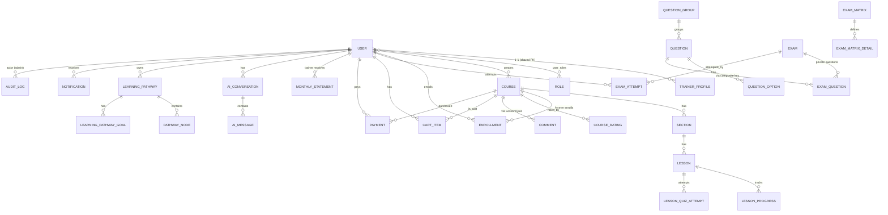
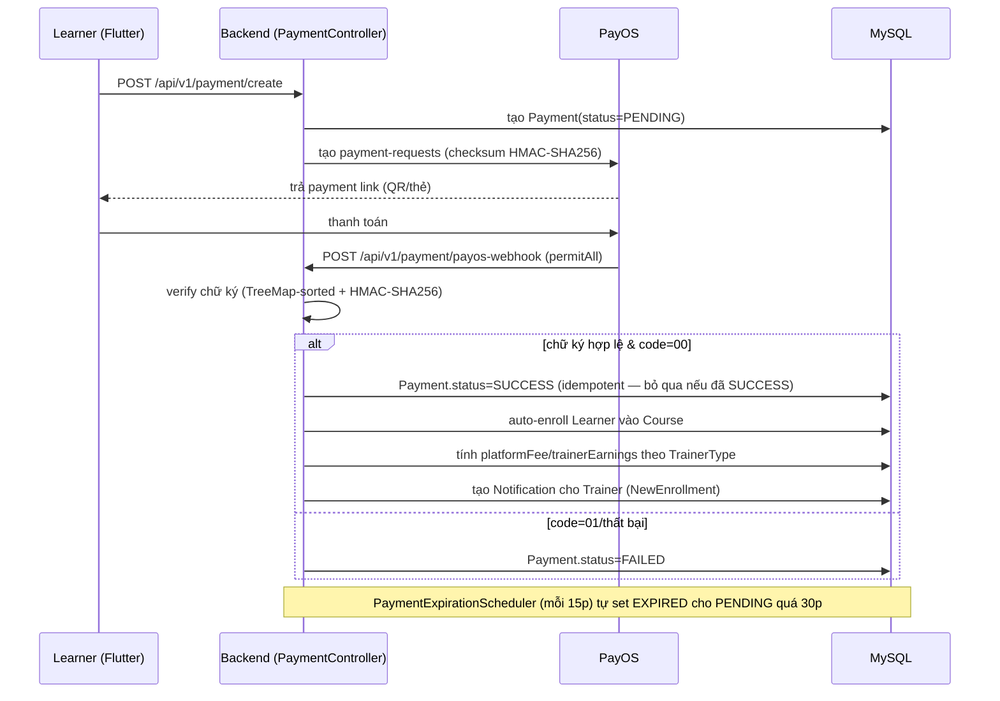
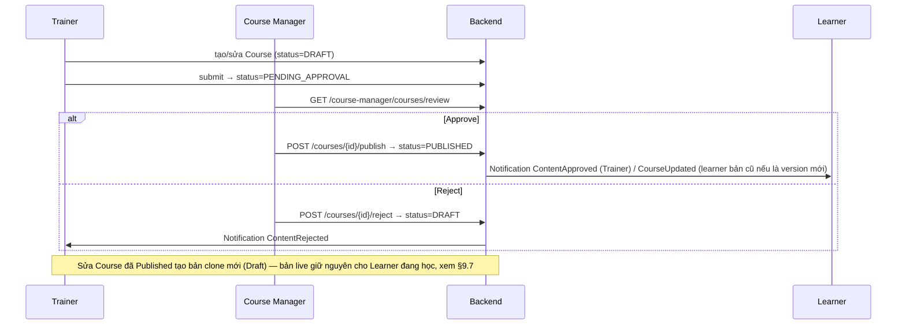
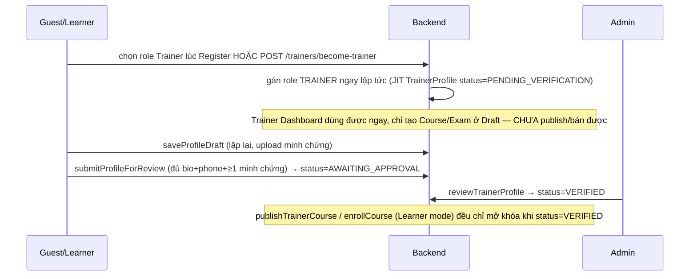

# HanGo — Project Documentation (Requirements & Development Baseline)

> **Version:** 1.0
> **Ngôn ngữ:** Tiếng Việt, thuật ngữ nghiệp vụ & kỹ thuật giữ nguyên English để đồng bộ code.
> **Ký hiệu:** `FR` = Functional Requirement · `BR` = Business Rule · 📌 = mục còn để mở (không chặn v1).
> **Phạm vi tài liệu:** mô tả nghiệp vụ + functional + conceptual model. **Không** bao gồm REST endpoints hay DDL (đã có codebase); phần AI chỉ mô tả chức năng.

---

## Mục lục

1. [Giới thiệu & Phạm vi](#1-giới-thiệu--phạm-vi)
2. [Thuật ngữ (Glossary)](#2-thuật-ngữ-glossary)
3. [Mô hình kinh doanh](#3-mô-hình-kinh-doanh)
4. [Actors, Roles & Phân quyền](#4-actors-roles--phân-quyền)
5. [Tech Stack & Architecture](#5-tech-stack--architecture)
6. [Bản đồ tính năng (Feature Map)](#6-bản-đồ-tính-năng-feature-map)
7. [Functional Requirements theo module](#7-functional-requirements-theo-module)
8. [Global Business Rules](#8-global-business-rules)
9. [Vòng đời, State Machines & Versioning](#9-vòng-đời-state-machines--versioning)
10. [Cross-module Workflows](#10-cross-module-workflows)
11. [AI Features](#11-ai-features)
12. [Enums tổng hợp](#12-enums-tổng-hợp)
13. [Non-Functional Requirements](#13-non-functional-requirements)
14. [Decision Log & Future Items](#14-decision-log--future-items)
15. [Package Structure chi tiết (Backend & Frontend)](#15-package-structure-chi-tiết-backend--frontend)
16. [Tổng quan Cơ sở dữ liệu (Database Overview)](#16-tổng-quan-cơ-sở-dữ-liệu-database-overview)
17. [Tổng quan API (API Overview)](#17-tổng-quan-api-api-overview)
18. [Sequence Diagram — Luồng nghiệp vụ chính](#18-sequence-diagram--luồng-nghiệp-vụ-chính)
19. [Deployment](#19-deployment)
20. [Configuration](#20-configuration)
21. [Testing Strategy](#21-testing-strategy)
22. [Known Limitations & Rủi ro kỹ thuật](#22-known-limitations--rủi-ro-kỹ-thuật)
23. [Future Roadmap](#23-future-roadmap)

---

## 1. Giới thiệu & Phạm vi

### 1.1 Sản phẩm

**HanGo (Smart Language Self-Study Platform)** là Learning Management System chuyên biệt cho việc học và ôn thi môn **Tiếng Anh THPT Quốc Gia**, kết hợp ba thành phần trong một nền tảng:

- **LMS** — quản lý nội dung & tiến độ học.
- **Course Marketplace** — Trainer phân phối, Learner mua/học Course.
- **AI-powered Learning Platform** — AI hỗ trợ cả người dạy và người học.

HanGo **không tự sản xuất nội dung**; nền tảng kết nối Trainer (tạo Course) với Learner (học), và kiểm soát chất lượng xuất bản qua Course Manager.

### 1.2 Trong phạm vi (In-scope, v1)

- 14 module chức năng (xem §6), triển khai trên **nền web**.
- Toàn bộ luồng: đăng ký/onboarding → tạo & duyệt nội dung → học & luyện đề → recommendation → thanh toán & doanh thu.

### 1.3 Ngoài phạm vi (Out-of-scope, v1)

Ứng dụng mobile app native (làm sau nếu còn thời gian), refund/hoàn tiền, tự động payout cho Trainer, giới hạn & tính phí AI, đa ngôn ngữ giao diện, GroupType trong course-authoring (v1 chỉ dùng GroupType để hiển thị và tạo câu hỏi trong Exam và Question Bank), pass-score cho Quiz, lớp học trực tiếp, nhắn tin trực tiếp, forum, gamification, chứng chỉ hoàn thành, hỗ trợ môn khác ngoài Tiếng Anh THPT.

---

## 2. Thuật ngữ (Glossary)

| Thuật ngữ | Định nghĩa |
|---|---|
| **Course** | Khóa học do Trainer tạo, gồm nhiều Section. |
| **Section** | Chương/phần trong Course, chứa nhiều Lesson. |
| **Lesson** | Bài học nhỏ nhất; chứa nhiều **LessonBlock** (text/video/pdf/image) và có thể có Quiz. |
| **Quiz** | Bài luyện tập trong Lesson, dùng câu hỏi từ Question Bank (tái sử dụng). |
| **Exam** | Bài thi độc lập với Course, mô phỏng đề THPT, dùng câu hỏi trong Question Bank. |
| **Question Bank** | Kho câu hỏi tái sử dụng của Trainer và Course Manager, phục vụ Quiz và Exam. |
| **QuestionGroup** | Nhóm câu hỏi dùng chung ngữ liệu (passage). |
| **Attempt** | Một lần Learner làm Quiz/Exam; được phép nhiều lần. |
| **SkillType** | Loại kỹ năng của câu hỏi/khóa học (Grammar, Reading...); dùng cho phân tích & gợi ý. |
| **Weakness Analysis** | Phân tích điểm yếu theo SkillType sau khi làm Exam. |
| **Recommendation** | Gợi ý Course/lộ trình dựa trên kết quả Exam. |
| **Trainer** | Người tạo nội dung; hai loại: Teacher / Tutor. |
| **Course Manager** | Người kiểm duyệt trình bày & xuất bản nội dung, kế thừa các chức năng chính của Trainer nhưng có thêm các công cụ trong đó; tạo và quản lý Exam. *Lưu ý code: các endpoint dành cho role này hiện chấp nhận **cả 2** authority string `TRAINER_LEAD` và `COURSE_MANAGER` song song (`hasAnyRole`/`hasAnyAuthority` liệt kê cả hai) — có vẻ là dấu vết của một lần đổi tên role chưa dọn dẹp hết, chưa xác nhận role nào thực sự được cấp cho user Course Manager mới.* |
| **Monthly Statement** | Báo cáo doanh thu hàng tháng của Trainer. |

---

## 3. Mô hình kinh doanh

### 3.1 Loại hình

Marketplace-based Learning Management System — HanGo là nền tảng trung gian, thu phí qua chia sẻ doanh thu.

### 3.2 Revenue Sharing

|        Loại Trainer      |  Trainer nhận  |  HanGo nhận   |
|--------------------------|----------------|---------------|
| **Teacher**              |     70%        |      30%      |
| **Tutor**                |     60%        |      40%      |

**Quy tắc doanh thu:**
- Course **đầu tiên** của mỗi Trainer **bắt buộc miễn phí**; sau đó tự do đặt free/paid.
- Course trả phí: Learner thanh toán qua HanGo (**PayOS** — đổi từ thiết kế VNPay ban đầu, xem §14) → ghi nhận doanh thu theo Course → cuối kỳ tổng hợp thành Monthly Statement → Trainer xác nhận → **Course Manager** chi trả (chuyển khoản thủ công + ghi nhận).

### 3.3 Định giá Course (Price Tier)

Backend **tự đánh giá quy mô Course** (số Lesson, số Quiz, thời lượng video...) để **gợi ý** một mức giá tham chiếu:

|                  Quy mô                  |    Gợi ý    |
|------------------------------------------|-------------|
| Lớn (nhiều nội dung/quiz/thời lượng dài) | 700.000 VND |
|         Trung bình                       | 500.000 VND |
|           Nhỏ                            | 300.000 VND |

> Backend chỉ **gợi ý**; **Trainer chốt giá cuối cùng** (≥ 0 VND). Công thức tính quy mô sẽ được làm rõ ở giai đoạn sau.

### 3.4 Stakeholders

**Internal:** Administrator, Course Manager, Trainer, Learner.
**External:** Guest, Payment Gateway (VNPay), AI Provider, Email Service, Media/File Storage (Cloudinary).

---

## 4. Actors, Roles & Phân quyền

### 4.1 Nguyên tắc

- **One account, one primary role:** mỗi người dùng có **một** tài khoản với **một** primary role (Learner / Trainer / CourseManager / Administrator).
- **Trainer dual-mode:** tài khoản **Trainer bao gồm cả năng lực Learner**, chuyển qua **UI mode switch** (Trainer mode ⇄ Learner mode):
  - *Trainer mode:* dùng đầy đủ chức năng Trainer.
  - *Learner mode:* enroll/mua/học Course của Trainer khác, làm Quiz/Exam, nhận Recommendation; các chức năng Trainer bị **làm mờ (disabled)**.(if (role == TRAINER) → có: [Learner permissions] + [Trainer permissions]
    if (role == LEARNER) → có: [Learner permissions])
  - Bất kỳ tài khoản nào có primary role là Trainer (dù đăng ký trực tiếp từ Guest hay được nâng cấp từ Learner) đều bao gồm cả năng lực của Learner qua cơ chế dual-mode này. Do đó, Trainer được tạo trực tiếp từ Guest hoàn toàn sử dụng được các chức năng của Learner khi bật Learner mode.
  - Đây là UI/session state, không phải role thứ hai; permission = năng lực Trainer ∪ năng lực Learner. CourseManager & Administrator **không** có Learner mode.
  - *Lưu ý về phân quyền ở Backend:* Để đảm bảo nguyên tắc "không tin tưởng frontend" (§5), trạng thái active mode (TrainerMode hay LearnerMode) cần được truyền tải trong request (ví dụ qua JWT token claim hoặc API request header) để Backend xác thực và giới hạn hành vi tương ứng (ví dụ: Trainer không được làm Quiz/Exam của chính khóa học mình sở hữu ngay cả khi đang bật Learner mode).
- **Quy trình chuyển đổi role và giữ lịch sử học tập:**
  - **Từ Guest đăng ký trực tiếp lên Trainer:** Sau khi hồ sơ được duyệt, tài khoản có primary role là **Trainer**. Trainer này hoàn toàn dùng được mọi chức năng của Learner bằng cách bật *Learner mode*.
  - **Từ Learner nâng cấp lên Trainer:** Sau khi hồ sơ được duyệt, primary role chuyển từ **Learner ➔ Trainer**. Do Trainer thừa hưởng mọi năng lực của Learner qua *Trainer dual-mode*, tài khoản này vẫn giữ nguyên lịch sử học tập, tiến độ và các khóa học đã mua trước đó, không bị mất mát dữ liệu.
- **Ownership:** mọi Course/Question thuộc về Trainer tạo ra; chỉ owner được sửa.
- **Governance:** nội dung phải qua kiểm duyệt trước khi Published.
- **Separation of duties:** Course Manager lo **chất lượng nội dung + tài chính (chia doanh thu)**; Administrator lo **user + hệ thống + giám sát**. Administrator **không** quản lý tài chính/chi trả doanh thu.

### 4.2 Mô tả role

|          Role           |         Vai trò          |         Giới hạn chính          |
|-------------------------|--------------------------|---------------------------------|
|       **Guest**         | Chưa đăng nhập; xem nội dung công khai, đăng ký. | Không xem Lesson; không làm Quiz/Exam. |
|       **Learner**       | Học, luyện đề, nhận recommendation. | Không tạo nội dung; không publish. |
|       **Trainer**       | Tạo Course/Lesson/Quiz/Exam; quản lý Question Bank; theo dõi doanh thu. Có **Learner mode**. | Không tự publish; không duyệt; không quản lý user. |
| **Course Manager**  | Review & publish nội dung (chỉ trình bày). Tạo Exam. Quản lý & chi trả doanh thu. | Không sửa nội dung Course. |
| **Administrator**   | Quản trị user, role, hệ thống, AI. | Không sửa nội dung Course của Trainer; không quản lý & chi trả doanh thu. |

### 4.3 RBAC Matrix

> ✅ được phép · ❌ không · **Own** = chỉ trên tài nguyên do mình sở hữu.

| Resource / Action | Guest | Learner | Trainer | Course Manager | Admin |
|---|:--:|:--:|:--:|:--:|:--:|
| Register / Login / Reset password (OTP) | ✅ | ✅ | ✅ | ✅ | ✅ |
| View / Update own Profile | ❌ | ✅ | ✅ | ✅ | ✅ |
| Submit Trainer Application | ✅ | ✅ | ❌ | ❌ | ❌ |
| Review / Approve Trainer Application | ❌ | ❌ | ❌ | ❌ | ✅ |
| Browse / Search / View Course & Exam | ✅ | ✅ | ✅ | ✅ | ✅ |
| View Lesson content | ❌ | ✅ (enrolled) | ✅ Own | ✅ | ✅ |
| Create / Update / Archive Course | ❌ | ❌ | ✅ Own | ❌ | ❌ |
| Submit Course for review | ❌ | ❌ | ✅ Own | ❌ | ❌ |
| Review / Approve / Publish Course | ❌ | ❌ | ❌ | ✅ | ❌ |
| Manage Section / Lesson / Quiz / Media | ❌ | ❌ | ✅ Own | ❌ | ❌ |
| Manage Question Bank | ❌ | ❌ | ✅ Own | ❌ | ❌ |
| Create / Update Exam | ❌ | ❌ | ✅ (→review) | ✅ (self-publish) | ❌ |
| Review / Publish Exam | ❌ | ❌ | ❌ | ✅ | ❌ |
| Enroll / Purchase / Continue Course | ❌ | ✅ | ✅ (Learner mode) | ❌ | ❌ |
| Attempt Quiz / Exam | ❌ | ✅ | ✅ (Learner mode) | ❌ | ❌ |
| Rate Course | ❌ | ✅ | ✅ (Learner mode) | ❌ | ❌ |
| View Course Rating Notification (low rating / low average) | ❌ | ❌ | ❌ | ✅ | ❌ |
| View Recommendation | ❌ | ✅ | ✅ (Learner mode) | ❌ | ❌ |
| Comment / Reply (Lesson & Quiz) | ❌ | ✅ | ✅ | ❌ | ❌ |
| Moderate Comment | ❌ | ❌ | ❌ | ❌ | ✅ |
| AI Content Generation | ❌ | ❌ | ✅ | ❌ | ❌ |
| AI Learning Assistant | ❌ | ✅ | ✅ (Learner mode) | ❌ | ❌ |
| View own Revenue / Confirm Statement | ❌ | ❌ | ✅ Own | ❌ | ✅ |
| Generate Statement / Confirm Payment / Record Transfer | ❌ | ❌ | ❌ | ❌ | ✅ |
| User Management / Assign Role / Permissions | ❌ | ❌ | ❌ | ❌ | ✅ |
| Platform Dashboard / Analytics / AI Usage / Audit log | ❌ | ❌ | ❌ | (content) | ✅ (full) |

---

## 5. Tech Stack & Architecture

| Thành phần | Lựa chọn |
|---|---|
| **Frontend** | **Flutter** — target **Web** ở v1 (mobile app để giai đoạn sau). Mọi role dùng chung web app, phân vùng UI theo role. |
| **Backend** | **Java + Spring Boot**, REST API |
| **Kiến trúc** | Monolith, layered / clean architecture |
| **Database** | **MySQL 8.0** |
| **Auth** | **JWT** (access token + refresh token); đăng nhập email/mật khẩu, **và Google OAuth2** (Sign-in with Google) |
| **Realtime** | **WebSocket** (dùng cho Notification) |
| **Media / File** | **Cloudinary** (video, pdf, ảnh của Lesson) |
| **Payment** | **PayOS** (tiền tệ **VND**) — *cập nhật 2026-07-24: đổi từ VNPay ban đầu; xem §5.1 và §14* |
| **Email** | Email Service cho **OTP verification** (bắt buộc) & thông báo |
| **AI** | LLM API (đã tích hợp; chi tiết tích hợp ngoài phạm vi tài liệu này) |
| **Deployment** | **AWS** |
| **Source control** | **GitHub** |

**Nguyên tắc kiến trúc chính:**
- Phân quyền RBAC kiểm tra ở **mọi API** (không tin frontend).
- Payment/business logic quan trọng xử lý ở **server + IPN webhook**, không dựa vào return URL.
- Media không lưu trong DB; DB chỉ giữ **URL Cloudinary**.

---

## 6. Bản đồ tính năng (Feature Map)

```
FE-01 Authentication
├── Register (+ Email OTP Verification)
├── Login
├── Forgot Password
├── Reset Password
└── Logout

FE-02 Profile Management
├── View Profile
├── Update Profile
├── Change Password
└── View Learning Profile

FE-03 Role & Permission Management
├── Account Management (view / activate-deactivate / create)
├── Role Management (assign / update)
├── Permission Management (view / configure)
└── Platform Monitoring (dashboard & analytics / AI usage / audit log)

FE-04 Trainer Onboarding
├── Trainer Application (submit / upload documents / track status)
├── Application Review (review / approve-reject)
└── Trainer Activation

FE-05 Course Management
├── Course Discovery (browse / search / filter)
├── Course Authoring (create / update / archive)
└── Course Review (submit / review / approve-reject / publish-unpublish)

FE-06 Course Content Management
├── Manage Section
├── Manage Lesson (LessonBlock: text-first + media)
├── Manage Quiz
├── Upload File (Cloudinary)
└── Import Content (Excel)

FE-07 Question Bank Management
├── Create Question
├── Manage Question
└── AI Generate Question & Explanation

FE-08 Exam Management
├── Create Exam (Trainer & Course Manager)
├── Manage Exam Structure
├── Approve / Reject
├── Publish Exam
├── Take Exam (timer + auto-submit)
├── Exam Result
└── View Attempt History

FE-09 AI Assistant
├── Learning Assistant (explain concept / question / answer / Q&A)
└── Content Generation (quiz-question / explanation)

FE-10 Learning Management
├── Course Enrollment
├── Learning Progress
├── Continue Learning
├── Lesson Learning
├── Quiz Attempt
├── Learning History
└── Rate Course

FE-11 Recommendation
├── Weakness Analysis (by SkillType)
├── Rule-based Recommendation
├── AI Recommendation
└── AI Learning Pathway

FE-12 Payment & Revenue
├── Course Purchase (VNPay)
├── View Order Status
├── Manage Revenue
├── Confirm Revenue (Trainer)
└── Revenue Settlement (Course Manager)

FE-13 Comment Management
├── View Comments
├── Comment (Lesson & Quiz)
├── Reply Comment
└── Moderate Comment (Admin)

FE-14 Notification
├── Realtime In-app Notification (WebSocket)
└── Email Notification
```

---

## 7. Functional Requirements theo module

> Mỗi module: **Actors · Functional Requirements · Business Rules**.

### 7.1 Authentication (`AUTH`)
**Actors:** Guest, mọi role đã đăng nhập.

| ID | Requirement |
|---|---|
| FR-AUTH-01 | Đăng ký tài khoản bằng email, mật khẩu, họ tên; có thể chọn role **Learner** hoặc **Trainer** ngay lúc đăng ký (`RegisterRequest.role`, whitelist LEARNER/TRAINER — cập nhật 2026-07-17 để khớp code đã triển khai, xem BR-TRN-01). |
| FR-AUTH-02 | Gửi **OTP** qua email; tài khoản chỉ active sau khi xác minh OTP thành công (**bắt buộc**). |
| FR-AUTH-03 | Đăng nhập bằng email + mật khẩu; cấp **access token + refresh token** (JWT). |
| FR-AUTH-04 | Quên mật khẩu → nhận OTP qua email. |
| FR-AUTH-05 | Đặt lại mật khẩu sau khi xác minh OTP. |
| FR-AUTH-06 | Đăng xuất, thu hồi token/session. |
| FR-AUTH-07 | Đăng nhập bằng **Google OAuth2** (Sign-in with Google); nếu email chưa tồn tại → tự động tạo tài khoản (JIT provisioning) với role mặc định **Learner**. |

**BR-AUTH-01:** email là định danh duy nhất.
**BR-AUTH-02:** mật khẩu theo chuẩn phổ biến hiện nay (tối thiểu 8 ký tự, gồm chữ và số).
**BR-AUTH-03:** tài khoản tạo qua Google OAuth2 coi email đã được Google xác thực → bỏ qua bước OTP, `isVerified = true` ngay khi tạo.

### 7.2 Profile Management (`PROF`)
**Actors:** Learner, Trainer, Course Manager, Admin.

| ID | Requirement |
|---|---|
| FR-PROF-01 | Xem profile cá nhân. |
| FR-PROF-02 | Cập nhật profile (họ tên, avatar, số điện thoại). |
| FR-PROF-03 | Đổi mật khẩu (yêu cầu mật khẩu hiện tại). |
| FR-PROF-04 | Learner xem **Learning Profile**: khóa đã học, tiến độ, lịch sử Exam, điểm yếu. |
| FR-PROF-05 | Trainer có trang public profile / brand page (thương hiệu, bio, danh sách Course). 📌 |

### 7.3 Role & Permission Management (`RBAC`)
**Actors:** Administrator.

| ID | Requirement |
|---|---|
| FR-RBAC-01 | Xem danh sách tài khoản; tìm kiếm & lọc theo role/status (`GET /api/admin/users`). |
| FR-RBAC-02 | Activate / Deactivate (lock/unlock) tài khoản; whitelist status `ACTIVE`/`INACTIVE`; Admin không tự khoá chính mình (`PUT /api/admin/users/{id}/status`). |
| FR-RBAC-03 | Tạo tài khoản thủ công (Learner/Trainer/Course Manager/Admin), whitelist role hợp lệ — `AuthService.createUserByAdmin` (`POST /api/admin/users`). |
| FR-RBAC-04 | Gán / cập nhật role + profile + status qua cùng 1 endpoint (`PUT /api/admin/users/{id}`) — status đi qua whitelist + tự-khoá-chính-mình giống FR-RBAC-02. |
| FR-RBAC-05 | Xem permission theo role. **Quyết định 2026-07-22 (theo yêu cầu tester):** giữ **static/read-only** — không xây dựng permission matrix động (không có `Permission`/`RolePermission` entity, không đổi `@PreAuthorize("hasRole(...)")` sang `hasAuthority()`). Tab "Roles" ở FE mô tả **đúng** quyền hạn thật đang được enforce trong code, không còn là text marketing hardcode tuỳ ý — nhưng vẫn không có khả năng "cấu hình" (không có nút Save, không gọi API). |
| FR-RBAC-06 | Dashboard & Analytics toàn nền tảng: `totalUsers`, `totalRoles`, `totalCourses`, `totalEnrollments`, weekly registration chart (7 ngày, **số thật, không fabricate** — trước đây bug tự bịa số khi không có đăng ký mới, đã sửa 2026-07-22), Top 5 Courses theo số lượt enroll. **Không có doanh thu** — module Payment/Revenue chưa tồn tại (100% Planned), nên không thể hiển thị mà không bịa số. |
| FR-RBAC-07 | Giám sát AI Usage: tổng số lượt gọi Gemini (Chat + Embedding), tỉ lệ thành công, breakdown theo loại, biểu đồ 7 ngày — dữ liệu **thật**, ghi nhận tại điểm chốt duy nhất `GeminiClientService` (mọi lời gọi AI trong toàn hệ thống đều đi qua đây). Không ước tính token/chi phí vì chưa có price model. |
| FR-RBAC-08 | Xem **audit log** hành động Admin trên user/role (tạo account, đổi role/profile/status) — `GET /api/admin/audit-log`. **Phạm vi cố tình giới hạn** trong RBAC; không mở rộng sang approve/publish/payment ở module khác (quyết định 2026-07-22, tránh refactor cross-module quá lớn). |

### 7.4 Trainer Onboarding (`TRN`)
**Actors:** Guest/Learner (nộp), Administrator (duyệt).

| ID | Requirement |
|---|---|
| FR-TRN-01 | Nộp đơn Trainer, chọn loại **Teacher** hoặc **Tutor**. |
| FR-TRN-02 | Điền thông tin cá nhân, phone, CCCD (optional), **thông tin ngân hàng** (để nhận chi trả). |
| FR-TRN-03 | Upload minh chứng theo loại (Teacher: bằng cấp/chứng chỉ/kinh nghiệm; Tutor: điểm THPTQG/chứng chỉ/minh chứng). |
| FR-TRN-04 | Theo dõi trạng thái đơn. |
| FR-TRN-05 | Admin xem thông tin & minh chứng; Approve/Reject kèm ghi chú. |
| FR-TRN-06 | Khi Approve → kích hoạt tài khoản Trainer, lưu TrainerType & RevenueShareRate. |

**BR-TRN-01:** Trainer phải qua duyệt Admin **trước khi được publish/bán Course** — đây là điểm chặn thật sự (enforced tại `TrainerDashboardServiceImpl.publishTrainerCourse`: publish bị chặn với lỗi "Bạn cần hoàn thiện hồ sơ và được Admin phê duyệt để bắt đầu bán khóa học." trừ khi `TrainerProfile.status = VERIFIED`). *(Cập nhật 2026-07-17 để khớp code đã triển khai)* — role **Trainer** trên tài khoản (và quyền vào Trainer Dashboard để tạo Course/Exam **ở trạng thái Draft**) hiện được cấp **ngay lập tức**, qua 1 trong 2 đường: (a) tự chọn role Trainer lúc đăng ký (FR-AUTH-01), hoặc (b) gọi `POST /api/v1/trainers/become-trainer` — cả hai đều **không chờ Admin duyệt hồ sơ**. Nói cách khác: gán role Trainer ≠ được phép kiếm tiền; ranh giới doanh thu vẫn do Admin gác qua `TrainerProfile.status`, nhưng ranh giới "có phải Trainer hay không" (nhìn thấy Trainer Dashboard) đã dịch chuyển sớm hơn so với thiết kế FR-TRN-01..06 gốc (nộp đơn → Admin duyệt → mới có role). Nếu team muốn giữ đúng luồng gốc (chỉ có role sau khi Admin duyệt), đây là điểm cần sửa code, không phải chỉ sửa doc.
**BR-TRN-02:** Course **đầu tiên bắt buộc miễn phí**.

### 7.5 Course Management (`CRS`)
**Actors:** Guest/Learner (discovery), Trainer (authoring), Course Manager (review).

| ID | Requirement |
|---|---|
| FR-CRS-01 | Browse Course đã Published. |
| FR-CRS-02 | Search Course theo từ khóa. |
| FR-CRS-03 | Filter theo category, tags, SkillType, giá, rating. |
| FR-CRS-04 | Xem chi tiết Course (mô tả, cấu trúc, giá, rating, Trainer, SkillType). Guest không xem nội dung Lesson. |
| FR-CRS-05 | Trainer tạo Course (metadata + chọn **tối đa 3 SkillType** thể hiện nội dung chính). |
| FR-CRS-06 | Trainer cập nhật Course (Draft/Rejected); backend **gợi ý price tier** theo quy mô, Trainer chốt giá. |
| FR-CRS-07 | Trainer archive Course. |
| FR-CRS-08 | Trainer xem thống kê enroll/doanh thu Course mình. |
| FR-CRS-09 | Trainer submit Course để duyệt. |
| FR-CRS-10 | Course Manager xem hàng chờ & review. |
| FR-CRS-11 | Course Manager Approve/Reject (kèm lý do). |
| FR-CRS-12 | Course Manager Publish/Unpublish. |
| FR-CRS-13 | Course Manager xem lịch sử publish. |

**BR-CRS-01:** Course Manager **chỉ kiểm tra trình bày** (template, metadata, cấu trúc, đầy đủ Lesson/Quiz, chính sách), **không** kiểm tra chuyên môn.
**BR-CRS-02:** Course Manager **không sửa** nội dung; cần đổi → Reject.
**BR-CRS-03:** sửa Course đã Published → tạo **version mới** cần duyệt lại; bản live giữ nguyên (xem §9.7).
**BR-CRS-04:** mỗi Course gắn **tối đa 3 SkillType** — dùng cho filter & AI recommendation.

### 7.6 Course Content Management (`CNT`)
**Actors:** Trainer (owner).

| ID | Requirement |
|---|---|
| FR-CNT-01 | Quản lý Section: tạo/sửa/xóa/sắp xếp. |
| FR-CNT-02 | Quản lý Lesson: tạo/sửa/xóa/sắp xếp; soạn nội dung bằng **LessonBlock** (ưu tiên text, có thể chèn thêm video/pdf/image). |
| FR-CNT-03 | Quản lý Quiz trong Lesson: tạo Quiz, thêm câu hỏi từ Question Bank. |
| FR-CNT-04 | Upload file (Video/PDF/Image) lên **Cloudinary**. |
| FR-CNT-05 | Import Content từ **file Excel (.xlsx)** theo template. |

**BR-CNT-01:** cấu trúc: Course → Section → Lesson → (LessonBlock, Quiz).

### 7.7 Question Bank Management (`QB`)
**Actors:** Trainer (owner).

| ID | Requirement |
|---|---|
| FR-QB-01 | Tạo Question: SkillType, Difficulty, QuestionType, Content, Explanation, Options (A/B/C/D), đáp án đúng, Visibility. |
| FR-QB-02 | Tạo QuestionGroup dùng chung passage (SharedContent). *(v1: GroupType chủ yếu phục vụ Exam.)* |
| FR-QB-03 | Xem/sửa/xóa/tìm kiếm Question theo SkillType, Difficulty, Visibility. |
| FR-QB-04 | Đặt Visibility Public/Private. |
| FR-QB-05 | AI Generate Question & Explanation (bản nháp → Trainer sửa). |

**BR-QB-01:** mỗi Question có **đúng 1 SkillType**.
**BR-QB-02:** Question của Quiz tái sử dụng được; Question của Exam khóa theo Exam.

### 7.8 Exam Management (`EXM`)
**Actors:** Trainer & Course Manager (tạo/duyệt), Learner (làm bài).

| ID | Requirement |
|---|---|
| FR-EXM-01 | Trainer hoặc Course Manager tạo Exam (metadata + cấu trúc). |
| FR-EXM-02 | Tạo Exam Questions **riêng** cho Exam. |
| FR-EXM-03 | Trainer submit → Course Manager Approve/Reject; Course Manager publish. Exam do Course Manager tạo được self-publish. |
| FR-EXM-04 | Learner start & làm Exam với **đếm giờ + auto-submit** khi hết giờ. |
| FR-EXM-05 | Submit → **auto-grade**; xem điểm (thang 10), đáp án đúng, giải thích. |
| FR-EXM-06 | Làm lại **không giới hạn**; xem attempt history trong Exam detail. |
| FR-EXM-07 | Kết quả Exam kích hoạt Weakness Analysis & Recommendation (§7.11). |

**BR-EXM-01:** Exam mô phỏng đề THPTQG Tiếng Anh **mới nhất**: **40 câu, 50 phút, thang điểm 10** (mỗi câu 0,25đ), trắc nghiệm 1 đáp án.
**BR-EXM-02:** Exam độc lập với Course, đề ổn định.

### 7.9 AI Assistant (`AI`)
**Actors:** Learner (learning), Trainer (content).

| ID | Requirement |
|---|---|
| FR-AI-01 | Learner: Explain Concept / Explain Question / Explain Answer / Answer Learning Questions. |
| FR-AI-02 | Trainer: Generate Quiz-Question, Generate Explanation. |
| FR-AI-03 | Mọi lượt gọi AI được log (feature, token, cost) cho monitoring. |

**BR-AI-01:** đầu ra AI cho Trainer là **bản nháp**; Trainer phải sửa & chịu trách nhiệm trước khi Submit.
**BR-AI-02:** v1 **không giới hạn** hạn mức AI (chỉ log); limit/cost để giai đoạn sau.

### 7.10 Learning Management (`LRN`)
**Actors:** Learner (và Trainer ở Learner mode).

| ID | Requirement |
|---|---|
| FR-LRN-01 | Enroll Course miễn phí; Course trả phí enroll sau khi thanh toán (§7.12). |
| FR-LRN-02 | Xem "My Learning" — các Course đã tham gia. |
| FR-LRN-03 | Học Lesson (LessonBlock). |
| FR-LRN-04 | Continue Learning — quay lại đúng vị trí. |
| FR-LRN-05 | Theo dõi Progress (% = số Lesson hoàn thành / tổng Lesson). |
| FR-LRN-06 | Quiz Attempt: start/submit/review; **không giới hạn** số lần; xem attempt history. |
| FR-LRN-07 | Learning History — lịch sử học & làm bài. |
| FR-LRN-08 | Rate Course (1-5 sao + nhận xét optional) — chỉ cho Course đã **enroll và hoàn thành 100%** (`Enrollment.status='COMPLETED'`); nhận xét không bắt buộc. |
| FR-LRN-09 | `averageRating`/`totalRatings` của Course được **tính lại và cache thẳng trên `Course` entity** mỗi khi có rating mới/sửa/xoá (không tính lại từ đầu mỗi lần hiển thị) — phục vụ Course Detail (rating trung bình, tổng số rating, phân bố 1-5 sao, danh sách review mới nhất trước). |
| FR-LRN-10 | Rating ≤3 sao → tự động tạo notification cho **Course Manager** (`NotificationService.notifyCourseManagers`, type `LOW_RATING`). |
| FR-LRN-11 | Sau khi tính lại average, nếu average **chuyển từ >4.0 xuống ≤4.0** → tạo notification `LOW_AVERAGE_RATING` cho **Course Manager** — chỉ bắn 1 lần lúc "vượt ngưỡng", không lặp lại ở các rating thấp tiếp theo, và không bắn ở lượt rating đầu tiên (chưa có baseline để so sánh "vượt ngưỡng"). |

**BR-LRN-01:** chỉ Learner đã enroll mới xem nội dung Lesson & làm Quiz.
**BR-LRN-02:** học **tuần tự theo Lesson** — hoàn thành Lesson N mới mở Lesson N+1 (Quiz không bắt buộc để mở Lesson kế tiếp).
**BR-LRN-03:** Lesson "hoàn thành" khi Learner đánh dấu hoàn thành / xem hết nội dung.
**BR-LRN-04:** mỗi Learner rate **1 slot / Course** — có thể sửa lại rating/nhận xét của chính mình bất kỳ lúc nào sau đó (upsert), không phải hành động một-lần-duy-nhất không sửa được.
**BR-LRN-05:** Course mua rồi truy cập **trọn đời**.
**BR-LRN-06:** rating/review đã xoá không tính vào average (xoá thì tính lại ngay).
**BR-LRN-07:** Notification rating (FR-LRN-10/11) chỉ gửi cho **Course Manager**, không gửi Administrator — theo nguyên tắc phân việc đã có: Course Manager lo chất lượng nội dung, Administrator lo user/hệ thống (§4.1, BR-G05/BR-G11).

### 7.11 Recommendation (`REC`)
**Actors:** hệ thống (cho Learner) sau Exam.

| ID | Requirement |
|---|---|
| FR-REC-01 | Weakness Analysis theo **SkillType** từ ExamAttempt. |
| FR-REC-02 | Rule-based Recommendation: map SkillType yếu → Course có gắn SkillType đó. |
| FR-REC-03 | AI Recommendation cá nhân hóa. |
| FR-REC-04 | AI Learning Pathway: sinh lộ trình học. |

**BR-REC-01:** matching dựa trên **tối đa 3 SkillType** gắn ở mỗi Course.

### 7.12 Payment & Revenue (`PAY`)
**Actors:** Learner (mua), Trainer (doanh thu), Course Manager (settlement).

| ID | Requirement |
|---|---|
| FR-PAY-01 | Learner mua Course trả phí qua **PayOS** *(cập nhật 2026-07-24 để khớp code đã triển khai — thiết kế ban đầu là VNPay, xem §14)*. |
| FR-PAY-02 | Tạo Payment; theo dõi trạng thái thật trong code: `PENDING` → `SUCCESS`/`FAILED`; `PaymentExpirationScheduler` tự động chuyển `PENDING` quá 30 phút sang `EXPIRED` (chạy mỗi 15 phút). |
| FR-PAY-03 | Nhận **webhook** từ PayOS (`POST /api/v1/payment/payos-webhook`) → verify chữ ký HMAC-SHA256 (checksum key) → **auto** mark `SUCCESS` → **auto-enroll** (idempotent — kiểm tra trạng thái đã `SUCCESS` thì bỏ qua xử lý trùng). |
| FR-PAY-04 | **Auto** ghi nhận doanh thu theo Course, chia tỷ lệ theo TrainerType (70/30 · 60/40). |
| FR-PAY-05 | Trainer xem doanh thu, sales, enroll statistics. |
| FR-PAY-06 | **Auto** generate Monthly Statement cuối kỳ. |
| FR-PAY-07 | Trainer confirm Monthly Statement. |
| FR-PAY-08 | Course Manager **chuyển khoản thủ công** cho Trainer rồi **record transfer** (đánh dấu Paid). |

**BR-PAY-01:** Course miễn phí không tạo Order (đi thẳng Enroll).
**BR-PAY-02:** doanh thu chỉ ghi nhận khi Order = Paid.
**BR-PAY-03 — auto vs manual:** *pay-in* (mua, xác nhận thanh toán, ghi doanh thu, sinh statement) là **tự động**; *payout* (chuyển tiền cho Trainer) là **thủ công** ở v1, auto-payout để future.
**BR-PAY-04:** kỳ doanh thu theo tháng, timezone **Asia/Ho_Chi_Minh**; **kỳ chốt có thể cấu hình** (để phục vụ test), không hard-code cứng.

### 7.13 Comment Management (`CMT`)
**Actors:** Learner, Trainer (comment/reply/xóa comment của mình), Administrator (moderate).

> Chi tiết đầy đủ (Rule Engine, workflow từng bước, API, edge cases) xem `doc/specs/13-comment-management.md`.

| ID | Requirement |
|---|---|
| FR-CMT-01 | Xem danh sách comment trong **Lesson và Quiz** — chỉ hiện comment `APPROVED`; riêng tác giả vẫn thấy comment `PENDING` của chính mình (đang chờ duyệt). Comment `REJECTED` **ẩn hoàn toàn kể cả với tác giả** — tác giả chỉ nhận thông báo lúc đăng, không thấy lại comment đó trong luồng thảo luận. |
| FR-CMT-02 | Đăng comment trong Lesson/Quiz — qua **Rule Engine** (normalize text → check blacklist keyword + regex pattern) để tự động gán status `APPROVED`/`PENDING`/`REJECTED`, **không có bước AI moderation**. |
| FR-CMT-03 | Reply comment (nested), cũng qua Rule Engine như comment gốc. |
| FR-CMT-04 | **Administrator** xem danh sách comment (filter theo status/lesson-quiz), xem **Comment Detail** (nội dung gốc, nội dung đã normalize, lý do bị gắn cờ), **Approve/Reject** comment `PENDING`, **Delete** bất kỳ comment nào. |
| FR-CMT-05 | User tự sửa/xóa **comment của chính mình**; sửa lại nội dung sẽ chạy lại Rule Engine (có thể đổi status). |

**BR-CMT-01:** comment gắn ở Lesson & Quiz; ở cấp Course chỉ có **Rating** (không comment).
**BR-CMT-02:** comment `REJECTED` do khớp **blacklist keyword** (vi phạm — offensive); comment `PENDING` do khớp **regex pattern** nghi vấn (số điện thoại/link/email/mời liên hệ ngoài nền tảng) nhưng chưa chắc vi phạm — chờ Admin duyệt. Không khớp gì → `APPROVED` ngay, không qua Admin.

### 7.14 Notification (`NTF`)
**Actors:** tất cả role.

| ID | Requirement |
|---|---|
| FR-NTF-01 | **Realtime in-app notification** qua **WebSocket**; xem & đánh dấu đã đọc. |
| FR-NTF-02 | Trigger cho **Learner**: mua thành công, Course cập nhật, reply comment. |
| FR-NTF-03 | Trigger cho **Trainer**: có người enroll, có comment, Course/Exam được duyệt/từ chối, Statement cần confirm. |
| FR-NTF-04 | Gửi **email** cho sự kiện quan trọng (OTP verify, reset password, mua thành công, duyệt Trainer). |

---

## 8. Global Business Rules

- **BR-G01 — One account, one primary role:** riêng Trainer có Learner mode qua UI switch; không tạo tài khoản thứ hai.
- **BR-G02 — First course free:** Course đầu tiên của mỗi Trainer bắt buộc miễn phí.
- **BR-G03 — Revenue split:** Teacher 70/30, Tutor 60/40, theo TrainerType.
- **BR-G04 — Two-step governance:** nội dung qua Course Manager review trước khi Published.
- **BR-G05 — Presentation-only review:** Course Manager không đánh giá chuyên môn; trách nhiệm học thuật thuộc Trainer.
- **BR-G06 — Content ownership:** chỉ owner (Trainer) được sửa Course/Question.
- **BR-G07 — Quiz vs Exam sourcing:** Quiz dùng Question Bank (tái sử dụng); Exam dùng câu hỏi riêng (khóa theo Exam).
- **BR-G08 — Unlimited attempts:** Quiz & Exam làm lại không giới hạn; lưu toàn bộ attempt.
- **BR-G09 — AI is draft-only:** đầu ra AI cần Trainer duyệt/sửa trước khi publish.
- **BR-G10 — Re-approval + versioning:** sửa Course/Exam đã Published tạo version mới cần duyệt lại; bản live giữ nguyên (§9.7).
- **BR-G11 — Separation of duties:** Administrator không cầm tiền; Course Manager quản lý & chi trả doanh thu.

---

## 9. Vòng đời, State Machines & Versioning

### 9.1 Account
```
Guest --Register+OTP--> Learner
Guest/Learner --Apply+Admin Approve--> Trainer
Learner/Trainer --Admin lock--> Locked --Unlock--> (previous role)
```

### 9.2 Trainer Application

> Cập nhật 2026-07-17 để khớp code đã triển khai (`TrainerOnboardingServiceImpl`) — tên trạng thái thật là `TrainerProfile.status`, không phải Draft/Submitted/Approved/Rejected như bản thiết kế gốc; role **Trainer** được gán ngay khi bắt đầu (xem BR-TRN-01), không chờ tới bước Approve.

```
Guest/Learner --chọn role Trainer lúc Register, hoặc gọi become-trainer--> role TRAINER gán ngay
  --> TrainerProfile{status=PENDING_VERIFICATION} (JIT-tạo nếu chưa có; Trainer Dashboard dùng được, chỉ tạo Course/Exam ở Draft)
PENDING_VERIFICATION --saveProfileDraft (lặp lại)--> PENDING_VERIFICATION
PENDING_VERIFICATION --submitProfileForReview (đủ bio+phone+≥1 minh chứng)--> AWAITING_APPROVAL
AWAITING_APPROVAL --Admin reviewTrainerProfile: status=VERIFIED--> VERIFIED (publish/bán Course mở khóa)
AWAITING_APPROVAL --Admin reviewTrainerProfile: status khác (vd SUSPENDED/từ chối)--> (không cho saveProfileDraft nếu SUSPENDED; các status khác quay lại chỉnh sửa được)
```

### 9.3 Course (theo từng version — §9.7)
```
Draft --Submit--> Submitted --Reject--> Rejected --Edit--> Draft
                              --Approve--> Approved --Publish--> Published
Published --Edit--> [version mới: Draft → ... → Published, live pointer chuyển]
Published --Unpublish/Archive--> Archived
```

### 9.4 Exam
```
(Trainer)   Draft --Submit--> Submitted --Approve--> Approved --Publish--> Published --Archive--> Archived
(CourseMgr) Draft --Publish(self)--> Published --Archive--> Archived
```

### 9.5 Order (VNPay)
```
Pending --IPN success--> Paid --enroll done--> Completed
Pending --IPN fail/timeout--> Failed
```

### 9.6 Monthly Statement
```
Generated --Trainer confirm--> TrainerConfirmed --Course Manager transfer+record--> Paid
```

### 9.7 Versioning (Course & Exam)
- Tách **identity** (Course/Exam — thứ Learner enroll/tham chiếu) khỏi **version** (nội dung sửa được, có lifecycle riêng).
- Mỗi identity có nhiều version; `CurrentPublishedVersion` trỏ tới version đang live.
- Sửa nội dung đã Published:
```
1. Trainer sửa → tạo VersionMới = clone version live, status = Draft
2. VersionMới: Draft → Submit → Review → (Reject↺ / Approve → Publish)
3. Khi VersionMới Published → live pointer chuyển, version cũ Archived
* Suốt 1–2, Learner vẫn học version live cũ, không gián đoạn.
```
- Section/Lesson/Quiz & Exam Questions thuộc về **một version**.

---

## 10. Cross-module Workflows

### 10.1 Trainer Onboarding → First Course
```
Guest/Learner → Submit Application (+bank info) → Upload Documents → Admin Review
→ Approve → Trainer Activated → Create First (Free) Course → Submit
→ Course Manager Review → Publish
```

### 10.2 Course Authoring → Learning
```
Trainer: Create Course (chọn ≤3 SkillType) → Sections → Lessons (LessonBlock) → Quiz
→ Submit → Course Manager Review → Approve → Publish
→ Learner: Enroll/Purchase → học tuần tự Lesson → Quiz Attempt → Progress → Rate Course
```

### 10.3 Exam → Recommendation
```
Trainer/Course Manager: Create Exam → Exam Questions → Publish
→ Learner: Attempt (40 câu/50 phút, timer) → Auto Grade (thang 10)
→ Weakness Analysis (SkillType) → Rule-based + AI Recommendation → AI Learning Pathway
```

### 10.4 Payment (PayOS pay-in) → Settlement

> Cập nhật 2026-07-24 để khớp code đã triển khai (`PaymentServiceImpl`) — cổng thanh toán thật là **PayOS**, không phải VNPay như thiết kế ban đầu (xem §14). Cột mốc trạng thái thật: `Payment.status` = `PENDING → SUCCESS|FAILED|EXPIRED`; `MonthlyStatement.status` = `PENDING_TRAINER_CONFIRM → TRAINER_CONFIRMED → PAID`.

```
Learner: Purchase → tạo Payment (PENDING) → redirect PayOS payment link → thanh toán (QR/thẻ)
→ PayOS gọi webhook → backend verify chữ ký HMAC-SHA256 → Payment = SUCCESS (idempotent) → auto-enroll
→ auto tính RevenueRecord ngay trên Payment (platformFee/trainerEarnings, split theo TrainerType)
→ PaymentExpirationScheduler tự động đánh EXPIRED cho Payment PENDING quá 30 phút (chạy mỗi 15 phút)
--- cuối kỳ ---
Course Manager/Admin: gọi API generate → gom Payment SUCCESS+chưa-vào-statement theo Trainer → tạo MonthlyStatement (PENDING_TRAINER_CONFIRM)
→ Trainer Confirm (TRAINER_CONFIRMED) → Course Manager chuyển khoản thủ công → record transfer (PAID) + email thông báo Trainer
```

---

## 11. AI Features

> Phần AI đã được tích hợp; dưới đây mô tả **chức năng**, không mô tả cách tích hợp kỹ thuật.

| Nhóm | Chức năng | Người dùng | Ghi chú |
|---|---|---|---|
| Learning Assistant | Explain Concept / Question / Answer, Answer Learning Questions | Learner | Hỗ trợ trong lúc học & sau khi làm bài |
| Content Generation | Generate Quiz-Question, Generate Explanation | Trainer | Bản nháp — Trainer duyệt/sửa |
| Recommendation | AI Recommendation, AI Learning Pathway | Hệ thống (cho Learner) | Dựa trên Weakness Analysis + SkillType của Course |
| Monitoring | AI Usage log & dashboard | Admin | Đếm lượt/token/chi phí |

**Ràng buộc:** v1 không giới hạn hạn mức; mọi lượt gọi được log.

---

## 12. Enums tổng hợp

| Enum | Giá trị |
|---|---|
| Role | Learner · Trainer · CourseManager · Administrator — *giá trị thật lưu trên `roles.role_name`/JWT authority: `LEARNER`, `TRAINER`, `TRAINER_LEAD` hoặc `COURSE_MANAGER` (2 tên cùng tồn tại trong code cho vai trò Course Manager, xem §22), `ADMINISTRATOR`* |
| ActiveMode *(Trainer UI)* | TrainerMode · LearnerMode — UI/session state, chưa thấy claim riêng trong JWT hiện tại (xem §22) |
| TrainerType | Business label "Teacher/Tutor" — *giá trị thật trên `TrainerProfile.trainerType`: `PROFESSIONAL` (Teacher, 70/30) · `PEER_TUTOR` (Tutor, 60/40)* |
| AccountStatus | Active · Locked — *giá trị thật trên `User.status`: chuỗi tự do, `AuthService` chỉ chặn đăng nhập khi status = `"INACTIVE"` (xem GAP-AUTH-01, §22)* |
| ApplicationStatus | Draft · Submitted · Approved · Rejected — *tên gọi nghiệp vụ; giá trị thật trên `TrainerProfile.status` là `PENDING_VERIFICATION → AWAITING_APPROVAL → VERIFIED` (hoặc `SUSPENDED`), xem §9.2* |
| CourseVersionStatus | Draft · Submitted · Rejected · Approved · Published · Archived — *giá trị thật trên `Course.status`: `DRAFT`, `PENDING_APPROVAL` (gộp Submitted), `PUBLISHED`, `ARCHIVED`; không thấy giá trị `REJECTED`/`APPROVED` tách riêng trong code hiện tại — Course Manager reject gọi thẳng `returnCourseToDraft` (→ `DRAFT`), Trainer's own reject path (`rejectTrainerCourseDraft`) lại set `REJECTED` (2 luồng khác nhau, xem §22 HIGH-04)* |
| CourseOverallStatus | HasDraft · Published · Archived |
| ExamVersionStatus | Draft · Submitted · Approved · Published · Archived — *giá trị thật trên `Exam.status` tương tự Course: `DRAFT`, `PENDING_APPROVAL`/`SUBMITTED` (cả 2 chuỗi được chấp nhận), `PUBLISHED`, `ARCHIVED`* |
| LessonBlockType | Text · Video · PDF · Image |
| QuestionType | SingleChoice |
| Difficulty | Easy · Medium · Hard |
| Visibility | Public · Private |
| SkillType | Conversation/Short Sentences · Synonym · Antonym · Pronunciation · Grammar · Sentence Meaning · Sentence Combining · Fill in Blank · Reading Comprehension · Arrangement |
| GroupType | Notice Completion · Flyer Completion · Passage Arrangement · Information Gap Filling · Reading Comprehension |
| OrderStatus *(→ `Payment.status`)* | Business label "Pending/Paid/Completed/Failed" — *giá trị thật trong code: `PENDING → SUCCESS` hoặc `FAILED`; `PaymentExpirationScheduler` thêm `EXPIRED` cho Payment PENDING quá 30 phút. Không có giá trị "Completed" riêng — enroll xảy ra ngay khi webhook set `SUCCESS`.* |
| StatementStatus | Generated · TrainerConfirmed · Paid — *giá trị thật trên `MonthlyStatement.status`: `PENDING_TRAINER_CONFIRM` (sau generate) → `TRAINER_CONFIRMED` (Trainer xác nhận) → `PAID` (Course Manager/Admin settle)* |
| CommentTargetType | Lesson · Quiz |
| CommentStatus | APPROVED (visible) · PENDING (Admin review, hidden) · REJECTED (hidden) — quyết định bởi Rule Engine (§7.13), không phải quyết định thủ công của Admin tại thời điểm đăng |
| NotificationType | PurchaseSuccess · CourseUpdated · CommentReply · NewEnrollment · ContentApproved · ContentRejected · StatementReady · **LOW_RATING · LOW_AVERAGE_RATING** (2 loại đã có code thật qua `NotificationService`, chỉ lưu DB — chưa realtime WebSocket/email; các loại còn lại trong danh sách này vẫn **Planned**, chưa có `NotificationService`/entity nào phục vụ chúng trước 2026-07-22) |
| AuditActionType | CREATE_USER · UPDATE_USER · UPDATE_USER_STATUS — String tự do trên `AuditLog.actionType`, không phải Java enum thật; chỉ log hành động Admin trên user/role (FR-RBAC-08) |
| AiUsageCallType | CHAT (`generateChatResponse`) · EMBEDDING (`generateEmbedding`) — trên `AiUsageLog.callType`, ghi tại điểm chốt `GeminiClientService` |

---

## 13. Non-Functional Requirements

- **NFR-01 Security:** mật khẩu hash (bcrypt/argon2); auth JWT (access+refresh); RBAC ở mọi API; verify checksum VNPay; chống OWASP Top 10.
- **NFR-02 Privacy:** CCCD/minh chứng/bank info lưu an toàn, chỉ Admin xem.
- **NFR-03 Payment integrity:** IPN idempotent (chống IPN trùng); đối chiếu amount; xử lý business logic ở server, không ở return URL.
- **NFR-04 Performance:** danh sách phản hồi nhanh, có phân trang; media qua CDN Cloudinary.
- **NFR-05 Realtime:** notification đẩy qua WebSocket.
- **NFR-06 Reliability:** Exam timer + auto-submit chính xác; auto-grade nhất quán.
- **NFR-07 Auditability:** log hành động quản trị (approve/publish/payment) & AI usage.
- **NFR-08 Language/UI:** toàn bộ giao diện **Tiếng Anh** (English mặc định, không đa ngôn ngữ v1); web (Flutter Web), hướng responsive.
- **NFR-09 Config:** kỳ chốt doanh thu **cấu hình được** (phục vụ test), không hard-code.

---

## 14. Decision Log & Future Items

### 14.1 Đã chốt (v1)

| Vấn đề | Quyết định |
|---|---|
| Client | **Web** (Flutter Web) cho mọi role; app sau |
| Backend / DB | **Java Spring Boot** REST, **MySQL 8.0**, monolith, JWT (access+refresh) |
| Payment / tiền tệ | **VNPay**, **VND**; pay-in auto, payout thủ công |
| Media storage | **Cloudinary** |
| Email verify | **Bắt buộc**, qua **OTP** |
| Sửa nội dung đã Published | Duyệt lại + **versioning** |
| Trainer học/mua Course khác | **Có** — Learner mode qua UI switch |
| Exam | THPTQG mới nhất: **40 câu / 50 phút / thang 10**, timer + auto-submit |
| Quiz | không giới hạn giờ, chưa có pass-score |
| SkillType / GroupType | enum cố định; v1 tập trung **SkillType**; GroupType chỉ cho Exam |
| Course tagging | Trainer chọn **≤3 SkillType** → dùng cho AI gợi ý & pathway |
| Định giá | backend gợi ý tier (300k/500k/700k), **Trainer chốt** |
| Learning | tuần tự theo **Lesson**; truy cập trọn đời |
| Rate Course | **1 lần** / Learner / Course |
| Comment | ở **Lesson & Quiz**; Course chỉ Rating; moderation = **Admin** |
| Notification | **realtime WebSocket** + email; có cho cả Trainer |
| Import | **Excel (.xlsx)** |
| Retake | không giới hạn |
| Doanh thu | Admin quản lý & chi trả; kỳ theo tháng (Asia/Ho_Chi_Minh), **cấu hình được** |
| UI language | **English** |
| Audit log | có (mức cơ bản) |
| Login | email/mật khẩu **và Google OAuth2** (JIT provisioning, role mặc định Learner) — cập nhật 2026-07-11 để khớp code đã triển khai (`AuthService.googleLogin`, `POST /api/v1/auth/google`) |
| Trainer role vs. duyệt Admin | Role **Trainer** gán ngay khi đăng ký chọn role Trainer hoặc gọi `become-trainer`, **không** chờ Admin duyệt hồ sơ trước; điểm chặn thật của BR-TRN-01 dịch xuống bước **publish Course** (`TrainerProfile.status = VERIFIED`) — cập nhật 2026-07-17 để khớp code đã triển khai (`TrainerOnboardingServiceImpl.becomeTrainer`, `TrainerDashboardServiceImpl.publishTrainerCourse`). Xem BR-TRN-01 (§7.4) và §9.2. |

### 14.2 Future phase (ngoài v1)

Mobile app; refund policy & auto-payout; AI usage limit & cost model; pass-score cho Quiz; GroupType trong course-authoring & analytics; đa ngôn ngữ giao diện; công thức price-tier chi tiết; role Finance riêng. *(Chi tiết đầy đủ, có ưu tiên: [`ROADMAP.md`](ROADMAP.md) §23.)*

---

## 15. Package Structure chi tiết (Backend & Frontend)

> Cấu trúc tổng quan xem thêm [`ARCHITECTURE.md`](ARCHITECTURE.md). Mục này liệt kê **inventory thật** của source code tại thời điểm audit (2026-07-24) để làm tài liệu tra cứu nhanh.

### 15.1 Backend — `hango-backend/src/main/java/com/hango/hango_backend/`

N-Tier: `Controller → Service → Repository`, entity không bao giờ trả thẳng ra client (map qua DTO thủ công, xem §20).

| Package | Số file | Vai trò |
|---|---|---|
| `config/` | 7 | Bean & `@ConfigurationProperties` cho JWT, Gemini, AI guardrail, Cloudinary, Google OAuth2; `SystemParameterDataInitializer` seed dữ liệu lookup lúc khởi động. |
| `controller/` | 26 | REST endpoint, nhận/trả DTO, khai báo `@PreAuthorize`/`hasAnyRole` (chi tiết §17). |
| `dto/` | 83 | Request/Response payload — tách biệt hoàn toàn với entity. |
| `entity/` | 34 | JPA model map trực tiếp bảng MySQL (chi tiết §16). |
| `exeption/` *(tên gói thật trong code — không phải "exception")* | 2 | `ApiException` (RuntimeException + HttpStatus) + `GlobalExceptionHandler` (`@RestControllerAdvice`, hiện chỉ bắt `ApiException` — xem §22). |
| `repository/` | 36 | 33 `JpaRepository` (1:1 với entity) + 3 projection interface thuần (`TopCourseProjection`, `TrainerCourseProjection`, `TrainerCourseDetailProjection`). |
| `sercurity/` *(tên gói thật trong code — không phải "security")* | 5 | `SecurityConfig` (filter chain, CORS, `permitAll` list), `JwtAuthFilter`, `JwtUtils`-adjacent helpers, `UserDetailsImpl`/`UserDetailsServiceImpl`. |
| `service/` (+1 file trong `service/impl/`) | 46 + 1 | Business logic. 12 cặp interface+Impl, 22 class cụ thể không interface (vd `AuthService`, `GeminiClientService`, `EmailService`), vài record helper nội bộ. *Chỉ `CourseManagerDashboardServiceImpl` nằm trong `service/impl/` — 11 impl còn lại nằm phẳng trong `service/`, có vẻ là một lần tái cấu trúc dở dang (xem §22).* |
| `util/` | 2 | `JwtUtils` (sinh/validate JWT), `VectorUtil` (embedding vector JSON + cosine similarity, workaround cho MySQL không có kiểu vector gốc). |

**Danh sách Service (theo domain nghiệp vụ):**

| Domain | Service chính |
|---|---|
| Identity/Auth | `AuthService`, `UserDetailsServiceImpl` |
| Trainer Onboarding | `TrainerOnboardingService`/`Impl` |
| Course & Content | `CourseService`/`Impl`, `LessonService`/`Impl`, `CourseImportService`, `SectionQuestionController` (logic nằm thẳng trong controller — xem §22) |
| Question Bank & Exam | `TrainerQuestionService`/`Impl`, `TrainerQuestionAIService`, `ExamService`, `TrainerExamMatrixService`/`Impl` |
| Course Manager Review | `CourseManagerDashboardService`/`Impl` |
| Trainer Dashboard | `TrainerDashboardService`/`Impl` |
| AI Assistant | `AIAssistantService`, `AIPromptBuilder`, `ScopeGuardrailService`, `LessonEmbeddingService`, `GeminiClientService` (điểm chốt duy nhất gọi Gemini API) |
| Recommendation / Learning Pathway | `ExamCourseRecommendationAIService`, `ExamResultAnalyzerService`, `LearningPathwayService`, `PathwayGoalMergeService`, `PathwayMutationService`, `PathwayProgressSnapshotService`, `PathwayReroutePolicyService`, `PathwayTimeboxingScheduler` |
| Learning / Rating | `CourseRatingService`/`Impl` (rating + cache `Course.averageRating`) |
| Payment & Revenue | `PaymentService`/`Impl` (PayOS), `PaymentExpirationScheduler`, `MonthlyStatementService`/`Impl`, `CartService`/`Impl` |
| Comment | `CommentService`/`Impl`, `CommentRuleEngineService` |
| Notification | `NotificationService` |
| Hạ tầng dùng chung | `CloudinaryService`, `EmailService` |

### 15.2 Frontend — `hango-frontend/lib/`

> ⚠️ Cấu trúc **thật** khác với mô tả "Clean Architecture + Riverpod + go_router" trong `CONSTITUTION.md` bản gốc — đã cập nhật `CONSTITUTION.md`/`ARCHITECTURE.md` để khớp code. Chi tiết đầy đủ và bằng chứng: [`AUDIT_REPORT.md`](AUDIT_REPORT.md) HIGH-06, HIGH-07, MED-07, MED-08.

143 file `.dart` trong `lib/`:

| Thư mục | Nội dung thật |
|---|---|
| `data/models/` (1 file) | `course_manager_dashboard_summary.dart` — model thứ 3 song song với `domain/model/` và `domain/entities/` (xem ghi chú trùng lặp bên dưới). |
| `data/repositories/` (10 file) | `cart_`, `course_`, `exam_`, `exam_ai_recommendation_`, `lesson_`, `notification_`, `pathway_` (+ extension mock agentic), `payment_`, `trainer_ai_recommendation_` — mỗi file tự gọi `http` trực tiếp, tự đính JWT thủ công từ `SharedPreferences`. |
| `data/services/` (5 file) | `auth_service.dart` (phiên đăng nhập qua `SharedPreferences`), `course_service.dart`, `course_manager_api.dart`, `trainer_onboarding_service.dart`, `revenue_settlement_service.dart`. |
| `domain/model/` (12 file) | Model "cũ hơn", có `fromJson`: `course`, `course_detail`, `exam_models`, `lesson_detail`, `recommendation`, `notification_item`, `ai_*`, `auth_session`, `trainer_ai_question_models`, `course_review_summary`. |
| `domain/entities/` (3 file) | `exam.dart`, `learning_pathway.dart`, `learning_pathway_agentic_mocks.dart` — thêm sau (tính năng AI Learning Pathway), **có `Exam` class khác kiểu, không tương thích** với `domain/model/exam_models.dart`'s `Exam` (xem §22). |
| `presentation/pages/` (67 file, 6 role folder + 5 trang auth gốc) | `admin/` (3, nhưng `admin_dashboard_page.dart` một file **5648 dòng**), `course/` (6), `course_manager/` (8), `exam/` (6), `learner/` (4, `learner_home_page.dart` **3071 dòng**), `trainer/` (35 — role có nhiều tính năng nhất: course authoring, exam authoring, question bank, matrix builder, onboarding). |
| `presentation/widgets/` (19 file, có `learning_pathway/`, `learner/` con) | Widget tái sử dụng — Node Tree, AI Mentor panel, comment box, exam card... |
| `services/` (3 file) | `app_state.dart` (`ChangeNotifier` toàn app — **cơ chế state-management thật duy nhất**, không phải Riverpod), `hango_api.dart` (client `HangoApi` dùng ở 7 trang), `secure_session_store.dart` (`flutter_secure_storage`, dùng song song với `SharedPreferences` của `AuthService` — 2 nơi lưu session không đồng bộ tường minh, xem §22). |
| `utils/` (21 file) | `config.dart` (`EnvConfig` — base URL branch theo `Uri.base.host`, không dùng `--dart-define`), `app_theme.dart` (màu chủ đạo `#20B486`), `cart_manager`, `wishlist_manager`, các cặp `*_stub.dart`/`*_web.dart` cho conditional import (web vs mobile). |

**Trùng lặp cần biết khi điều hướng code:** `domain/model/` vs `domain/entities/` vs `data/models/` là **3 vị trí model khác nhau** hình thành từ 3 đợt phát triển không đồng bộ (không phải chủ ý kiến trúc); `lib/services/` vs `lib/data/services/` tương tự — là 2 tầng "service" hình thành cách nhau ~1 tháng, chưa gộp lại. Xem [`AUDIT_REPORT.md`](AUDIT_REPORT.md) MED-07/MED-08 để biết bằng chứng cụ thể trước khi thêm code mới vào bất kỳ vị trí nào trong số này — nên hỏi lại nếu không chắc chắn nên đặt file mới ở đâu.

---

## 16. Tổng quan Cơ sở dữ liệu (Database Overview)

> Không dùng migration tool (Flyway/Liquibase) — schema quản lý qua Hibernate `ddl-auto` (mặc định thật trong `application.properties` là `update`, xem §20 và §22 HIGH-01). 34 entity, chỉ 1 enum Java thật (`AIMessage.MessageRole`) — mọi field status/type khác đều là `String` tự do (xem §12).



*(Sơ đồ trên lược giản để dễ đọc — không vẽ toàn bộ FK phụ như `Course.parentId`/`latestVersionId` hay các trường "denormalized" khác, xem ghi chú bên dưới.)*

### 16.1 Theo cụm nghiệp vụ

| Cụm | Entity | Ghi chú |
|---|---|---|
| **Identity** | `User`, `Role`, `TrainerProfile`, `PasswordResetOtp` | `User↔Role` là M:M qua `user_roles`, fetch EAGER. `TrainerProfile` là 1:1 mở rộng theo `user_id`. |
| **Content** | `Course`, `Section`, `Lesson` | Cây nội dung Course→Section→Lesson. `Course.parentId`/`latestVersionId` là **plain Long**, không phải `@ManyToOne` — cơ chế versioning dựa vào convention ở tầng Service, Hibernate không thấy được quan hệ này. |
| **Learning** | `Enrollment`, `LessonProgress`, `LessonQuizAttempt`, `CourseRating`, `Comment` | Đều treo trên `User` + `Course`/`Lesson`. |
| **Question Bank & Exam** | `QuestionCategory`, `QuestionGroup`, `Question`, `QuestionOption`, `Exam`, `ExamQuestion`(+`ExamQuestionId` composite key), `ExamMatrix`, `ExamMatrixDetail`, `ExamAttempt` | Độc lập phần lớn với Course — chỉ nối qua `Lesson.exam` (optional, quiz trong Lesson) và `Question.section` (optional). |
| **AI** | `AIConversation`, `AIMessage`, `AiUsageLog` | `AIMessage.MessageRole` (USER/ASSISTANT) — enum Java thật duy nhất trong toàn bộ `entity/`. |
| **Learning Pathway** | `LearningPathway`, `LearningPathwayGoal`, `PathwayNode`, `PathwayEvent` | `PathwayNode.parentNodeId`, `PathwayEvent.pathwayId`/`learnerId` đều là plain Long, không phải JPA relation. |
| **Commerce** | `CartItem`, `Payment`, `MonthlyStatement` | `Payment.statementId` là plain Long trỏ tới `MonthlyStatement` (không có `@ManyToOne`). `Payment.vnpayTxnNo`/cột `vnpay_txn_no` là tên cũ còn sót lại từ thiết kế VNPay ban đầu — cổng thanh toán thật hiện tại là PayOS (xem §22). |
| **Notification & Audit** | `Notification`, `AuditLog` | `Notification` hỗ trợ 2 chế độ target loại trừ nhau: theo `user` (cụ thể) hoặc theo `recipientRole` (broadcast). |
| **Lookup chung** | `SystemParameter` | Bảng EAV dùng chung cho SkillType/Difficulty/Category/GroupType — không tách bảng lookup riêng cho từng loại. |

**Điểm cần lưu ý khi thêm entity mới:** phần lớn field trạng thái là `String` tự do (không `@Enumerated`), và nhiều quan hệ là Long thô thay vì JPA association — xem §22 (MED-05, MED-06) trước khi giả định một truy vấn JPA sẽ tự động join được các quan hệ này.

---

## 17. Tổng quan API (API Overview)

> Danh sách đầy đủ 26 Controller. `@PreAuthorize`/`permitAll` lấy trực tiếp từ code — không phải suy đoán. Base URL: `/api/...` (một số endpoint cũ dùng `/api/auth/**`, phần lớn dùng `/api/v1/**`).

| Controller | Base path | Endpoint chính | Role gate |
|---|---|---|---|
| `AuthController` | `/api/auth` | login, register, google, forgot/verify/reset-password, resend-verification, avatar upload | Public (trừ avatar upload — role đã đăng nhập) |
| `UserController` | `/api/v1/users` | GET/PUT `/me`, PUT `/change-password` | Authenticated |
| `AdminController` | `/api/admin` | dashboard/stats, users CRUD, `/users/{id}/status`, audit-log, ai-usage | `ADMINISTRATOR` |
| `AdminCommentController` | `/api/admin` | comments list/detail/status/delete | `ADMINISTRATOR` |
| `TrainerOnboardingController` | `/api/v1` | become-trainer, trainers/profile (draft/submit), admin/trainer-profiles (review) | Authenticated → Trainer roles → `ADMINISTRATOR` cho review |
| `CourseController` | `/api/v1/courses` | list/detail (public), enroll/unenroll, switch-version, reviews | Public browse; enroll cần login |
| `TrainerDashboardController` | `/api/v1/trainer` | course/exam CRUD, submit/publish/approve/reject (controller lớn nhất, ~20 endpoint) | `TRAINER`/`ADMINISTRATOR`/`TRAINER_LEAD`/`COURSE_MANAGER`; approve/reject loại trừ Trainer |
| `CourseManagerDashboardController` | `/api/v1/course-manager` | dashboard, notifications, courses/exams review-publish-reject | `TRAINER_LEAD`/`COURSE_MANAGER`/`ADMINISTRATOR` |
| `SectionQuestionController` | `/api/v1/trainer` | sections/questions CRUD (raw `JdbcTemplate`) | ⚠️ **Không có `@PreAuthorize`** (xem §22 CRIT-04) |
| `TrainerQuestionController` | `/api/v1/trainer/question-bank` | CRUD + status patch | `TRAINER`/`ADMINISTRATOR`/`TRAINER_LEAD` |
| `TrainerQuestionAIController` | `/api/v1/trainer/questions/ai` | AI generate question | Authenticated (không role-gate riêng) |
| `TrainerExamMatrixController` | `/api/v1/trainer/matrices` | list/generate | `TRAINER`+ (tạo matrix chỉ `ADMINISTRATOR`/`COURSE_MANAGER`) |
| `CourseManagerExamMatrixController` | `/api/v1/course-manager/matrices` | list/create/generate | `COURSE_MANAGER`/`ADMINISTRATOR` |
| `ExamController` | `/api/v1/exams` | list/questions (public), my-attempts, submit | Public browse; attempts cần login |
| `ExamImportController` | `/api/v1/trainer/exams` | import-excel-multiple, template | `TRAINER`/`ADMINISTRATOR`/`TRAINER_LEAD` |
| `ExamCourseRecommendationController` | `/api/v1/exams` | POST `/ai/recommend-courses` | Không role-gate riêng |
| `LessonController` | `/api/v1/lessons` | detail, complete, quiz-attempts | ⚠️ `permitAll()` ở filter chain + nhận `userId` qua `@RequestParam` (xem §22 CRIT-02) |
| `CommentController` | `/api/v1/comments` | CRUD lesson comment + like/unlike | ⚠️ `permitAll()` + `userId` qua `@RequestParam` (xem §22 CRIT-02) |
| `AIAssistantController` | `/api/v1/ai-assistant` | messages, conversations, status | `permitAll()` (messages/conversations có check `isAuthenticated()` ở URL riêng) |
| `LearningPathwayController` | `/api/v1/pathways` | generate/get/reroute/schedule/merge/chat (nhiều endpoint nhất) | `LEARNER` (riêng `/me` mở thêm cho Trainer/Admin/CM) |
| `PaymentController` | `/api/v1/payment` | create, payos-webhook, my-history, status | Không role-gate riêng; webhook `permitAll()` |
| `CartController` | `/api/v1/cart` | get/add/remove/clear/sync | Authenticated (check thủ công, không `@PreAuthorize`) |
| `MonthlyStatementController` | `/api/v1` | trainer/revenue-summary, trainer/statements(+confirm), course-manager/statements(+generate/settle) | `TRAINER`/`TRAINER_LEAD`/`TEACHER` (trainer side) · `TRAINER_LEAD`/`COURSE_MANAGER`/`ADMINISTRATOR` (CM side) |
| `NotificationController` | `/api/v1/notifications` | list, unread-count, mark read/read-all | Authenticated (mới thêm — chồng chéo với notifications trong `CourseManagerDashboardController`, xem §22) |
| `MetadataController` | `/api/v1/metadata` | parameters, categories | Public (read-only lookup) |
| `TestDBController` | `/api/test-db*` | seed/init/test data | ⚠️ **`permitAll()`, không auth, chạy raw SQL kể cả reset mật khẩu** (xem §22 CRIT-01 — nghiêm trọng nhất trong toàn bộ audit) |

---

## 18. Sequence Diagram — Luồng nghiệp vụ chính

### 18.1 Payment (PayOS) → Enroll → Revenue



### 18.2 Course Authoring → Review → Publish (+ Versioning)



### 18.3 Trainer Onboarding



---

## 19. Deployment

> Hướng dẫn từng bước đầy đủ: [`DEPLOY_GUIDE.md`](../DEPLOY_GUIDE.md). Mục này tóm tắt kiến trúc triển khai thật.

**Hạ tầng:** 1 AWS EC2 (Ubuntu 24.04) chạy Docker Compose gồm 4 service — `backend` (Spring Boot JAR, port 8080 nội bộ), `frontend` (Flutter Web build tĩnh, phục vụ qua Nginx port 80 nội bộ), `nginx` (reverse proxy + TLS, expose 80/443 ra ngoài), `certbot` (tự renew Let's Encrypt mỗi 12h). Database: MySQL ngoài (Aiven Cloud), không chạy trong Docker Compose.

**Domain:** `hangog92.online`/`www.hangog92.online` → Frontend; `api.hangog92.online` → Backend (`nginx/conf.d/hango.conf` định tuyến theo `server_name`).

**Build image:**
- Backend: `eclipse-temurin:17-jre-alpine` (JRE **17**, không phải 21 — khớp `pom.xml`, xem §22 MED-01), copy `hango-backend-0.0.1-SNAPSHOT.jar`.
- Frontend: `nginx:alpine`, copy `build/web` (Flutter Web release build).

**CI/CD (`.github/workflows/`):**
| Workflow | Trigger | Việc làm |
|---|---|---|
| `backend-ci.yml` | PR → `main`/`develop` | Setup JDK 21 (runner toolchain — build vẫn compile theo `java.version=17` trong pom), `mvn clean verify -DskipTests` |
| `frontend-ci.yml` | PR → `main`/`develop` | Flutter 3.44.0, `flutter analyze --no-fatal-infos --no-fatal-warnings`, `flutter test` |
| `deploy.yml` | push → `dev` | Build JAR (`-DskipTests`) + Flutter Web release → zip cùng `docker-compose.yml`/Dockerfiles/nginx → SCP lên EC2 → SSH `docker-compose up -d --build` + restart nginx + prune image cũ |

**Lưu ý vận hành:** secrets (PayOS, JWT, Cloudinary, DB, mail) truyền qua `.env` trên EC2 + `${VAR}` trong `docker-compose.yml`/GitHub Secrets — không hardcode trong repo (xem §22 CRIT-03 về sự cố đã phát hiện và xử lý trong audit này). Deploy tự động chỉ chạy khi push vào `dev`, không tự động deploy `main`.

---

## 20. Configuration

> File mẫu: `hango-backend/src/main/resources/application.properties.example` (không chứa giá trị thật — copy thành `application.properties` và điền theo môi trường).

| Nhóm cấu hình | Property prefix | Ghi chú |
|---|---|---|
| Datasource | `spring.datasource.*` | MySQL, `driver-class-name=com.mysql.cj.jdbc.Driver`. |
| JPA/Hibernate | `spring.jpa.hibernate.ddl-auto` | File thật dùng default `update` qua biến môi trường (`${SPRING_JPA_HIBERNATE_DDL_AUTO:update}`); file `.example` khuyến nghị `validate`. **Chưa có Flyway/Liquibase** — xem §22 HIGH-01. |
| JWT | `hango.jwt.secret`, `hango.jwt.expirationMs` | Bind qua `JwtProperties`, nhưng `JwtUtils`/`AuthService` thực tế đọc `@Value` riêng, không inject `JwtProperties` (dead-weight nhẹ). |
| Cloudinary | `cloudinary.cloud-name/api-key/api-secret` | Dùng bởi `CloudinaryService`; cloud-name cũng bị hardcode lặp lại ở 4 file frontend thay vì đọc từ config tập trung (xem §22). |
| Google OAuth2 | `google.client-id` | Dùng bởi `GoogleAuthConfig` để verify Google ID Token (Sign-in with Google, JIT provisioning role Learner). |
| Mail (SMTP) | `spring.mail.*` | Gmail SMTP, dùng bởi `EmailService` cho OTP/thông báo email; có fallback log ra console nếu mail lỗi (không chặn luồng chính). |
| PayOS | `payos.client-id/api-key/checksum-key` | Dùng bởi `PaymentServiceImpl` — cổng thanh toán thật của hệ thống (không phải VNPay, xem §22). |
| AI (Gemini) | `hango.gemini.*` | apiKey/chatModel/embeddingModel/baseUrl/timeoutSeconds — bind qua `GeminiProperties`, dùng bởi `GeminiClientService` (điểm chốt duy nhất gọi Gemini). |
| AI Guardrail | `hango.ai-assistant.*` | `scopeSimilarityThreshold`, `maxPromptLength` — dùng bởi `ScopeGuardrailService`. |

**Frontend:** không có file `.env`/`--dart-define` — base URL resolve động trong `lib/utils/config.dart` (`EnvConfig`) theo `Uri.base.host` lúc runtime (web) hoặc literal `10.0.2.2:8080` (Android emulator). Xem §22 MED-10.

---

## 21. Testing Strategy

> Chiến lược đầy đủ: [`TESTING.md`](TESTING.md) · Quy tắc QA Agent: [`agent_qa.md`](agent_qa.md) · Danh sách method + trạng thái từng module: [`specs/unit_test_plan.md`](specs/unit_test_plan.md) · Báo cáo coverage chi tiết nhất: [`TEST_AUDIT_REPORT.md`](TEST_AUDIT_REPORT.md).

**Trạng thái thật tại thời điểm audit (2026-07-24):**

| | Backend | Frontend |
|---|---|---|
| Framework | JUnit 5 + Mockito (`@ExtendWith(MockitoExtension.class)`) | `flutter_test` |
| Phạm vi | **Chỉ Service layer** (quy tắc team, xem `agent_qa.md`) — 2 ngoại lệ Controller khi logic nằm thẳng trong Controller không qua Service (`AdminController`, `SectionQuestionController`) | Model/widget đơn lẻ |
| Test class | 34 | 2 |
| Test case | 517 | ~2 nhóm test (model `Course.fromJson`, widget `InteractiveNodeTree`) |
| Kết quả lần chạy gần nhất | **517/517 pass, 0 fail, 0 error** | Chưa có CI riêng chạy song song coverage report |
| Coverage theo Service | 28/34 class có test (82%) — 6 class chưa có test là các wrapper mỏng quanh dịch vụ ngoài (`CloudinaryService`, `EmailService`, `GeminiClientService` — không có seam để mock) hoặc đã hoãn có chủ đích (`CourseImportService`, 737 dòng) | 0/67 trang, 0/~15 repository/service |
| Tích hợp/E2E | **Chưa có** `@SpringBootTest`/`Testcontainers`/MockMvc thật nào trong suite hiện tại — dù `TESTING.md`/`CONSTITUTION.md` mô tả chiến lược này | Chưa có |

**Nguyên tắc code-first (đã áp dụng xuyên suốt):** test phản ánh **hành vi thật của code hiện tại**, không phải ý định thiết kế ban đầu trong Markdown — khi phát hiện lệch (method đổi tên, chưa tồn tại, hành vi khác doc), test + `unit_test_plan.md` cập nhật theo code, không viết test theo doc rồi để fail. Toàn bộ gap/gap đã sửa được log có ngày tháng trong `unit_test_plan.md` §2.

Chi tiết đầy đủ (coverage summary theo module, danh sách method còn thiếu test, ưu tiên khuyến nghị): xem [`TEST_AUDIT_REPORT.md`](TEST_AUDIT_REPORT.md).

---

## 22. Known Limitations & Rủi ro kỹ thuật

> Danh sách đầy đủ, có mức độ nghiêm trọng và bằng chứng file:line: [`AUDIT_REPORT.md`](AUDIT_REPORT.md). Mục này tóm tắt để người đọc tài liệu (không phải người audit) biết trước khi build tiếp lên hệ thống.

**🔴 Bảo mật — cần xử lý trước khi có traffic thật đáng kể:**
- `TestDBController` (`/api/test-db/**`) không yêu cầu đăng nhập và chạy SQL trực tiếp, bao gồm một endpoint reset mật khẩu tài khoản Trainer về giá trị cố định rồi trả về email+mật khẩu trong response.
- `CommentController`/`LessonController` nhận `userId` từ query param do client gửi thay vì lấy từ JWT/SecurityContext — bất kỳ ai cũng có thể mạo danh user khác để đăng/sửa/xóa comment hoặc nộp quiz.
- `SectionQuestionController` (CRUD câu hỏi/section của Trainer) không có `@PreAuthorize` — bất kỳ role đã đăng nhập nào (kể cả Learner) đều gọi được.
- Một bản `DEPLOY_GUIDE.md` cũ từng chứa giá trị thật của PayOS credentials + email cá nhân, đã commit lên remote — đã được thay bằng placeholder trong audit này, nhưng **cần rotate lại key thật trên PayOS Dashboard** vì giá trị cũ coi như đã lộ.

**🟠 Kiến trúc & hạ tầng:**
- Chưa có migration tool (Flyway/Liquibash) — schema dựa vào Hibernate `ddl-auto=update` (môi trường thật) — rủi ro schema drift.
- Không có error-handling nhất quán toàn API — nhiều nơi lộ tên class exception ra response.
- Cổng thanh toán thật là PayOS nhưng nhiều tài liệu (đã sửa trong đợt audit này) và một số tên field/cột (`vnpayTxnNo`) vẫn mang tên VNPay cũ.
- Có 2 luồng "approve/reject Course" xử lý khác nhau (`TrainerDashboardServiceImpl` vs `CourseManagerDashboardServiceImpl`) với status/notification không đồng nhất.

**🟡 Frontend:**
- Stack thật là `StatefulWidget` + `setState()` + 1 `ChangeNotifierProvider` gốc (package `provider`), **không phải Riverpod**; routing thật là `Navigator`/`MaterialPageRoute` thủ công, **không phải `go_router`** (dù `CONSTITUTION.md` bản gốc mô tả vậy — đã sửa).
- 2 vị trí lưu session song song (`SharedPreferences` và `flutter_secure_storage`) không đồng bộ tường minh.
- Gần như chưa có test coverage (2/67 trang có test gián tiếp).

**🟡 Data modeling:** hầu hết field trạng thái là `String` tự do, không phải Java enum — không có bảo vệ compile-time khỏi lỗi chính tả trạng thái; một số quan hệ là Long thô thay vì JPA association (không hiện trong ERD tự động).

**Đầy đủ, xếp hạng mức độ, và khuyến nghị xử lý:** xem [`AUDIT_REPORT.md`](AUDIT_REPORT.md) (Critical/High/Medium/Low) và kế hoạch theo phiên bản tại [`ROADMAP.md`](ROADMAP.md).

---

## 23. Future Roadmap

Bản kế hoạch phiên bản tiếp theo — đầy đủ, có sắp xếp ưu tiên — nằm ở tài liệu riêng: **[`ROADMAP.md`](ROADMAP.md)**.

Tóm tắt 5 hạng mục ưu tiên cao nhất (chi tiết đầy đủ trong ROADMAP.md):
1. Vá 4 lỗ hổng bảo mật Critical (§22) trước khi mở rộng traffic thật.
2. Rotate PayOS credentials đã lộ; xác nhận không còn giá trị thật nào khác bị commit.
3. Thêm Flyway + baseline schema hiện tại; chuyển `ddl-auto` sang `validate`.
4. Thống nhất 1 luồng approve/reject Course/Exam duy nhất (bỏ luồng trùng lặp).
5. Chuẩn hoá error-handling response toàn API (`GlobalExceptionHandler` catch-all).

Các hạng mục ngoài v1 đã liệt kê ở §14.2 (mobile app, refund/auto-payout, AI usage limit, GroupType mở rộng, đa ngôn ngữ, price-tier chi tiết, role Finance riêng...) được giữ nguyên trong ROADMAP.md kèm mức ưu tiên cụ thể hơn.

---

