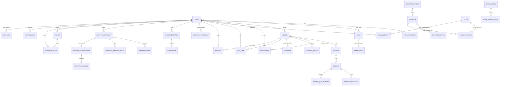
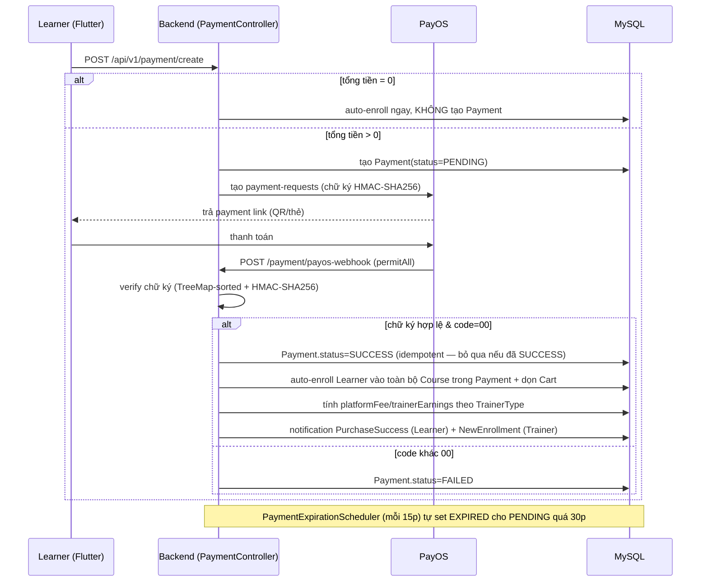
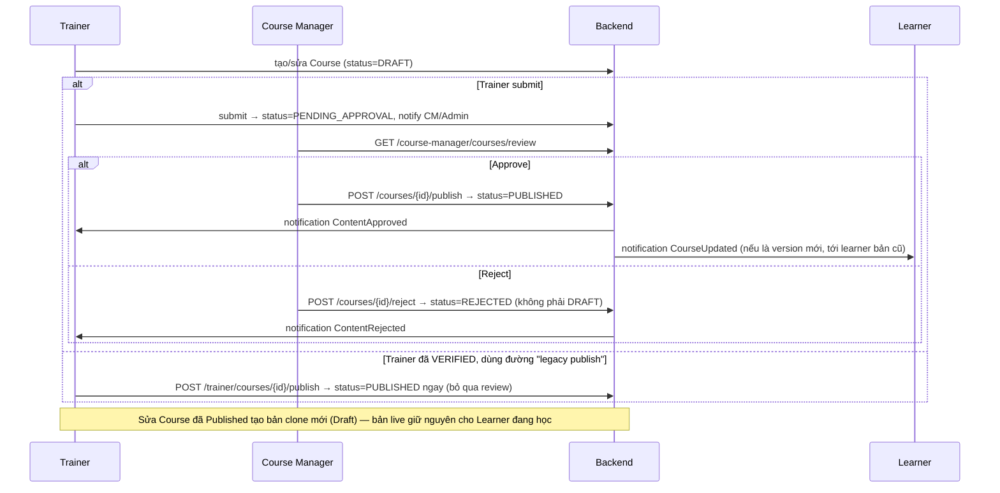
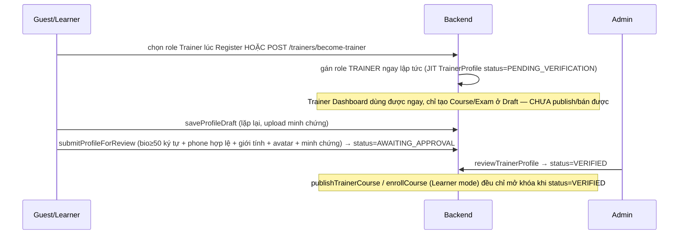
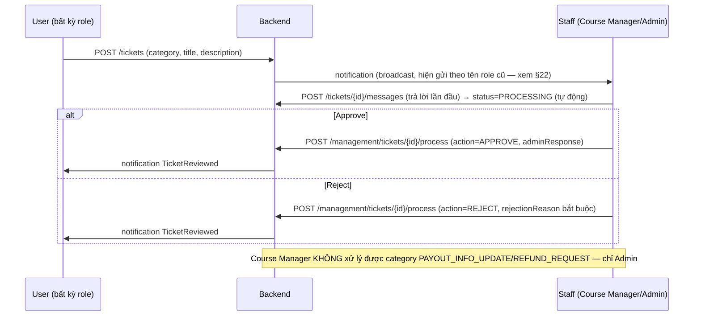

# HanGo — Project Documentation (Requirements & Development Baseline)

> **Version:** 2.0
> **Ngôn ngữ:** Tiếng Việt, thuật ngữ nghiệp vụ & kỹ thuật giữ nguyên English để đồng bộ code.
> **Ký hiệu:** `FR` = Functional Requirement · `BR` = Business Rule · 📌 = mục còn để mở (không chặn v1).
> **Phạm vi tài liệu:** mô tả nghiệp vụ + functional + conceptual model. **Không** bao gồm REST endpoints hay DDL chi tiết dòng-theo-dòng (đã có codebase); phần AI chỉ mô tả chức năng.
> **Đợt cập nhật này (2026-08-10):** đọc lại toàn bộ backend (`hango-backend/`, 284 file `.java`) và frontend (`hango-frontend/`, 161 file `.dart`) trực tiếp trên code hiện tại của nhánh `dev`/`fix-code-v2` (đã đồng bộ, cùng commit `0f55cc6`), đối chiếu với **Feature Map 19 module** do team cung cấp. Mọi claim quan trọng trong tài liệu này đều bắt nguồn từ việc đọc code trực tiếp trong đợt audit này, không copy mù từ báo cáo cũ. Các báo cáo audit rời trước đây (`AUDIT_REPORT.md`, `TEST_AUDIT_REPORT.md`, `AUTH_FIX_REPORT.md`, `ROADMAP.md`) đã được xác nhận **không cần dùng nữa** và đã bị gỡ khỏi `doc/` — nội dung còn giá trị được gộp thẳng vào tài liệu này (§21, §22, §23) thay vì link ra file rời.

---

## Mục lục

1. [Giới thiệu & Phạm vi](#1-giới-thiệu--phạm-vi)
2. [Thuật ngữ (Glossary)](#2-thuật-ngữ-glossary)
3. [Mô hình kinh doanh](#3-mô-hình-kinh-doanh)
4. [Actors, Roles & Phân quyền](#4-actors-roles--phân-quyền)
5. [Tech Stack & Architecture](#5-tech-stack--architecture)
6. [Bản đồ tính năng (Feature Map)](#6-bản-đồ-tính-năng-feature-map)
7. [Functional Requirements theo module](#7-functional-requirements-theo-module)
8. [Global Business Rules](#8-global-business-rules)
9. [Vòng đời, State Machines & Versioning](#9-vòng-đời-state-machines--versioning)
10. [Cross-module Workflows](#10-cross-module-workflows)
11. [AI Features](#11-ai-features)
12. [Enums tổng hợp](#12-enums-tổng-hợp)
13. [Non-Functional Requirements](#13-non-functional-requirements)
14. [Decision Log & Future Items](#14-decision-log--future-items)
15. [Package Structure chi tiết (Backend & Frontend)](#15-package-structure-chi-tiết-backend--frontend)
16. [Tổng quan Cơ sở dữ liệu (Database Overview)](#16-tổng-quan-cơ-sở-dữ-liệu-database-overview)
17. [Tổng quan API (API Overview)](#17-tổng-quan-api-api-overview)
18. [Sequence Diagram — Luồng nghiệp vụ chính](#18-sequence-diagram--luồng-nghiệp-vụ-chính)
19. [Deployment](#19-deployment)
20. [Configuration](#20-configuration)
21. [Testing Strategy](#21-testing-strategy)
22. [Known Limitations & Rủi ro kỹ thuật](#22-known-limitations--rủi-ro-kỹ-thuật)
23. [Future Roadmap](#23-future-roadmap)

---

## 1. Giới thiệu & Phạm vi

### 1.1 Sản phẩm

**HanGo (Smart Language Self-Study Platform)** là Learning Management System chuyên biệt cho việc học và ôn thi môn **Tiếng Anh THPT Quốc Gia**, kết hợp ba thành phần trong một nền tảng:

- **LMS** — quản lý nội dung & tiến độ học.
- **Course Marketplace** — Trainer phân phối, Learner mua/học Course.
- **AI-powered Learning Platform** — AI hỗ trợ cả người dạy và người học (AI Assistant trong Lesson, AI Learning Pathway sau Exam).

HanGo **không tự sản xuất nội dung**; nền tảng kết nối Trainer (tạo Course) với Learner (học), và kiểm soát chất lượng xuất bản qua Course Manager.

### 1.2 Trong phạm vi (In-scope, v1)

- **19 module chức năng** (xem §6), triển khai trên **nền web**.
- Toàn bộ luồng: đăng ký/onboarding → tạo & duyệt nội dung → học & luyện đề → recommendation/AI pathway → thanh toán & doanh thu → hỗ trợ (ticket).

### 1.3 Ngoài phạm vi (Out-of-scope, v1)

Ứng dụng mobile app native (làm sau nếu còn thời gian), refund/hoàn tiền tự động (yêu cầu hoàn tiền hiện đi qua Ticket nhưng **chưa** có hành động backend nào thật sự đảo trạng thái Payment/Enrollment — xem §22), tự động payout cho Trainer (vẫn chuyển khoản thủ công), giới hạn & tính phí AI theo hạn mức, đa ngôn ngữ giao diện, GroupType trong course-authoring (v1 chỉ dùng GroupType để hiển thị và tạo câu hỏi trong Exam Matrix/Question Bank), pass-score cho Quiz, lớp học trực tiếp, nhắn tin trực tiếp, forum, gamification, chứng chỉ hoàn thành, hỗ trợ môn khác ngoài Tiếng Anh THPT.

---

## 2. Thuật ngữ (Glossary)

| Thuật ngữ | Định nghĩa |
|---|---|
| **Course** | Khóa học do Trainer tạo, gồm nhiều Section. |
| **Section** | Chương/phần trong Course, chứa nhiều Lesson. |
| **Lesson** | Bài học nhỏ nhất; nội dung dạng text-first (`Lesson.content`), có thể có video/pdf/image đính kèm và một Quiz/Exam gắn kèm. |
| **Quiz** | Bài luyện tập gắn vào Lesson, dùng câu hỏi từ Question Bank (tái sử dụng). |
| **Exam** | Bài thi độc lập với Course, mô phỏng đề THPT, dùng câu hỏi soạn riêng cho Exam (không tái sử dụng với Question Bank). |
| **Exam Matrix** | Bản thiết kế (blueprint) tái sử dụng để **sinh Exam tự động**: 1 tập luật (skill × difficulty × group-type × số lượng câu) dùng để lấy mẫu câu hỏi khi generate Exam. |
| **Question Bank** | Kho câu hỏi tái sử dụng của Trainer/Course Manager, phục vụ Quiz (và làm nguồn tham chiếu cho Exam Matrix). |
| **QuestionGroup** | Nhóm câu hỏi dùng chung ngữ liệu (passage). |
| **Attempt** | Một lần Learner làm Quiz/Exam; được phép nhiều lần. |
| **SkillType / Category** | Nhãn kỹ năng/chủ đề của Course và Question, lưu qua bảng lookup dùng chung `SystemParameter` (không có entity `SkillType` riêng); dùng cho filter, Exam Matrix & AI recommendation. |
| **Weakness Analysis** | Phân tích điểm yếu suy ra từ các câu trả lời sai trong Exam Attempt gần nhất (nhóm theo topic/skill), phục vụ AI Recommendation & Learning Pathway. |
| **Recommendation** | Gợi ý Course/lộ trình dựa trên kết quả Exam — kênh AI (Gemini) là chính; không còn tách riêng một nhánh "rule-based" độc lập trong code hiện tại (xem §7.11). |
| **Learning Pathway** | Lộ trình học cá nhân hoá do AI sinh sau khi làm Exam — gồm chuỗi `PathwayNode` (mỗi node tương ứng 1 Course), có thể reroute (tự động hoặc "agentic" gợi ý/chấp nhận), lên lịch (time-boxing), và mastery-check theo spaced-repetition. |
| **Ticket** | Yêu cầu hỗ trợ do bất kỳ user nào (Learner/Trainer/Course Manager/Admin) tạo ra, staff (Course Manager/Admin) xử lý Approve/Reject. |
| **Trainer** | Người tạo nội dung; hai loại: `PROFESSIONAL` (Teacher) / `PEER_TUTOR` (Tutor). |
| **Course Manager** | Role kiểm duyệt trình bày & xuất bản nội dung (Course/Exam), quản lý Exam Matrix, xử lý Ticket, chi trả doanh thu. **Tên chính thức hiện tại là "Course Manager"** — đây từng được gọi là "Trainer Lead" trong giai đoạn đầu phát triển, đã đổi tên nghiệp vụ sang Course Manager (chức năng giữ nguyên). Code hiện còn sót một vài chỗ dùng chuỗi cũ `TRAINER_LEAD` (xem §22) — đây là nợ kỹ thuật cần dọn, **không phải** một role thứ hai đang tồn tại song song. |
| **Monthly Statement** | Báo cáo doanh thu hàng tháng của Trainer, có trừ thuế TNCN (PIT) nếu vượt ngưỡng. |
| **Permission** | Đơn vị quyền hạn rời rạc (ví dụ `MANAGE_OWN_COURSES`), gán cho Role qua bảng `role_permissions`; Admin có thể xem & cấu hình lại tập permission của từng Role qua UI (xem §4, §7.4). |

---

## 3. Mô hình kinh doanh

### 3.1 Loại hình

Marketplace-based Learning Management System — HanGo là nền tảng trung gian, thu phí qua chia sẻ doanh thu.

### 3.2 Revenue Sharing

|        Loại Trainer      |  Trainer nhận  |  HanGo nhận   |
|--------------------------|----------------|---------------|
| **Teacher** (`PROFESSIONAL`) |     70%        |      30%      |
| **Tutor** (`PEER_TUTOR`)     |     60%        |      40%      |

**Quy tắc doanh thu:**
- Course **đầu tiên** của mỗi Trainer **bắt buộc miễn phí**; sau đó tự do đặt free/paid.
- Course trả phí: Learner thanh toán qua HanGo (**PayOS**) → webhook xác nhận → ghi nhận doanh thu theo Payment (`platformFee`/`trainerEarnings`, tính ngay lúc webhook thành công) → cuối kỳ Course Manager/Admin tổng hợp thành Monthly Statement → Trainer xác nhận → **Course Manager** chi trả (chuyển khoản thủ công + ghi nhận, có trừ **10% thuế TNCN** nếu tổng thu nhập gộp trong kỳ ≥ 2.000.000 VND, theo Khoản 1 Điều 25 Thông tư 111/2013/TT-BTC).
- Revenue tổng hợp (theo Payment/theo Trainer, xuất Excel) hiện xem qua `Course Manager Settlement` (2 tab: Statements + Payments Log), **không** xuất hiện trên Admin Platform Dashboard (xem §7.19, §22).

### 3.3 Định giá Course (Price Tier)

Backend **tự tính** một mức giá gợi ý dựa trên công thức cộng dồn theo quy mô Course:
- Nền: 300.000 VND nếu Trainer là `PROFESSIONAL`, 150.000 VND nếu `PEER_TUTOR`.
- +150.000 VND nếu Trainer có hồ sơ minh chứng (`scoreReportUrl`) đã nộp.
- +200.000 / 100.000 / 50.000 VND theo độ khó Course (`ADVANCED`/`INTERMEDIATE`/`BASIC`).
- +10.000 VND / Lesson, +1.000 VND / phút thời lượng ước tính.

> Backend chỉ **gợi ý** (`Course.suggestedPrice`, có thể re-evaluate lại); **Trainer chốt giá cuối cùng** (≥ 0 VND).

### 3.4 Stakeholders

**Internal:** Administrator, Course Manager, Trainer, Learner.
**External:** Guest, Payment Gateway (PayOS), AI Provider (Google Gemini), Email Service, Media/File Storage (Cloudinary).

---

## 4. Actors, Roles & Phân quyền

### 4.1 Nguyên tắc

- **4 role thật trong hệ thống:** `LEARNER`, `TRAINER`, `COURSE_MANAGER`, `ADMINISTRATOR` — được seed & gán quyền qua `RolePermissionDataInitializer` mỗi lần backend khởi động. Chuỗi `TRAINER_LEAD` **không còn được seed/tạo mới ở đâu trong code** (đã xác nhận qua toàn bộ `RolePermissionDataInitializer`, `AuthService.ADMIN_CREATABLE_ROLES`) — chỉ còn sót trong một số `@PreAuthorize`/notification code như tàn dư đặt tên cũ (§22), không map tới bất kỳ user thật nào.
- **One account, one primary role:** mỗi người dùng có **một** tài khoản với **một** primary role.
- **Trainer dual-mode:** tài khoản **Trainer bao gồm cả năng lực Learner**, chuyển qua **UI mode switch** (Trainer mode ⇄ Learner mode):
  - *Trainer mode:* dùng đầy đủ chức năng Trainer.
  - *Learner mode:* enroll/mua/học Course của Trainer khác, làm Quiz/Exam, nhận Recommendation; các chức năng Trainer bị **làm mờ (disabled)**.
  - Bất kỳ tài khoản nào có primary role là Trainer đều bao gồm cả năng lực của Learner qua cơ chế dual-mode này (kể cả khi được nâng cấp từ Learner — lịch sử học tập/Course đã mua được giữ nguyên).
  - Đây là UI/session state, không phải role thứ hai; permission = năng lực Trainer ∪ năng lực Learner. CourseManager & Administrator **không** có Learner mode.
- **Ownership:** mọi Course/Question thuộc về Trainer tạo ra; chỉ owner được sửa (một số action Course/Exam/Question Bank cũng mở cho Course Manager tự thực hiện — xem từng module §7).
- **Governance:** nội dung phải qua kiểm duyệt trước khi Published (trừ khi người submit chính là Course Manager/Admin — tự động publish, xem §7.6).
- **Separation of duties:** Course Manager lo **chất lượng nội dung + tài chính (settlement)**; Administrator lo **user + hệ thống + giám sát**. Administrator không xử lý settlement, nhưng **có** nhận cùng lúc với Course Manager một số cảnh báo vận hành (vd rating thấp — xem BR-LRN tương ứng §7.13).

### 4.2 Mô tả role

|          Role           |         Vai trò          |         Giới hạn chính          |
|-------------------------|--------------------------|---------------------------------|
|       **Guest**         | Chưa đăng nhập; xem nội dung công khai, đăng ký. | Không xem Lesson (trừ 1 ngoại lệ kỹ thuật, xem §22); không làm Quiz/Exam yêu cầu đăng nhập. |
|       **Learner**       | Học, luyện đề, nhận recommendation/AI pathway, mua/giỏ hàng, gửi Ticket. | Không tạo nội dung; không publish. |
|       **Trainer**       | Tạo Course/Lesson/Quiz/Exam; quản lý Question Bank & Exam Matrix của mình; theo dõi doanh thu; gửi Ticket. Có **Learner mode**. | Cần `TrainerProfile.status = VERIFIED` mới publish/bán được Course (xem §7.5 BR-TRN-01). |
| **Course Manager**  | Review & publish Course/Exam; quản lý Exam Matrix (kể cả matrix riêng); xử lý Ticket (trừ 2 category tài chính nhạy cảm dành riêng Admin); settlement doanh thu; xem Platform Dashboard cơ bản. | Không tự tạo/sửa nội dung Course của Trainer khác (chỉ Approve/Reject/Hide); không xử lý Ticket loại `PAYOUT_INFO_UPDATE`/`REFUND_REQUEST`. |
| **Administrator**   | Quản trị user/role/permission, duyệt Trainer Application, moderate Comment, xem Platform Dashboard + AI Usage + Audit Log, xử lý mọi loại Ticket (kể cả 2 loại tài chính). | Không sửa nội dung Course của Trainer; không xuất hiện trực tiếp trong luồng settlement doanh thu (đó là việc của Course Manager), dù có thể tạo tài khoản Course Manager. |

### 4.3 RBAC — cơ chế phân quyền thật (đã đổi so với thiết kế ban đầu)

RBAC hiện là **hybrid**, không còn "chỉ `hasRole()` tĩnh":

- `Role` ↔ `Permission` là quan hệ M:M qua bảng `role_permissions`. `RolePermissionDataInitializer` seed **16 Permission** (4 nhóm module: *Learning & Enrollment*, *Course Management*, *Analytics*, *Platform*, *System Settings*) và gán mặc định cho mỗi role — **chỉ khi role đó hiện có 0 permission** (không ghi đè permission đã bị Admin tuỳ biến):
  - `LEARNER` → `ENROLL_AND_LEARN_COURSES, ATTEMPT_QUIZ_AND_EXAM, RATE_AND_COMMENT, AI_LEARNING_ASSISTANT`
  - `TRAINER` → `MANAGE_OWN_COURSES, MANAGE_QUESTION_BANK, CREATE_EXAMS_TRAINER, VIEW_OWN_REVENUE`
  - `COURSE_MANAGER` → `VIEW_PLATFORM_DASHBOARD, CREATE_AND_MANAGE_EXAMS_CM, VIEW_RATING_NOTIFICATIONS`
  - `ADMINISTRATOR` → `MANAGE_ACCOUNTS_ROLES, MODERATE_COMMENTS, REVIEW_TRAINER_APPLICATIONS, AUDIT_LOG_AI_USAGE`
  - *(Một vài permission code khác xuất hiện rải rác trong `@PreAuthorize`, ví dụ `REVIEW_COURSE` ở `CourseController`, chưa xác nhận độc lập có nằm trong danh sách seed mặc định hay không — cần grep lại trước khi coi là đã seed.)*
- **Admin có thể xem & cấu hình lại** ma trận role→permission qua UI thật (tab "Roles" trong Admin Dashboard, `RoleMatrixTab`/`RoleDetailDrawer`) gọi `GET /api/admin/permissions`, `GET /api/admin/roles`, **`PUT /api/admin/roles/{roleName}/permissions`** — đây chính là tính năng **"Configure Permission"** trong Feature Map (§6, FE-04), là một API thật có ghi DB, không còn là "tĩnh/chỉ đọc" như thiết kế trước đó. Mỗi `Permission` có `coreForRoles`/`restrictedForRoles` (CSV role name) giới hạn Admin không gán/gỡ bừa bãi.
- **Ở tầng Controller**, phần lớn endpoint dùng `@PreAuthorize("hasAuthority('MÃ_PERMISSION') or ... or hasRole('ADMINISTRATOR')")` — tức Administrator luôn có một cửa hardcode đi tắt qua mọi permission check, bất kể ma trận permission thật sự cấu hình gì. Một số controller (đáng chú ý: toàn bộ `CourseManagerDashboardController`, `ManagementTicketController`) vẫn dùng thuần `hasAnyRole('COURSE_MANAGER','ADMINISTRATOR')`/`hasRole(...)` theo tên role, không qua permission code — nghĩa là với riêng các endpoint đó, việc Admin "gỡ" permission của Course Manager qua UI Configure Permission sẽ **không** chặn được truy cập, vì check không nhìn vào permission code.
- Một vài controller (`CartController`, `TicketController` phía người tạo, `LessonController`, `CommentController`, `NotificationController`, `MetadataController`, `UserController`, `PaymentController`'s tạo-thanh-toán) **không có `@PreAuthorize` nào cả** — chỉ yêu cầu đã đăng nhập (`isAuthenticated()` mặc định hoặc tự kiểm tra `currentUser == null` trong code), tức mọi role đã login đều gọi được như nhau, không phân biệt Learner/Trainer/CM/Admin.

### 4.4 RBAC Matrix (theo nghiệp vụ)

> ✅ được phép · ❌ không · **Own** = chỉ trên tài nguyên do mình sở hữu · **(any login)** = không phân role, chỉ cần đăng nhập.

| Resource / Action | Guest | Learner | Trainer | Course Manager | Admin |
|---|:--:|:--:|:--:|:--:|:--:|
| Register / Login / Refresh / Reset password (OTP) | ✅ | ✅ | ✅ | ✅ | ✅ |
| View / Update own Profile, Change Password | ❌ | ✅ | ✅ | ✅ | ✅ |
| Submit Trainer Application | ✅ (sau đăng ký) | ✅ | — | ❌ | ❌ |
| Review / Approve Trainer Application | ❌ | ❌ | ❌ | ❌ | ✅ |
| Browse / Search / View Course & Exam (metadata) | ✅ | ✅ | ✅ | ✅ | ✅ |
| View Lesson content | ⚠️ kỹ thuật cho phép ẩn danh (xem §22) | ✅ (enrolled) | ✅ Own | ✅ | ✅ |
| Create / Update / Archive Course (metadata) | ❌ | ❌ | ✅ Own | ✅ (nếu tự tạo, tự publish luôn) | ❌ |
| Submit Course for review | ❌ | ❌ | ✅ Own | — (tự publish, không cần submit-review) | ❌ |
| Review / Approve / Reject / Publish / Hide Course | ❌ | ❌ | ⚠️ có 1 endpoint "legacy self-publish" riêng, xem §7.6/§22 | ✅ | ❌ |
| Manage Section / Lesson / Quiz / Media | ❌ | ❌ | ✅ Own | ❌ | ❌ |
| Manage Question Bank | ❌ | ❌ | ✅ Own | ✅ (đồng thời có `CREATE_AND_MANAGE_EXAMS_CM`) | ❌ |
| Manage Exam Matrix | ❌ | ❌ | ✅ (chỉ dùng matrix Public) | ✅ (tạo/sửa/toggle-public, xem cả Private) | ❌ |
| Create / Update Exam | ❌ | ❌ | ✅ (→review) | ✅ (self-publish) | ❌ |
| Review / Publish / Reject Exam | ❌ | ❌ | ❌ | ✅ | ❌ |
| Enroll / Purchase / Continue Course, dùng Cart | ❌ | ✅ | ✅ (Learner mode) | ❌ | ❌ |
| Attempt Quiz / Exam | ❌ | ✅ | ✅ (Learner mode) | ❌ | ❌ |
| Rate Course | ❌ | ✅ | ✅ (Learner mode) | ❌ | ❌ |
| Nhận cảnh báo Low Rating / Low Average Rating | ❌ | ❌ | ❌ | ✅ | ✅ (nhận đồng thời với CM) |
| View AI Recommendation / Learning Pathway | ❌ | ✅ | ✅ (Learner mode) | ❌ | ❌ |
| Dùng AI Assistant (trong Lesson) | ❌ | ✅ | ✅ (Learner mode) | ❌ | ❌ |
| AI Content Generation (Question/Exam) | ❌ | ❌ | ⚠️ hiện **không** có role-gate (bug, xem §22) | ⚠️ tương tự | ⚠️ tương tự |
| Tạo & tự trả lời Ticket của mình | ❌ | ✅ | ✅ | ✅ | ✅ (nhưng **không có UI** để dùng, xem §22) |
| Duyệt/xử lý (Approve/Reject) Ticket của người khác | ❌ | ❌ | ❌ | ✅ (trừ 2 category tài chính) | ✅ (mọi category) |
| View own Revenue / Confirm Statement | ❌ | ❌ | ✅ Own | — | — |
| Generate Statement / Settle (Paid) / Cancel / Export | ❌ | ❌ | ❌ | ✅ | ✅ |
| Comment / Reply / Like (Lesson & Quiz) | ❌ | ✅ | ✅ | ❌ | ❌ (nhưng moderate được) |
| Moderate Comment | ❌ | ❌ | ❌ | ❌ | ✅ |
| User/Account Management (tạo/khoá/sửa role) | ❌ | ❌ | ❌ | ❌ | ✅ |
| Configure Role → Permission matrix | ❌ | ❌ | ❌ | ❌ | ✅ |
| Platform Dashboard (không doanh thu) / AI Usage / Audit log | ❌ | ❌ | (dashboard riêng, có doanh thu) | (dashboard riêng, không doanh thu) | ✅ |

---

## 5. Tech Stack & Architecture

| Thành phần | Lựa chọn |
|---|---|
| **Frontend** | **Flutter** (Dart `^3.12.0`) — target **Web** ở v1. Mọi role dùng chung web app, phân vùng UI theo role. State management: 1 `ChangeNotifierProvider<AppState>` (package `provider`) + `StatefulWidget`/`setState()` theo trang — **không** dùng Riverpod. Routing: `Navigator.push`/`MaterialPageRoute` thủ công — **không** dùng `go_router`. Networking: `package:http` viết tay theo từng repository/service — `dio` có khai báo trong `pubspec.yaml` nhưng không phải cách gọi API chính đang dùng. |
| **Backend** | **Java 17 + Spring Boot 4.0.6**, REST API |
| **Kiến trúc** | Monolith, layered (`Controller → Service → Repository`) |
| **Database** | **MySQL 8.0**, quản lý schema qua Hibernate `ddl-auto` (mặc định hiện tại là **`validate`**, đọc qua biến môi trường `SPRING_JPA_HIBERNATE_DDL_AUTO`; chưa có Flyway/Liquibase) |
| **Auth** | **JWT** access token + **refresh token** (đối lập, `RefreshToken` được lưu **hash**, xoay vòng single-use khi refresh); đăng nhập email/mật khẩu **và Google OAuth2** (Sign-in with Google) |
| **RBAC** | Ma trận **role → permission động**, lưu DB, Admin cấu hình được qua UI (xem §4.3) — không còn "tĩnh/chỉ đọc" như thiết kế ban đầu |
| **Notification** | **Chỉ lưu DB + poll qua REST** (`GET /api/v1/notifications`, `/unread-count`) — **chưa có WebSocket/STOMP thật** trong code hiện tại, dù kiến trúc gốc dự tính realtime (xem §22) |
| **Media / File** | **Cloudinary** (video, pdf, ảnh của Lesson, avatar, minh chứng Trainer) |
| **Payment** | **PayOS** (tiền tệ **VND**) — một vài tên field/biến còn sót tên "VNPay" cũ (`vnpayTxnNo`), không ảnh hưởng hành vi |
| **Email** | SMTP (Gmail) cho **OTP verification** (bắt buộc), reset password, duyệt Trainer, thanh toán thành công, settlement — có fallback log console nếu gửi lỗi, không chặn luồng chính |
| **AI** | **Google Gemini** — điểm chốt duy nhất `GeminiClientService` (model chat `gemini-3.1-flash-lite`, embedding `text-embedding-004`), phục vụ 3 nhóm: AI Assistant (trong Lesson), AI Learning Pathway/Mentor Chat, AI Recommendation sau Exam. Mọi lượt gọi ghi `AiUsageLog`. |
| **Deployment** | **AWS** (EC2 + Docker Compose + Nginx, xem §19) |
| **Source control** | **GitHub** |

**Nguyên tắc kiến trúc chính:**
- Phân quyền kiểm tra ở **hầu hết** API, nhưng không phải tất cả — một số route quan trọng chỉ yêu cầu "đã đăng nhập" mà không phân biệt role (xem §4.3, §22).
- Payment/business logic quan trọng xử lý ở **server + webhook PayOS** (HMAC-SHA256 signature verify), không dựa vào return URL.
- Media không lưu trong DB; DB chỉ giữ **URL Cloudinary**.

---

## 6. Bản đồ tính năng (Feature Map)

```
FE-01 Authentication
├── Register
├── Login
├── Forgot Password
└── Logout

FE-02 Profile Management
├── View Profile
├── Update Profile
├── Change Password
├── View Learning History
└── View Trainer Public Profile

FE-03 Account Management
├── View Account List
├── View Account Details
├── Create Account Manually
├── Update Account
└── Activate/Deactivate Account

FE-04 Role and Permission Management
├── View Role List
├── Assign Role
├── Update Role
├── View Permission
└── Configure Permission

FE-05 Trainer Application Management
├── Create Trainer Application
├── Submit Trainer Application
├── View Trainer Application List
├── View Detail Trainer Application
├── Approve/Reject Trainer Application
└── Request for edit Trainer Application

FE-06 Course Management
├── View Course List
├── View Course Detail
├── Filter/Search Course
├── Import course by Excel
├── Save Draft
├── Submit Course
├── Update course
├── Delete draft course
├── View course update history
├── Approve/Reject Course
├── Publish Course
└── Hide course

FE-07 Course Content Management
├── Manage Section
├── View course's lesson details
├── Create course's lesson
├── Update course's lesson
├── Add course's lesson resource
├── Download course's material curriculum
├── View course's quiz list
├── Create course's quiz manually
├── Generate course's quiz by AI
├── Update course's quiz
└── Delete course's quiz

FE-08 Question Bank Management
├── View question list
├── View question detail
├── Search/Filter Question
├── Add question manually
├── Import question by Excel
├── Generate question by AI
└── Update question

FE-09 Exam Management
├── View Exam List
├── View Exam Detail
├── Search/Filter Exam
├── Import Exam from Excel
├── Generate Exam from Question Bank
├── Generate Exam by AI
├── Submit Exam (for Trainers)
├── Update Exam
├── View Exam Update History
├── Approve/Reject Exam
├── Publish Exam
├── Hide Exam
├── Take Exam
├── View Exam Result
└── View Attempt Exam

FE-10 Exam Matrix Management
├── View Exam Matrix List
├── View Exam Matrix Detail
├── Create Exam Matrix
└── Update Exam Matrix

FE-11 AI Recommendation
├── Receive Weakness Analysis
├── Receive AI Learning Pathway
├── View Course Recommendation
└── Update AI Learning Pathway

FE-12 AI Assistant
├── Explain Concept
├── Explain Question
├── Explain Answer
└── Answer Learning Questions

FE-13 Learning Management
├── Enroll course
├── Learn Lesson
├── Download course's material curriculum
├── Chat with AI
├── Mark lesson as completed
├── Do quiz
├── View quiz history
├── View course certificate
├── View course's feedback
├── Leave rating and feedback
└── View learning progress

FE-14 Payment and Revenue
├── Purchase course
├── Receive Revenue Notifications & Email
├── Confirm Payout
├── Manage Revenue
└── View history transaction

FE-15 Cart Management
├── View cart list
├── Add cart item
└── Remove cart item

FE-16 Ticket Management
├── Send Ticket
├── View Ticket List
├── View Ticket Detail
└── Reply to Ticket

FE-17 Comment Management
├── View Comments
├── Create Comment
├── Reply Comment
├── Like/Dislike Comment
├── Delete Comment
└── Moderate Comment

FE-18 Notification
├── View Notifications
└── Mark Notification as read

FE-19 Dashboard
├── View Dashboard & Analytics
└── Monitor AI Usage
```

> **Ghi chú đối chiếu code — các mục trong Feature Map trên chưa xác nhận độc lập/khác thiết kế ở đợt audit này (không tự ý bỏ hay đổi so với danh sách team cung cấp, chỉ ghi chú để dùng khi viết FR chi tiết ở §7):**
> - *View course certificate* (FE-13): **không tìm thấy** entity/endpoint "Certificate" nào trong code hiện tại — HanGo không có khái niệm chứng chỉ hoàn thành ở v1 (khớp §1.3 out-of-scope "chứng chỉ hoàn thành"). Cần xác nhận lại với team đây là placeholder cho tương lai hay cần bỏ khỏi Feature Map.
> - *Download course's material curriculum* xuất hiện ở cả FE-07 và FE-13 — chưa tìm thấy một API tải "trọn bộ tài liệu Course" (Cloudinary URL từng Lesson thì có, download hàng loạt thì chưa xác nhận).
> - *View Attempt Exam* (FE-09) và *View quiz history* (FE-13) là 2 tính năng riêng biệt trong code (Exam Attempt vs Lesson Quiz Attempt, hai bảng khác nhau) — không phải trùng lặp.

---

## 7. Functional Requirements theo module

> Mỗi module: **Actors · Functional Requirements · Business Rules**. Mã module giữ nguyên các mã ngắn cũ (AUTH, PROF, CRS, CNT, QB, EXM, AI, LRN, PAY, CMT, NTF) và thêm mã mới cho các module tách/mới: **ACC** (Account Management), **RBAC** (Role & Permission), **TRN** (Trainer Application), **MTX** (Exam Matrix), **REC** (AI Recommendation), **CART**, **TKT** (Ticket), **DASH** (Dashboard).

### 7.1 Authentication (`AUTH`) — FE-01
**Actors:** Guest, mọi role đã đăng nhập.

| ID | Requirement |
|---|---|
| FR-AUTH-01 | Đăng ký bằng email/mật khẩu/họ tên, chọn role **Learner** hoặc **Trainer** (`RegisterRequest.role`, whitelist đúng 2 giá trị này — chọn Trainer ở đây gán role Trainer **ngay**, xem BR-TRN-01 §7.5). |
| FR-AUTH-02 | Gửi OTP 6 số qua email (SecureRandom, hết hạn 5 phút, tối đa 5 lần thử sai, cooldown gửi lại 60s); tài khoản chỉ `ACTIVE` sau khi verify. |
| FR-AUTH-03 | Đăng nhập email + mật khẩu → cấp **access token (JWT)** + **refresh token** (random, lưu hash, xoay vòng single-use). |
| FR-AUTH-04/05 | Quên mật khẩu → OTP qua email → đặt lại mật khẩu (không lộ email có tồn tại hay không — chống user enumeration). |
| FR-AUTH-06 | Đăng xuất: thu hồi refresh token hiện tại (`POST /api/auth/logout`); đổi mật khẩu thành công cũng thu hồi **toàn bộ** refresh token của user (buộc đăng nhập lại mọi thiết bị). |
| FR-AUTH-07 | Đăng nhập **Google OAuth2** — verify chữ ký ID Token (không còn nhánh fallback bỏ qua verify); email chưa tồn tại → tự tạo tài khoản **Learner**, `isVerified=true` ngay (bỏ qua OTP vì Google đã xác thực email). |
| FR-AUTH-08 | Khoá đăng nhập 15 phút sau **5 lần** sai mật khẩu liên tiếp (đếm trên `User`, reset khi đăng nhập thành công). |

**BR-AUTH-01:** email là định danh duy nhất, so khớp không phân biệt hoa/thường.
**BR-AUTH-02:** mật khẩu 8–64 ký tự, bắt buộc có chữ hoa + chữ thường + số + ký tự đặc biệt (regex `^(?=.*[a-z])(?=.*[A-Z])(?=.*\d)(?=.*[^A-Za-z0-9]).{8,64}$`).
**BR-AUTH-03:** tài khoản qua Google OAuth2 coi email đã được Google xác thực → bỏ qua OTP.
**BR-AUTH-04:** login của tài khoản có status khác `ACTIVE` (bất kể giá trị cụ thể) bị chặn với thông báo chung "liên hệ hỗ trợ"; riêng email chưa verify có thông báo riêng "hãy xác minh email", kiểm tra **trước** check status.

### 7.2 Profile Management (`PROF`) — FE-02
**Actors:** Learner, Trainer, Course Manager, Admin.

| ID | Requirement |
|---|---|
| FR-PROF-01/02 | Xem & cập nhật profile cá nhân: họ tên, avatar, số điện thoại, giới tính, ngày sinh, địa chỉ, username, email (đổi email → `isVerified` reset về `false`). |
| FR-PROF-03 | Đổi mật khẩu (yêu cầu đúng mật khẩu hiện tại), thu hồi toàn bộ refresh token khi đổi thành công. |
| FR-PROF-04 | Learner xem **Learning History**: các Course đã enroll/hoàn thành, lịch sử Exam attempt — hiện được phục vụ qua endpoint danh sách Course có `filterType=ENROLLED\|IN_PROGRESS\|COMPLETED`, không phải một endpoint "learning-profile" tổng hợp riêng. |
| FR-PROF-05 | Trainer có trang public profile hiển thị bio/kinh nghiệm/danh sách Course — nội dung phần này (bio, CV & Experience) đã có trong `TrainerProfilePage`; mức độ "public" (Guest xem được không cần login) **chưa xác nhận độc lập** trong đợt audit này, cần kiểm tra lại route/API cụ thể trước khi coi là hoàn tất. |

**BR-PROF-01:** `ProfileUpdateRequest` hiện **không có validation annotation** nào ở backend (`@Email`/`@NotBlank`/`@Size`) — cập nhật profile với dữ liệu sai định dạng vẫn được lưu (xem §22).

### 7.3 Account Management (`ACC`) — FE-03
**Actors:** Administrator.

| ID | Requirement |
|---|---|
| FR-ACC-01 | Xem danh sách tài khoản, tìm kiếm & lọc theo `roleType` (`learner`/`trainer`/`course_manager`/`admin`/`staff`) — `GET /api/admin/users`, trả về field an toàn (không mật khẩu). |
| FR-ACC-02 | Xem chi tiết 1 tài khoản — `GET /api/admin/users/{id}`. |
| FR-ACC-03 | Tạo tài khoản thủ công (Learner/Trainer/Course Manager/Admin), tài khoản tạo kiểu này **kích hoạt ngay** (`isVerified=true`, `status=ACTIVE`, không cần OTP) — `POST /api/admin/users`. |
| FR-ACC-04 | Cập nhật tài khoản (họ tên/email/sđt/giới tính/ngày sinh/status/role trong 1 API) — `PUT /api/admin/users/{id}`. |
| FR-ACC-05 | Activate/Deactivate — `PUT /api/admin/users/{id}/status`, whitelist status `ACTIVE`/`INACTIVE`; **Admin không tự khoá được chính mình** (chặn ở cả 2 API FR-ACC-04/05). |
| FR-ACC-06 | Mọi hành động tạo/sửa/đổi status ghi 1 dòng `AuditLog` (ai, làm gì, trên user nào, khi nào) — xem đầy đủ ở FR-DASH-03 (§7.19). |

### 7.4 Role and Permission Management (`RBAC`) — FE-04
**Actors:** Administrator.

| ID | Requirement |
|---|---|
| FR-RBAC-01 | Xem danh sách Role — `GET /api/admin/roles` (kèm permission hiện có của từng role). |
| FR-RBAC-02 | Gán/cập nhật role cho 1 tài khoản — qua chung API FR-ACC-04 (`PUT /api/admin/users/{id}`, field `role`, thay thế toàn bộ role hiện có bằng 1 role mới). |
| FR-RBAC-03 | Xem danh sách Permission — `GET /api/admin/permissions` (16 permission được seed, nhóm theo `module`: Learning & Enrollment / Course Management / Analytics / Platform / System Settings). |
| FR-RBAC-04 | **Configure Permission** — `PUT /api/admin/roles/{roleName}/permissions`: Admin thay thế toàn bộ tập permission của 1 Role bằng danh sách permission code mới, có ràng buộc theo `Permission.coreForRoles`/`restrictedForRoles`. Đây là API thật, có hiệu lực (ảnh hưởng runtime tới các endpoint dùng `hasAuthority(...)`) — **không phải** màn hình tĩnh/chỉ đọc. |

**BR-RBAC-01:** `hasRole('ADMINISTRATOR')` là cửa hardcode luôn được phép ở hầu hết endpoint dùng `hasAuthority(...)`, bất kể ma trận permission thật sự cấu hình gì cho role Administrator.
**BR-RBAC-02:** một nhóm endpoint (đáng chú ý: toàn bộ Course Manager dashboard/review, toàn bộ staff-side Ticket) không đọc permission code mà chỉ kiểm tra tên role — Configure Permission (FR-RBAC-04) **không** có tác dụng lên nhóm endpoint này.

### 7.5 Trainer Application Management (`TRN`) — FE-05
**Actors:** Guest/Learner (nộp đơn), Administrator (duyệt).

| ID | Requirement |
|---|---|
| FR-TRN-01 | Tạo/kích hoạt hồ sơ Trainer — `POST /api/v1/trainers/become-trainer`: gán role **Trainer ngay lập tức**, tạo `TrainerProfile{status=PENDING_VERIFICATION}` với `revenueShare` mặc định theo loại (0.70 `PROFESSIONAL` / 0.60 `PEER_TUTOR`). |
| FR-TRN-02 | Lưu nháp hồ sơ nhiều lần (`PUT /trainers/profile`) — bị chặn nếu status đang `AWAITING_APPROVAL` hoặc `SUSPENDED`. |
| FR-TRN-03 | Submit hồ sơ để duyệt (`POST /trainers/profile/submit`) — validate: bio ≥ 50 ký tự, số điện thoại đúng định dạng VN (`^(03\|05\|07\|08\|09)\d{8}$`, không cho số lặp/số dãy `1234567890`), có giới tính, có avatar, có minh chứng (`scoreReportUrl`) → chuyển `AWAITING_APPROVAL`, thông báo mọi Admin. |
| FR-TRN-04 | Theo dõi trạng thái đơn — `GET /trainers/profile`, hiển thị `adminNotes` nếu có. |
| FR-TRN-05 | Admin xem danh sách + duyệt (`GET /admin/trainer-profiles`, `PUT /admin/trainer-profiles/{id}/review`) — chỉ khi set `VERIFIED` mới áp dụng/validate lại `revenueShare` (0.50–0.95 nếu Admin ghi đè, ngược lại theo mặc định 70/60 theo loại) và publish/bán Course được mở khoá. Gửi cả email lẫn notification khi duyệt (dù verified hay không). |
| FR-TRN-06 | Request for edit — khi Admin trả về trạng thái khác `VERIFIED` (khác `SUSPENDED`), Trainer sửa & submit lại được, quay lại vòng lặp FR-TRN-02/03. |

**BR-TRN-01:** role **Trainer** (và quyền vào Trainer Dashboard, tạo Course/Exam ở Draft) được cấp **ngay lập tức** lúc chọn role ở Register hoặc gọi `become-trainer` — **không** chờ Admin duyệt. Ranh giới Admin duyệt chỉ chặn ở bước **publish/bán Course**, enforced tại `TrainerDashboardServiceImpl.publishTrainerCourse`: publish bị chặn trừ khi `TrainerProfile.status = VERIFIED`.
**BR-TRN-02:** Course đầu tiên bắt buộc miễn phí (kiểm tra ở tầng Course, không phải tầng Trainer Application).
**BR-TRN-03:** Admin gửi trường `status` khi review hiện **không có whitelist ở server** — về mặt hợp đồng API chỉ nên gửi 1 trong 3 giá trị `VERIFIED`/`PENDING_VERIFICATION`/`SUSPENDED`, nhưng code không tự chặn giá trị khác (xem §22).

### 7.6 Course Management (`CRS`) — FE-06
**Actors:** Guest/Learner (discovery), Trainer (authoring), Course Manager (review).

| ID | Requirement |
|---|---|
| FR-CRS-01/02/03 | Browse/Search/Filter Course đã Published theo category/skill/giá/rating. |
| FR-CRS-04 | Xem chi tiết Course; Guest không xem nội dung Lesson (trừ ngoại lệ kỹ thuật §22). |
| FR-CRS-05 | Trainer tạo Course (metadata + chọn **1–3 category/SkillType**). |
| FR-CRS-06 | Trainer cập nhật Course Draft/Rejected; giá gợi ý tự tính theo công thức §3.3, Trainer luôn sửa được. |
| FR-CRS-07 | Xoá Course còn ở Draft ("Delete draft course"). |
| FR-CRS-08 | Import Course hàng loạt từ Excel (`.xlsx`) — `CourseImportService` **tự parse XML thô** (unzip + DOM, không dùng Apache POI dù dependency `poi-ooxml` có trong `pom.xml`) để dựng Section/Lesson/LessonBlock. |
| FR-CRS-09 | Trainer submit Course để duyệt — `POST /trainer/courses/{id}/submit`, **nhánh tự publish ngay nếu người submit đang giữ role Course Manager/Admin**, ngược lại chuyển `PENDING_APPROVAL` và báo mọi Course Manager/Admin. |
| FR-CRS-10 | Xem lịch sử cập nhật Course (các version trước/rejection reason) — qua `Course.parentId`/`latestVersionId` + `rejectionReason` lưu trên chính version bị reject. |
| FR-CRS-11 | Course Manager Approve/Reject (kèm lý do) — `POST /course-manager/courses/{id}/publish`\|`reject`. |
| FR-CRS-12 | Course Manager Publish. |
| FR-CRS-13 | Course Manager Hide/Unhide Course đã publish. |

**BR-CRS-01:** Course Manager **chỉ kiểm tra trình bày** (template, metadata, cấu trúc, đầy đủ Lesson/Quiz, chính sách), **không** kiểm tra chuyên môn — sửa nội dung cần Reject, không tự sửa.
**BR-CRS-02:** sửa Course đã Published → tạo bản clone mới (`Course.parentId` trỏ về bản cũ) ở trạng thái Draft, phải qua lại Submit → Review; bản đang Published giữ nguyên phục vụ Learner cho tới khi bản mới Published (§9.3).
**BR-CRS-03:** `Course.status` có **6 giá trị thật**: `DRAFT` (mặc định) · `PENDING_APPROVAL` · `PUBLISHED` · `REJECTED` · `ARCHIVED` · `HIDDEN`.
**BR-CRS-04:** mỗi Course gắn **1–3 category/SkillType** (bắt buộc ít nhất 1, tối đa 3) — validate ở `TrainerDashboardServiceImpl.resolveCategories`.
**BR-CRS-05 — hai đường tới `PUBLISHED` (điểm cần lưu ý):** ngoài luồng Submit → Course Manager Review → Publish ở trên, `TrainerDashboardServiceImpl.publishTrainerCourse` (endpoint riêng của Trainer, comment code ghi "Legacy direct publish") cho phép Trainer đã `VERIFIED` tự publish thẳng **bất kỳ** Course nào của mình sang `PUBLISHED` mà **không cần** qua `PENDING_APPROVAL`/Course Manager review. Cả 2 đường đều đang sống trong code — chưa hợp nhất thành 1 luồng duy nhất (xem §22).

### 7.7 Course Content Management (`CNT`) — FE-07
**Actors:** Trainer (owner), Course Manager (nếu tự tạo Course).

| ID | Requirement |
|---|---|
| FR-CNT-01 | Quản lý Section: tạo/sửa/xóa/sắp xếp — thực hiện qua payload lồng nhau khi tạo/sửa Course (không có `SectionController` riêng). |
| FR-CNT-02 | Xem chi tiết / tạo / sửa Lesson trong Section; nội dung Lesson lưu text-first (`Lesson.content`, LONGTEXT), có thể gắn thêm resource (video/pdf/image qua Cloudinary). |
| FR-CNT-03 | Tải tài liệu Lesson (link Cloudinary trả kèm chi tiết Lesson). |
| FR-CNT-04 | Xem danh sách Quiz của Course/Lesson. |
| FR-CNT-05 | Tạo Quiz thủ công — chọn câu hỏi có sẵn từ Question Bank qua `SectionQuestionController` (`GET .../questions/select`, `POST .../lessons/{id}/questions`). |
| FR-CNT-06 | Generate Quiz bằng AI — qua `TrainerQuestionAIController`, dùng chung engine AI-generate câu hỏi với Question Bank (§7.8). |
| FR-CNT-07 | Sửa/Xoá câu hỏi trong Quiz. |

**BR-CNT-01:** cấu trúc `Course → Section → Lesson → (nội dung + Quiz gắn qua field `exam` optional trên `Lesson`)`. Không có entity `LessonBlock`/`Quiz` tách riêng như thiết kế ban đầu mô tả — Quiz thực chất là 1 `Exam`/nhóm câu hỏi được gắn vào `Lesson`.
**BR-CNT-02 (lỗ hổng cần biết trước khi thêm tính năng mới):** `SectionQuestionController` (8 endpoint CRUD Section/Question ở module này) **không có `@PreAuthorize` nào** — bất kỳ role đã đăng nhập nào (kể cả Learner) hiện gọi được các endpoint này. Xem §22.

### 7.8 Question Bank Management (`QB`) — FE-08
**Actors:** Trainer (owner), Course Manager (dùng chung permission `CREATE_AND_MANAGE_EXAMS_CM`).

| ID | Requirement |
|---|---|
| FR-QB-01 | Xem danh sách Question, lọc theo type/skill/category/difficulty/search/sort. |
| FR-QB-02 | Xem chi tiết Question. |
| FR-QB-03 | Search/Filter Question (cùng API FR-QB-01). |
| FR-QB-04 | Tạo Question thủ công (SkillType, Difficulty, nội dung, giải thích, đúng **4 lựa chọn** A/B/C/D, đúng 1 đáp án đúng) — v1 chỉ hỗ trợ **1 QuestionType: SingleChoice**. |
| FR-QB-05 | Import Question hàng loạt từ Excel. |
| FR-QB-06 | Generate Question bằng AI (`TrainerQuestionAIController /generate`) — bản nháp, Trainer/Course Manager phải xem & sửa trước khi lưu. |
| FR-QB-07 | Sửa Question; đổi status (`PATCH .../{id}/status`). |
| FR-QB-08 | Tạo QuestionGroup dùng chung passage (SharedContent) — phục vụ chủ yếu cho Exam Matrix/Exam. |

**BR-QB-01:** mỗi Question có **đúng 1 SkillType/category**.
**BR-QB-02 (lỗ hổng cần biết):** `TrainerQuestionAIController` (3 endpoint AI-generate) **không có `@PreAuthorize`** và service phía sau cũng không tự kiểm tra role — bất kỳ user đã đăng nhập nào (kể cả Learner) hiện gọi được tính năng AI-generate câu hỏi/đề thi của Trainer. Xem §22.

### 7.9 Exam Management (`EXM`) — FE-09
**Actors:** Trainer & Course Manager (tạo/duyệt), Learner (làm bài).

| ID | Requirement |
|---|---|
| FR-EXM-01/02 | Xem danh sách/chi tiết Exam Published; Search/Filter. |
| FR-EXM-03 | Import Exam từ Excel (`ExamImportController`, dùng **Apache POI thật** — khác Course import, xem §7.6). |
| FR-EXM-04 | Generate Exam từ Exam Matrix — chọn 1 matrix, hệ thống lấy mẫu câu hỏi theo luật (skill/difficulty/group-type/số lượng) trong matrix (§7.10). |
| FR-EXM-05 | Generate Exam bằng AI (chat-driven, `TrainerQuestionAIController /exams/chat`, `/exams/generate-from-chat`). |
| FR-EXM-06 | Trainer submit Exam để duyệt. |
| FR-EXM-07 | Update Exam (khi còn Draft/bị Reject). |
| FR-EXM-08 | Xem lịch sử cập nhật Exam. |
| FR-EXM-09 | Course Manager Approve/Reject Exam. |
| FR-EXM-10 | Course Manager Publish Exam. |
| FR-EXM-11 | Course Manager Hide Exam. |
| FR-EXM-12 | Learner Take Exam: đếm giờ + auto-submit khi hết giờ. |
| FR-EXM-13 | Xem điểm (0–10) sau khi nộp — tính **server-side**, dựa trên `QuestionOption.isCorrect`, không tin điểm client gửi lên. |
| FR-EXM-14 | Xem lại các Attempt (không giới hạn số lần làm lại). |

**BR-EXM-01 (đã hiệu chỉnh — quan trọng):** **không có** hằng số "40 câu / 50 phút / thang 10" áp dụng cho **mọi** Exam như thiết kế ban đầu mô tả. `Exam.durationMinutes`/`expectedQuestionCount`/`passingScore` là field tự do do Trainer/Course Manager/Exam Matrix quyết định khi tạo — hoàn toàn cấu hình được theo từng Exam. Con số "40 câu/50 phút/thang điểm 10" **chỉ đúng cho một Exam duy nhất được seed sẵn lúc khởi động** (`EntryExamDataInitializer`, id cố định `999`, tên "Global Entry Placement Test") — đây là **bài kiểm tra đầu vào** dùng để sinh Learning Pathway lần đầu cho Learner mới, không phải khuôn mẫu bắt buộc cho Exam thường.
**BR-EXM-02:** điểm luôn tính trên thang **0–10** (2 chữ số thập phân), không có khái niệm pass/fail — chỉ có điểm số.
**BR-EXM-03:** Exam Question soạn **riêng cho Exam**, không dùng chung/không tái sử dụng với Question Bank của Quiz.
**BR-EXM-04:** duyệt/publish Exam đi qua **một** luồng duy nhất (`CourseManagerDashboardServiceImpl.publishExam`/`returnExamToDraft`) — không có "legacy self-publish" riêng cho Trainer như ở Course; tuy vậy tên method `returnExamToDraft` **gây hiểu nhầm** — hành vi thật của nó là set status `REJECTED`, không phải đưa về `DRAFT`.

### 7.10 Exam Matrix Management (`MTX`) — FE-10
**Actors:** Trainer (dùng matrix Public), Course Manager (tạo/sửa/toggle mọi matrix).

| ID | Requirement |
|---|---|
| FR-MTX-01 | Xem danh sách Exam Matrix — Trainer chỉ thấy matrix `isPublic=true`; Course Manager thấy tất cả (kể cả Private). |
| FR-MTX-02 | Xem chi tiết 1 Exam Matrix (tiêu đề, mô tả, danh sách luật `skill × difficulty × group-type(tuỳ chọn) × category(tuỳ chọn) × số lượng câu`). |
| FR-MTX-03 | Tạo Exam Matrix — hiện tại **mọi matrix tạo mới đều `isPublic=true`** (hardcode), cờ Private/Public trong data model tồn tại nhưng chưa có luồng tạo/toggle nào thật sự đặt `isPublic=false` ngoài API `toggle-public` (Course Manager). |
| FR-MTX-04 | Sửa Exam Matrix (chỉ Course Manager). |
| FR-MTX-05 | Generate Exam từ 1 Exam Matrix — tổng `quantity` các dòng luật trở thành số câu mặc định (ghi đè được), tạo `Exam` mới ở `DRAFT`/`PRIVATE`, hệ thống lấy mẫu câu hỏi khớp luật từ Question Bank. |

**BR-MTX-01:** Trainer và Course Manager dùng **chung 1 service** (`CourseManagerExamMatrixService`), khác nhau ở API/quyền truy cập chứ không phải 2 hệ thống riêng.

### 7.11 AI Recommendation (`REC`) — FE-11
**Actors:** hệ thống AI (cho Learner) sau Exam.

| ID | Requirement |
|---|---|
| FR-REC-01 | **Receive Weakness Analysis** — phân tích các câu trả lời sai trong Exam Attempt gần nhất (nhóm theo `topic`/`skill`), trả về danh sách kỹ năng yếu (`weakSkills`) và chủ đề trọng yếu (`criticalTopics`). Đây là **field suy ra**, không phải 1 entity/endpoint "Weakness Analysis" độc lập. |
| FR-REC-02 | **View Course Recommendation** — `POST /api/v1/exams/ai/recommend-courses`: Gemini gợi ý tối đa **3 Course** phù hợp + 1 đoạn tóm tắt điểm yếu, dựa trên danh sách Course thật (không bịa `courseId`); nếu AI lỗi/parse fail → trả rỗng để Frontend tự fallback. |
| FR-REC-03 | **Receive AI Learning Pathway** — sinh lộ trình học (`POST /pathways/generate`): chuỗi `PathwayNode` (mỗi node = 1 Course), có `reasonWhy`, gắn lịch học (time-boxing) nếu có input mục tiêu/thời hạn/giờ-mỗi-tuần. |
| FR-REC-04 | **Update AI Learning Pathway** — không có 1 API "update" duy nhất, mà là 3 cơ chế cập nhật khác nhau, tất cả đã có code thật: <br>①**Reroute tự động** (`PUT /pathways/{id}/reroute`) — dựa điểm Attempt gần nhất: <60 → khoá lại các node chưa hoàn thành, mở lại từ bước 1; ≥60 → giữ nguyên. <br>②**Reroute "agentic"** (`POST .../reroute/suggestions` → `/accept`\|`/decline`) — hệ thống đề xuất **Fast-track** (bỏ qua node đã thành thạo) hoặc **Detour** (chèn node bổ trợ khi trượt liên tiếp ≥2 lần), Learner chấp nhận/từ chối. <br>③**Edit Goal / Schedule** (`PUT .../schedule`, hoặc quick action `ADJUST_SCHEDULE`) — đổi target score/deadline/giờ-mỗi-tuần, tính lại lịch time-boxing. |

**BR-REC-01:** matching Course dựa trên category/SkillType gắn ở mỗi Course (tối đa 3, §7.6 BR-CRS-04).
**BR-REC-02:** điều kiện Fast-track hiện **luôn thoả** phần "không trùng kỹ năng yếu" vì field `hasWeakSkillOverlap` đang hardcode `false` trong `PathwayProgressSnapshotService` — chưa nối logic thật (xem §22), cần biết trước khi coi Fast-track suggestion là đã lọc đúng theo điểm yếu.
**BR-REC-03:** tính năng "Multi-goal merge" (gộp nhiều mục tiêu học trùng lặp) đã có service (`PathwayGoalMergeService`) nhưng **chưa nối vào bất kỳ Controller nào** — không gọi được từ API/UI ở thời điểm audit.

### 7.12 AI Assistant (`AI`) — FE-12
**Actors:** Learner (trong lúc học 1 Lesson cụ thể).

| ID | Requirement |
|---|---|
| FR-AI-01 | **Explain Concept / Explain Question / Explain Answer / Answer Learning Questions** — gói chung trong 1 API chat (`POST /api/v1/ai-assistant/messages`), luôn gắn với **1 `lessonId` cụ thể** (bắt buộc, không có chat chung chung ngoài phạm vi Lesson). |
| FR-AI-02 | Xem lịch sử hội thoại (`GET /conversations`), lưu theo `AIConversation`/`AIMessage` (role `USER`/`ASSISTANT`). |
| FR-AI-03 | Mọi lượt gọi Gemini (chat lẫn embedding) được ghi `AiUsageLog` tại 1 điểm chốt duy nhất (`GeminiClientService`) — phục vụ Dashboard AI Usage (§7.19). |
| FR-AI-04 | Gợi ý 3 câu hỏi tiếp theo sau mỗi câu trả lời (follow-up suggestions), sinh bằng 1 lượt gọi Gemini phụ. |

**BR-AI-01:** 3 lớp guardrail giới hạn AI chỉ trả lời trong phạm vi Lesson: (1) system prompt yêu cầu từ chối lịch sự câu hỏi ngoài phạm vi, (2) bắt buộc gắn `lessonId` hợp lệ, (3) so khớp embedding similarity giữa câu hỏi và nội dung Lesson với 1 ngưỡng cấu hình được. **Lưu ý vận hành:** ngưỡng này (`hango.ai-assistant.scope-similarity-threshold`) hiện **không được set** ở bất kỳ file `application.properties*` nào tìm thấy trong repo → Java `double` mặc định `0.0`, khiến lớp guardrail thứ 3 gần như luôn cho qua (no-op) trong cấu hình hiện có — xem §22.
**BR-AI-02:** v1 **không giới hạn** hạn mức AI theo user (chưa có quota/rate-limit riêng ngoài retry-backoff khi Gemini trả 429); chỉ log để phục vụ giám sát.
**BR-AI-03:** output AI luôn coi là **draft** ở phía Trainer (Question/Exam generation, §7.8/§7.9) — Trainer phải tự duyệt/sửa trước khi lưu chính thức.

### 7.13 Learning Management (`LRN`) — FE-13
**Actors:** Learner (và Trainer ở Learner mode).

| ID | Requirement |
|---|---|
| FR-LRN-01 | Enroll Course miễn phí ngay; Course trả phí enroll tự động sau khi Payment `SUCCESS` (§7.14). Không có role-gate riêng cho enroll — bất kỳ user đã đăng nhập nào (kể cả Trainer/Admin) hiện enroll được, không chỉ Learner. |
| FR-LRN-02 | Learn Lesson — xem nội dung + tài liệu đính kèm (`GET /lessons/{id}`, cho phép xem ẩn danh, `isCompleted` mặc định `false` nếu chưa đăng nhập). |
| FR-LRN-03 | Download course's material curriculum — link Cloudinary trả kèm chi tiết Lesson. |
| FR-LRN-04 | Chat with AI — nhúng `AIAssistantService` ngay trong trang học Lesson (§7.12). |
| FR-LRN-05 | Mark lesson as completed (`PUT /lessons/{id}/complete`) — cập nhật `LessonProgress`, tính lại % hoàn thành Course (khoá ghi bằng pessimistic lock để tránh đua tiến trình), chuyển `Enrollment.status=COMPLETED` khi đạt 100%. |
| FR-LRN-06 | Do quiz — nộp Quiz attempt (`POST /lessons/{id}/quiz-attempts`); nộp **bất kỳ** attempt nào (không phân biệt điểm) cũng tự động đánh dấu Lesson hoàn thành. |
| FR-LRN-07 | View quiz history — `GET /lessons/{id}/quiz-attempts`. |
| FR-LRN-08 | View learning progress — % = Lesson hoàn thành / tổng Lesson, lưu trên `Enrollment.progressPercentage`. |
| FR-LRN-09 | Leave rating and feedback — 1–5 sao + nhận xét (optional), chỉ khi `Enrollment.status=COMPLETED`; có thể sửa lại rating của chính mình sau đó (upsert, không phải hành động 1 lần). |
| FR-LRN-10 | View course's feedback — danh sách review công khai + phân bố sao, email người review được ẩn 1 phần. |
| FR-LRN-11 | `averageRating`/`totalRatings` tính lại & ghi đè thẳng lên `Course` (write-through cache) mỗi khi có rating mới/sửa/xoá. |
| FR-LRN-12 | Rating ≤ **3** sao → tạo notification `LOW_RATING` cho **cả Course Manager lẫn Administrator** (đã hiệu chỉnh so với thiết kế cũ — code hiện gửi cho cả hai, không chỉ riêng Course Manager). |
| FR-LRN-13 | Khi average rating chuyển từ **>4.0 xuống ≤4.0** → tạo notification `LOW_AVERAGE_RATING`, chỉ bắn 1 lần lúc "vượt ngưỡng" (không lặp lại ở các rating thấp tiếp theo, không bắn ở rating đầu tiên vì chưa có baseline để so sánh). |

**BR-LRN-01:** chỉ Learner đã enroll mới xem được nội dung Lesson đầy đủ ở UI — **nhưng chưa có chặn ở server**: gọi thẳng `GET /api/v1/lessons/{id}` với bất kỳ id nào (kể cả chưa enroll, kể cả chưa đăng nhập) vẫn trả về nội dung. Xem §22.
**BR-LRN-02:** thiết kế nghiệp vụ là học **tuần tự theo Lesson** (hoàn thành Lesson N mới mở Lesson N+1) — **nhưng hiện chưa có chặn thứ tự nào ở server** (grep toàn backend không thấy check "Lesson trước đã complete chưa" trước khi cho complete/xem Lesson sau). Đây hiện là ràng buộc **chỉ ở Frontend**, có thể bị bỏ qua nếu gọi API trực tiếp. Xem §22.
**BR-LRN-03:** Lesson "hoàn thành" khi Learner bấm Mark as Completed hoặc nộp 1 Quiz attempt bất kỳ (không cần đạt điểm tối thiểu).
**BR-LRN-04:** mỗi Learner rate 1 slot/Course, sửa lại được (upsert).
**BR-LRN-05:** Course mua rồi truy cập trọn đời (không có cơ chế hết hạn truy cập trong code).
**BR-LRN-06:** rating/review đã xoá không tính vào average.

### 7.14 Payment and Revenue (`PAY`) — FE-14
**Actors:** Learner (mua), Trainer (nhận doanh thu), Course Manager (settlement), Administrator (xem/export toàn bộ giao dịch — không tự chi trả).

| ID | Requirement |
|---|---|
| FR-PAY-01 | Purchase course — `POST /api/v1/payment/create`: hỗ trợ mua 1 hoặc nhiều Course cùng lúc (từ Cart). Nếu **tổng tiền = 0** (toàn bộ Course free/đã giảm về 0) → auto-enroll ngay, **không** tạo `Payment` row, không gọi PayOS. |
| FR-PAY-02 | Tạo link thanh toán PayOS (QR/thẻ) — ký request bằng HMAC-SHA256 (field sort theo alphabet). |
| FR-PAY-03 | Nhận **webhook** PayOS (`POST /payment/payos-webhook`, public) → verify chữ ký (TreeMap-sort field theo alphabet + HMAC-SHA256) → **auto** mark `SUCCESS`/`FAILED` → **auto-enroll** toàn bộ Course trong Payment — **idempotent** (khoá ghi pessimistic + bỏ qua nếu đã `SUCCESS`). |
| FR-PAY-04 | **Auto** tính `platformFee`/`trainerEarnings` ngay khi webhook `SUCCESS`, theo tỷ lệ `PROFESSIONAL` 70/30 · `PEER_TUTOR` 60/40. |
| FR-PAY-05 | View history transaction — Learner (`GET /payment/my-history`), Course Manager/Admin (`GET /payment/manager/all`, lọc theo status/settlementStatus/search, export Excel). |
| FR-PAY-06 | Manage Revenue — Course Manager/Admin tạo Monthly Statement thủ công theo kỳ (`POST /course-manager/statements/generate`, **chưa có cron tự động** — mặc định kỳ hiện tại nếu không truyền `periodMonth`). |
| FR-PAY-07 | Receive Revenue Notifications & Email — notification `StatementReady` cho Trainer khi statement được tạo; email khi statement được settle. |
| FR-PAY-08 | Trainer **Confirm Payout** — xác nhận (`TRAINER_CONFIRMED`) hoặc từ chối (`REJECTED`, kèm lý do) 1 Statement. |
| FR-PAY-09 | Course Manager/Admin **settle** Statement (chuyển khoản thủ công rồi ghi nhận `PAID`) — bắt buộc `bankTxnRef` ≥4 ký tự + ảnh biên lai `.jpg`/`.jpeg`/`.png` (không nhận `.webp`); có thể **Cancel** (giải phóng Payment về `PENDING` settlement) hoặc **Regenerate** lại từ `REJECTED`/`CANCELLED`. |

**BR-PAY-01:** Course miễn phí không tạo `Payment`, đi thẳng Enroll.
**BR-PAY-02:** doanh thu chỉ ghi nhận khi `Payment.status=SUCCESS`.
**BR-PAY-03 — auto vs manual:** pay-in (mua, xác nhận thanh toán, ghi doanh thu, sinh statement khi được Course Manager/Admin bấm) là tự động ngay khi trigger; **payout** (chuyển tiền cho Trainer) vẫn hoàn toàn thủ công.
**BR-PAY-04:** `PaymentExpirationScheduler` chạy mỗi **15 phút**, tự chuyển `Payment.status` từ `PENDING` sang `EXPIRED` nếu quá **30 phút**. `MonthlyStatementScheduler` (cron `0 0 0 1 * *`) tự chạy 00:00 ngày 1 hàng tháng, nhắm tới **tháng trước** — nhưng API generate thủ công (FR-PAY-06) lại mặc định **tháng hiện tại** nếu không truyền param, khác hành vi với scheduler tự động (xem §22). Chưa xác nhận timezone tường minh cho 2 job này (không tìm thấy cấu hình timezone riêng — chạy theo giờ mặc định của JVM/host, **chưa chắc là Asia/Ho_Chi_Minh** như thiết kế ban đầu giả định).
**BR-PAY-05 (mới, chưa có ở thiết kế cũ):** Statement bị trừ **10% thuế TNCN** nếu tổng thu nhập gộp của Trainer trong kỳ ≥ 2.000.000 VND (theo Khoản 1 Điều 25 Thông tư 111/2013/TT-BTC, trích trong code); `netPayoutAmount = trainerGrossSum - pitTax`.
**BR-PAY-06:** chưa có trạng thái `Payment` nào phản ánh hoàn tiền — Ticket category `REFUND_REQUEST` tồn tại và Admin xử lý được (Approve/Reject), nhưng **chưa có code nào** tự động đảo trạng thái `Payment`/`Enrollment` khi 1 yêu cầu hoàn tiền được duyệt (xem §22, khớp với out-of-scope §1.3).

### 7.15 Cart Management (`CART`) — FE-15
**Actors:** Learner (và Trainer ở Learner mode).

| ID | Requirement |
|---|---|
| FR-CART-01 | View cart list — tự động lọc bỏ (không xoá row, chỉ ẩn) Course đã enroll khỏi danh sách hiển thị. |
| FR-CART-02 | Add cart item — chặn nếu đã enroll ("Bạn đã sở hữu khóa học này"); nếu đã có trong giỏ thì bỏ qua êm (không báo lỗi). |
| FR-CART-03 | Remove cart item; Clear toàn bộ giỏ. |
| FR-CART-04 | Sync giỏ hàng khách (lưu local/guest) vào giỏ DB ngay khi đăng nhập thành công. |

**BR-CART-01:** giỏ hàng được dọn (xoá item tương ứng) ngay sau khi thanh toán thành công (cả trường hợp free lẫn paid).

### 7.16 Ticket Management (`TKT`) — FE-16 *(module mới, chưa có ở thiết kế trước)*
**Actors:** mọi role đã đăng nhập (tạo/tự trả lời ticket của mình), Course Manager & Administrator (xử lý ticket của người khác).

| ID | Requirement |
|---|---|
| FR-TKT-01 | Send Ticket — `POST /api/v1/tickets`: tiêu đề, mô tả, category (`GENERAL_ENQUIRY` mặc định, hoặc `CONTENT_ISSUE`/`REVENUE_STATEMENT_DISPUTE`/`PAYOUT_INFO_UPDATE`/`REFUND_REQUEST`); tự sinh `ticketCode` duy nhất, snapshot role người tạo, tạo sẵn `TicketMessage` đầu tiên từ chính nội dung mô tả. |
| FR-TKT-02 | View Ticket List — của chính mình (`GET /tickets/my-tickets?status=`, có filter tổng hợp `PROCESSED` = `APPROVED`∪`REJECTED`) hoặc hàng chờ toàn hệ thống cho staff (`GET /management/tickets`, filter theo status/category/từ khoá). |
| FR-TKT-03 | View Ticket Detail — nội dung + toàn bộ thread `TicketMessage`. |
| FR-TKT-04 | Reply to Ticket — `POST /tickets/{id}/messages` (chủ ticket **và** staff đều dùng chung API này để trả lời). |
| FR-TKT-05 | Staff xử lý ticket — `POST /management/tickets/{id}/process` với `action=APPROVE\|REJECT`, kèm `adminResponse` (Approve) hoặc bắt buộc `rejectionReason` (Reject); tự thêm 1 `TicketMessage` từ phía staff và báo notification cho chủ ticket. |
| FR-TKT-06 | Xem thống kê ticket theo status (`GET /management/tickets/stats`) — tổng/pending/processing/approved/rejected. |

**BR-TKT-01:** ai cũng tạo/tự trả lời ticket của chính mình được — `TicketController` phía người tạo **không có role-gate**, chỉ cần đăng nhập.
**BR-TKT-02:** xử lý ticket của người khác (`ManagementTicketController`) chỉ dành cho **Course Manager** và **Administrator** — không mở cho Trainer thường.
**BR-TKT-03:** trong nhóm staff, **chỉ Administrator** được xử lý 2 category nhạy cảm tài chính `PAYOUT_INFO_UPDATE`/`REFUND_REQUEST`; Course Manager cố xử lý 2 category này sẽ bị chặn ở tầng Service với lỗi rõ ràng ("Assigned to System Admin").
**BR-TKT-04:** ticket **chưa có cơ chế khoá thread** khi đã `APPROVED`/`REJECTED` — chủ ticket vẫn sửa được tiêu đề/mô tả hoặc thêm message sau khi ticket đã xử lý xong (xem §22).

### 7.17 Comment Management (`CMT`) — FE-17
**Actors:** Learner, Trainer (comment/reply/xóa comment của mình), Administrator (moderate).

| ID | Requirement |
|---|---|
| FR-CMT-01 | View Comments trong **Lesson và Quiz** — chỉ hiện comment `APPROVED`; tác giả vẫn thấy `PENDING` của chính mình; `REJECTED` **ẩn hoàn toàn kể cả với tác giả**. |
| FR-CMT-02 | Create Comment — qua **Rule Engine** (normalize text → check blacklist keyword + suspicious keyword + regex pattern) tự gán status `APPROVED`/`PENDING`/`REJECTED`, **không có bước AI moderation**. |
| FR-CMT-03 | Reply Comment (nested), cũng qua Rule Engine như comment gốc. |
| FR-CMT-04 | Like/Dislike Comment. |
| FR-CMT-05 | Delete Comment — chủ comment tự xoá của mình; Admin xoá bất kỳ comment nào. |
| FR-CMT-06 | Moderate Comment — Admin xem danh sách (filter status/lesson-quiz), xem Comment Detail (nội dung gốc, đã normalize, lý do bị gắn cờ), Approve/Reject `PENDING`. |

**BR-CMT-01:** comment gắn ở Lesson & Quiz; ở cấp Course chỉ có Rating (không comment).
**BR-CMT-02:** 2 tầng từ khoá riêng biệt — **blacklist** (chửi thề/xúc phạm) → `REJECTED` ngay; **suspicious keyword riêng** (nhẹ hơn, ví dụ "ngu", "dot") **và** regex pattern (số điện thoại/URL/email/mời liên hệ ngoài nền tảng) → `PENDING` chờ Admin duyệt. Không khớp gì → `APPROVED` ngay.
**BR-CMT-03:** userId lấy từ JWT/`@AuthenticationPrincipal`, không còn nhận từ query param client gửi (lỗ hổng mạo danh cũ đã được vá).
**BR-CMT-04:** endpoint moderate của Admin (`AdminCommentController`) hiện kiểm tra permission `MANAGE_ACCOUNTS_ROLES`, **không phải** permission `MODERATE_COMMENTS` mà `RolePermissionDataInitializer` seed riêng cho đúng mục đích này — cả 2 đều đang được Admin nắm nên hành vi thực tế chưa gây vấn đề, nhưng đây là điểm không khớp tên gọi nên biết trước khi Admin bị chỉnh sửa quyền qua Configure Permission (§7.4).

### 7.18 Notification (`NTF`) — FE-18
**Actors:** tất cả role.

| ID | Requirement |
|---|---|
| FR-NTF-01 | View Notifications — danh sách phân trang (`GET /api/v1/notifications`), gồm cả notification nhắm trực tiếp tới user lẫn broadcast theo role user đang giữ. |
| FR-NTF-02 | Mark Notification as read — từng cái (`PUT /{id}/read`) hoặc tất cả (`PUT /read-all`); xem số chưa đọc (`GET /unread-count`). |
| FR-NTF-03 | 12 loại notification có trigger thật trong code (không còn loại "Planned" nào chưa nối): `PurchaseSuccess`, `NewEnrollment`, `CommentReply`, `ContentApproved`, `ContentRejected`, `CourseUpdated`, `StatementReady`, `CourseSubmitted`, `TrainerApplicationSubmitted`, `TrainerApplicationReviewed`, `LOW_RATING`, `LOW_AVERAGE_RATING` — cộng thêm 2 loại riêng của Ticket (`TicketCreated`, `TicketReviewed`, viết dạng chuỗi tự do, chưa gộp vào danh sách hằng số chung). |
| FR-NTF-04 | Gửi **email** cho sự kiện quan trọng (OTP verify, reset password, mua thành công, duyệt Trainer, settlement) — độc lập với notification trong app, không rớt nếu gửi mail lỗi. |

**BR-NTF-01 (đã hiệu chỉnh — quan trọng):** hệ thống Notification hiện là **REST/poll-based**, **chưa có WebSocket/STOMP push thật** trong code (comment code ghi rõ "no realtime/WebSocket delivery yet") — khác với mô tả kiến trúc "Realtime WebSocket" ở thiết kế ban đầu. Frontend tự fetch lại khi mở chuông thông báo/sau khi đăng nhập, không có kết nối đẩy liên tục.
**BR-NTF-02:** notification broadcast theo role (vd `LOW_RATING`) có 1 dòng riêng cho **từng user** đang giữ role đó tại thời điểm tạo (materialize ngay, không phải 1 dòng dùng chung) — trạng thái đã đọc là độc lập theo từng người nhận.

### 7.19 Dashboard (`DASH`) — FE-19 *(tách riêng từ RBAC ở thiết kế cũ)*
**Actors:** Administrator (đầy đủ), Course Manager & Trainer (dashboard riêng theo phạm vi của mình).

| ID | Requirement |
|---|---|
| FR-DASH-01 | **View Dashboard & Analytics — Administrator:** `totalUsers`, `totalRoles`, `totalCourses`, `totalEnrollments`, biểu đồ đăng ký mới 7 ngày gần nhất (số thật), Top 5 Course theo lượt enroll. **Không có số liệu doanh thu/thanh toán trên endpoint này** (không inject `PaymentRepository`) — doanh thu toàn hệ thống xem qua module Payment (`/payment/manager/all`) và Monthly Statement, không phải trên Platform Dashboard. |
| FR-DASH-02 | **View Dashboard & Analytics — Course Manager:** số user đã đăng ký, số Course đang active/inactive, số Exam (`GET /course-manager/dashboard`) — cũng **không có** số liệu doanh thu (doanh thu xem ở màn Settlement riêng, §7.14). |
| FR-DASH-03 | **View Dashboard & Analytics — Trainer:** số Course/Learner/Exam, **doanh thu (`totalRevenue`, `monthlyRevenues` 12 tháng)**, rating trung bình, hoạt động gần đây — đây là dashboard **duy nhất** hiển thị số tiền trực tiếp trên trang tổng quan (phạm vi doanh thu của chính Trainer đó). |
| FR-DASH-04 | Xem Audit Log (`GET /admin/audit-log`) — hành động Admin trên tài khoản/role (tạo, sửa profile/role/status). **Phạm vi cố tình giới hạn** trong Account/Role Management — không mở rộng sang approve/publish Course-Exam hay payment ở module khác. |
| FR-DASH-05 | **Monitor AI Usage** (`GET /admin/ai-usage`) — tổng lượt gọi Gemini, tỉ lệ thành công, breakdown Chat/Embedding, biểu đồ 7 ngày. Số liệu này **gộp chung** lượt gọi từ cả AI Assistant, AI Recommendation, và AI Learning Pathway/Mentor Chat (mọi lời gọi đều đi qua 1 điểm chốt `GeminiClientService`) — không tách riêng theo tính năng nào gọi, chỉ tách theo loại lời gọi (CHAT/EMBEDDING). |

---

## 8. Global Business Rules

- **BR-G01 — One account, one primary role:** riêng Trainer có Learner mode qua UI switch; không tạo tài khoản thứ hai.
- **BR-G02 — First course free:** Course đầu tiên của mỗi Trainer bắt buộc miễn phí.
- **BR-G03 — Revenue split:** `PROFESSIONAL` 70/30, `PEER_TUTOR` 60/40; trừ thêm 10% thuế TNCN nếu thu nhập gộp trong kỳ ≥ 2 triệu VND.
- **BR-G04 — Two-step governance (có 1 lối tắt):** nội dung thường phải qua Course Manager review trước khi Published — trừ khi người submit chính là Course Manager/Admin (tự publish), hoặc Trainer dùng endpoint "legacy self-publish" của Course (§7.6 BR-CRS-05).
- **BR-G05 — Presentation-only review:** Course Manager không đánh giá chuyên môn; trách nhiệm học thuật thuộc Trainer.
- **BR-G06 — Content ownership:** chỉ owner (Trainer) được sửa Course/Question; Course Manager chỉ Approve/Reject/Hide, không sửa nội dung.
- **BR-G07 — Quiz vs Exam sourcing:** Quiz dùng Question Bank (tái sử dụng); Exam dùng câu hỏi soạn riêng (không tái sử dụng).
- **BR-G08 — Unlimited attempts:** Quiz & Exam làm lại không giới hạn; lưu toàn bộ attempt.
- **BR-G09 — AI is draft-only:** đầu ra AI cần Trainer/Course Manager duyệt/sửa trước khi lưu chính thức.
- **BR-G10 — Re-approval + versioning:** sửa Course đã Published tạo bản mới cần duyệt lại; bản live giữ nguyên (§9.3). Exam hiện **không** có cơ chế versioning tương tự — sửa Exam sửa thẳng trên bản ghi hiện có.
- **BR-G11 — Separation of duties (đã mở rộng):** Administrator không cầm tiền, không tự settlement; Course Manager quản lý & chi trả doanh thu. Nhưng ở mảng cảnh báo vận hành (rating thấp) và Ticket tài chính nhạy cảm, Administrator **có** vai trò song song/vượt trên Course Manager.
- **BR-G12 — RBAC động (mới):** phân quyền không còn thuần `hasRole()` tĩnh — có ma trận Role→Permission lưu DB, Admin cấu hình được qua UI, nhưng Administrator luôn có cửa hardcode đi tắt và một số controller quan trọng (Course Manager dashboard, Ticket quản lý) chưa đọc permission code (§4.3).

---

## 9. Vòng đời, State Machines & Versioning

### 9.1 Account
```
Guest --Register+OTP--> Learner
Guest/Learner --chọn role Trainer lúc Register, hoặc gọi become-trainer--> Trainer (role gán ngay, không chờ duyệt)
Admin --tạo tài khoản thủ công--> Learner/Trainer/Course Manager/Administrator (kích hoạt ngay, không OTP)
Learner/Trainer/Course Manager/Administrator --Admin lock (status=INACTIVE)--> Locked --Admin unlock (status=ACTIVE)--> (role cũ)
```

### 9.2 Trainer Application (`TrainerProfile.status`)
```
become-trainer / chọn role Trainer lúc Register --> role TRAINER gán ngay
  --> TrainerProfile{status=PENDING_VERIFICATION} (JIT-tạo, Trainer Dashboard dùng được ngay, chỉ tạo Course/Exam ở Draft — CHƯA publish/bán được)
PENDING_VERIFICATION --saveProfileDraft (lặp lại)--> PENDING_VERIFICATION
PENDING_VERIFICATION --submitProfileForReview (đủ bio≥50 ký tự + phone hợp lệ + giới tính + avatar + minh chứng)--> AWAITING_APPROVAL
AWAITING_APPROVAL --Admin review: status=VERIFIED--> VERIFIED (publish/bán Course mở khóa; revenueShare áp dụng)
AWAITING_APPROVAL --Admin review: status khác (SUSPENDED hoặc quay lại PENDING_VERIFICATION)--> (SUSPENDED chặn saveProfileDraft; còn lại sửa & submit lại được)
```

### 9.3 Course (theo từng version)
```
DRAFT --submit (submitter là Trainer thường)--> PENDING_APPROVAL
DRAFT --submit (submitter là Course Manager/Admin)--> PUBLISHED (tự publish ngay, bỏ qua review)
PENDING_APPROVAL --Course Manager reject (kèm lý do)--> REJECTED --Trainer sửa & submit lại--> PENDING_APPROVAL
PENDING_APPROVAL --Course Manager publish--> PUBLISHED
PUBLISHED --Trainer sửa nội dung--> [tạo version mới: DRAFT → ... → PUBLISHED; version cũ chuyển ARCHIVED khi version mới Published]
PUBLISHED --Trainer (đã VERIFIED) tự publish "legacy" bất kỳ Course nào của mình--> PUBLISHED (đường tắt, bỏ qua review — xem BR-CRS-05)
PUBLISHED --Course Manager hide--> HIDDEN --Course Manager unhide--> PUBLISHED
```

### 9.4 Exam
```
DRAFT --Trainer submit--> PENDING_APPROVAL/SUBMITTED --Course Manager reject--> REJECTED (method tên "returnExamToDraft" nhưng KHÔNG set về DRAFT)
PENDING_APPROVAL/SUBMITTED --Course Manager publish--> PUBLISHED --Course Manager hide--> (ẩn khỏi danh sách công khai)
DRAFT --Course Manager tự submit--> PUBLISHED (tự publish ngay, cùng cơ chế với Course)
```

### 9.5 Payment (PayOS)
```
(tổng tiền = 0) --> auto-enroll ngay, KHÔNG tạo Payment row
(tổng tiền > 0) --create--> PENDING --PayOS webhook, chữ ký hợp lệ, code=00--> SUCCESS --> auto-enroll + tính revenue
PENDING --PayOS webhook, code khác 00--> FAILED
PENDING --quá 30 phút (scheduler mỗi 15 phút)--> EXPIRED
```
`Payment.settlementStatus` (độc lập với `status`): `PENDING --gộp vào 1 Statement--> IN_STATEMENT --Statement PAID--> SETTLED` (hoặc quay lại `PENDING` nếu Statement bị Cancel).

### 9.6 Monthly Statement
```
(generate, thủ công theo kỳ) --> PENDING_TRAINER_CONFIRM
PENDING_TRAINER_CONFIRM --Trainer confirm--> TRAINER_CONFIRMED --Course Manager/Admin settle (kèm bankTxnRef + biên lai)--> PAID
PENDING_TRAINER_CONFIRM --Trainer reject (kèm lý do)--> REJECTED
(TRAINER_CONFIRMED hoặc PAID) --Course Manager/Admin cancel--> CANCELLED (giải phóng Payment liên quan về settlementStatus=PENDING)
(REJECTED hoặc CANCELLED) --regenerate--> PENDING_TRAINER_CONFIRM (tính lại từ đầu)
```

### 9.7 Ticket (mới)
```
(tạo) --> PENDING
PENDING --staff (Course Manager/Admin) trả lời lần đầu--> PROCESSING (tự động chuyển, không cần hành động Approve/Reject riêng)
PROCESSING --staff process: action=APPROVE--> APPROVED
PROCESSING --staff process: action=REJECT (kèm lý do)--> REJECTED
(mọi trạng thái) --chủ ticket/staff thêm message--> (không đổi status, kể cả sau APPROVED/REJECTED — chưa có khoá thread)
```

### 9.8 Versioning (chỉ áp dụng cho Course, không áp dụng cho Exam)
- Không có bảng version tách riêng — mỗi version Course là **1 row `Course`** khác, liên kết qua `Course.parentId`/`Course.latestVersionId` (plain `Long`, không phải quan hệ JPA — không được Hibernate tự join, chỉ đảm bảo đúng bằng convention ở tầng Service).
- Sửa nội dung Course đã Published:
```
1. Trainer sửa → tạo version mới (Course row mới, parentId trỏ về bản live) = DRAFT
2. Version mới: DRAFT → Submit → Review → (Reject↺ / Approve → Publish)
3. Khi version mới Published → latestVersionId của bản gốc trỏ sang version mới, bản cũ chuyển ARCHIVED
* Suốt bước 1–2, Learner đã enroll vẫn học bản Published cũ, không gián đoạn.
```
- Section/Lesson thuộc về **một** version Course cụ thể. Exam **không** có cơ chế version tương tự — sửa Exam là sửa thẳng trên bản ghi hiện có.

---

## 10. Cross-module Workflows

### 10.1 Trainer Application → First Course
```
Guest/Learner → chọn role Trainer (Register) hoặc become-trainer → role Trainer gán NGAY (chưa cần Admin duyệt)
→ Trainer vào Dashboard, tạo Course/Exam ở Draft
→ Song song: nộp hồ sơ (bio/phone/minh chứng) → Admin duyệt VERIFIED
→ Chỉ khi VERIFIED: Submit Course đầu tiên (bắt buộc free) → Course Manager Review → Publish
```

### 10.2 Course Authoring → Learning
```
Trainer: Create Course (chọn 1–3 category) → Section → Lesson (nội dung text-first + resource) → Quiz (chọn câu hỏi từ Question Bank hoặc AI-generate)
→ Submit → Course Manager Review → Approve → Publish (hoặc Trainer tự "legacy publish" nếu VERIFIED, bỏ qua review — BR-CRS-05)
→ Learner: Enroll/Purchase → học Lesson (chưa bị chặn thứ tự ở server) → Do Quiz → Progress → Rate Course
```

### 10.3 Exam Matrix → Exam → Recommendation
```
Course Manager: tạo Exam Matrix (luật skill/difficulty/group-type/số lượng)
→ Trainer/Course Manager: Generate Exam từ Matrix (hoặc tạo tay/AI/import Excel) → Submit → Course Manager Publish
→ Learner: Take Exam (timer, auto-submit) → Auto Grade (thang 10, server tính lại)
→ Weakness Analysis (từ câu sai) → AI Recommendation (Course) + AI Learning Pathway (lộ trình, reroute được)
```

### 10.4 Cart → Payment (PayOS) → Settlement
```
Learner: Add to Cart nhiều Course → Checkout → tạo Payment (PENDING, hoặc bỏ qua nếu free) → redirect PayOS (QR/thẻ)
→ PayOS gọi webhook → verify chữ ký HMAC-SHA256 → Payment=SUCCESS (idempotent) → auto-enroll + dọn Cart
→ tính platformFee/trainerEarnings ngay trên Payment (theo TrainerType)
→ PaymentExpirationScheduler tự EXPIRED cho Payment PENDING quá 30 phút (mỗi 15 phút)
--- cuối kỳ (Course Manager/Admin bấm tạo, chưa tự động) ---
gom Payment SUCCESS + chưa vào statement theo Trainer → MonthlyStatement (PENDING_TRAINER_CONFIRM)
→ Trainer Confirm (hoặc Reject) → Course Manager/Admin chuyển khoản thủ công (trừ PIT nếu ≥2 triệu) → settle (PAID) + email
```

### 10.5 Ticket (mới)
```
Bất kỳ role nào: Send Ticket (chọn category) → staff (Course Manager, hoặc Admin nếu category tài chính) trả lời lần đầu → PROCESSING
→ staff Approve (kèm phản hồi) hoặc Reject (kèm lý do) → chủ ticket nhận notification
```

---

## 11. AI Features

> Phần AI đã được tích hợp qua **Google Gemini** (`GeminiClientService` là điểm chốt duy nhất); dưới đây mô tả **chức năng**, không mô tả chi tiết prompt/kỹ thuật.

| Nhóm | Chức năng | Người dùng | Ghi chú |
|---|---|---|---|
| AI Assistant | Explain Concept/Question/Answer, trả lời câu hỏi tự do trong phạm vi 1 Lesson | Learner | 3 lớp guardrail (prompt + bắt buộc gắn Lesson + embedding-similarity); lớp thứ 3 hiện gần như no-op do thiếu cấu hình ngưỡng (§22) |
| AI Recommendation | Gợi ý Course sau Exam, tóm tắt điểm yếu | Hệ thống (cho Learner) | Dựa trên câu trả lời sai gần nhất, không phải 1 bảng "Weakness Analysis" riêng |
| AI Learning Pathway | Sinh lộ trình, reroute tự động/agentic, time-boxing, mastery-check (spaced repetition 1→3→7→14→30 ngày, ngưỡng đạt 80 điểm) | Learner | Nhiều service phối hợp (`LearningPathwayService` + 6 service phụ trợ), 1 service con (multi-goal merge) đã code xong nhưng chưa nối API |
| AI Mentor Chat | Trò chuyện tự do về lộ trình học (khác AI Assistant — không trả lời câu hỏi học thuật, tự chuyển hướng sang AI Assistant nếu Learner hỏi kiến thức) | Learner | Bộ lọc từ khoá riêng + hậu kiểm câu trả lời |
| Content Generation | Generate Question, Generate Quiz/Exam (kể cả sinh từ hội thoại chat) | Trainer, Course Manager | Bản nháp — người tạo phải duyệt/sửa trước khi lưu; 2 controller AI-generate hiện **chưa có role-gate** (§22) |
| Monitoring | AI Usage log & dashboard (`AiUsageLog`) | Admin | Đếm lượt gọi CHAT/EMBEDDING + tỉ lệ thành công; gộp chung mọi tính năng AI, không tách riêng theo nguồn gọi; chưa ước tính token/chi phí |

**Ràng buộc:** v1 không giới hạn hạn mức theo user; mọi lượt gọi được log.

---

## 12. Enums tổng hợp

| Enum | Giá trị |
|---|---|
| Role | `LEARNER` · `TRAINER` · `COURSE_MANAGER` · `ADMINISTRATOR` — 4 role thật, seed qua `RolePermissionDataInitializer`. `TRAINER_LEAD` là tên gọi cũ (giai đoạn đầu phát triển) của Course Manager, còn sót trong vài chỗ code (§22) nhưng **không** map tới user thật nào. |
| Permission | 16 permission code seed mặc định (xem §4.3), mỗi Permission có `module`, `coreForRoles`, `restrictedForRoles`; Admin cấu hình lại được qua UI. |
| ActiveMode *(Trainer UI)* | TrainerMode · LearnerMode — UI/session state, không phải claim riêng trong JWT. |
| TrainerType | `PROFESSIONAL` (Teacher, 70/30) · `PEER_TUTOR` (Tutor, 60/40) — free-text field trên `TrainerProfile.trainerType`. |
| AccountStatus | `User.status` — chuỗi tự do; hệ thống chỉ chặn login khi khác `ACTIVE`. |
| ApplicationStatus | `TrainerProfile.status`: `PENDING_VERIFICATION → AWAITING_APPROVAL → VERIFIED` (hoặc `SUSPENDED`), không có server-side whitelist khi Admin ghi giá trị mới (§22). |
| CourseStatus | `Course.status`: `DRAFT` · `PENDING_APPROVAL` · `PUBLISHED` · `REJECTED` · `ARCHIVED` · `HIDDEN` — 6 giá trị thật. |
| ExamStatus | `Exam.status`: `DRAFT` · `PENDING_APPROVAL`/`SUBMITTED` (cả 2 chuỗi được chấp nhận) · `PUBLISHED` · `REJECTED` · `ARCHIVED`. |
| LessonType | field tự do trên `Lesson.lessonType` (không phải enum Java) — không có entity `LessonBlock`/`Quiz` tách riêng. |
| QuestionType | `SingleChoice` — v1 chỉ hỗ trợ loại này. |
| Difficulty | Easy/Medium/Hard hoặc BASIC/INTERMEDIATE/ADVANCED tuỳ ngữ cảnh (lookup qua `SystemParameter`, không phải Java enum cố định). |
| Visibility | Public · Private — dùng cho Question và Exam Matrix. |
| SkillType/Category | lookup động qua `SystemParameter` (không có entity `SkillType` riêng); Course gắn 1–3, mỗi Question gắn đúng 1. |
| GroupType | lookup qua `SystemParameter`, dùng cho QuestionGroup/Exam Matrix. |
| PaymentStatus | `Payment.status`: `PENDING → SUCCESS`\|`FAILED` (webhook) `→ EXPIRED` (scheduler, quá 30 phút). Không có `REFUNDED`/`CANCELLED`. |
| SettlementStatus | `Payment.settlementStatus`: `PENDING → IN_STATEMENT → SETTLED` (hoặc quay lại `PENDING` nếu Statement bị Cancel). |
| StatementStatus | `MonthlyStatement.status`: `DRAFT` (mặc định) → `PENDING_TRAINER_CONFIRM` → `TRAINER_CONFIRMED`/`REJECTED` → `PAID`/`CANCELLED`; `REJECTED`/`CANCELLED` regenerate được về `PENDING_TRAINER_CONFIRM`. |
| TicketStatus | `Ticket.status`: `PENDING` (mặc định) · `PROCESSING` · `APPROVED` · `REJECTED`. |
| TicketCategory | free string trên `Ticket.category`: `GENERAL_ENQUIRY` (mặc định) · `CONTENT_ISSUE` · `REVENUE_STATEMENT_DISPUTE` · `PAYOUT_INFO_UPDATE` · `REFUND_REQUEST`. |
| TicketPriority | free string trên `Ticket.priority`, mặc định `MEDIUM`. |
| CommentTargetType | Lesson · Quiz. |
| CommentStatus | `APPROVED` (hiển thị công khai) · `PENDING` (chờ Admin, chỉ tác giả thấy) · `REJECTED` (ẩn hoàn toàn kể cả tác giả) — quyết định bởi Rule Engine lúc đăng/sửa. |
| NotificationType | 12 loại có trigger thật: `PurchaseSuccess` · `NewEnrollment` · `CommentReply` · `ContentApproved` · `ContentRejected` · `CourseUpdated` · `StatementReady` · `CourseSubmitted` · `TrainerApplicationSubmitted` · `TrainerApplicationReviewed` · `LOW_RATING` · `LOW_AVERAGE_RATING` — cộng 2 loại ad-hoc của Ticket: `TicketCreated`, `TicketReviewed`. |
| PathwayNodeStatus | `PathwayNode.status`: `LOCKED` (mặc định) · `IN_PROGRESS` · `COMPLETED`. |
| PathwayNodeType | `NORMAL` · `FAST_TRACK_SKIPPED` · `DETOUR_REMEDIAL` · `MERGED`. |
| AuditActionType | chuỗi tự do trên `AuditLog.actionType` (vd `CREATE_USER`, `UPDATE_USER`, `UPDATE_USER_STATUS`) — không phải Java enum, chỉ log hành động Admin trên user/role. |
| AiUsageCallType | `CHAT` · `EMBEDDING`, trên `AiUsageLog.callType`, ghi tại `GeminiClientService`. |

---

## 13. Non-Functional Requirements

- **NFR-01 Security:** mật khẩu hash BCrypt; auth JWT (access + refresh, refresh lưu hash + xoay vòng single-use); RBAC ở **hầu hết** API (một số route chỉ yêu cầu đăng nhập, không phân role — xem §4.3, §22); verify chữ ký PayOS.
- **NFR-02 Privacy:** CCCD/minh chứng/bank info lưu qua Cloudinary link, chỉ Admin xem được trong hồ sơ Trainer.
- **NFR-03 Payment integrity:** webhook PayOS idempotent (chống trùng); đối chiếu chữ ký; xử lý business logic ở server, không ở return URL.
- **NFR-04 Performance:** danh sách phản hồi có phân trang; media qua CDN Cloudinary.
- **NFR-05 Notification delivery:** hiện là **REST/poll-based**, chưa có push realtime (WebSocket) — đã hiệu chỉnh so với thiết kế ban đầu, xem §22.
- **NFR-06 Reliability:** Exam timer + auto-submit; auto-grade tính lại server-side, không tin điểm client.
- **NFR-07 Auditability:** log hành động Admin trên user/role (`AuditLog`) & AI usage (`AiUsageLog`) — chưa mở rộng audit log sang approve/publish/payment ở module khác.
- **NFR-08 Language/UI:** giao diện Tiếng Anh mặc định, không đa ngôn ngữ v1; web (Flutter Web), hướng responsive (sidebar cố định desktop, Drawer mobile/tablet).
- **NFR-09 Config:** kỳ chốt doanh thu hiện là **thủ công theo yêu cầu** (không phải cron tự động như tài liệu trước mô tả) — xem BR-PAY-04.

---

## 14. Decision Log & Future Items

### 14.1 Đã chốt (v1, tính tới 2026-08-10)

| Vấn đề | Quyết định |
|---|---|
| Client | Web (Flutter Web) cho mọi role; app mobile để sau |
| Backend / DB | Java 17, Spring Boot 4.0.6, MySQL 8.0, monolith, JWT (access + refresh); `ddl-auto` mặc định đã đổi từ `update` sang **`validate`** (an toàn hơn), vẫn chưa có Flyway/Liquibase |
| Payment / tiền tệ | **PayOS**, VND; pay-in auto, payout thủ công, trừ thêm 10% thuế TNCN nếu đủ ngưỡng |
| RBAC | Chuyển từ "tĩnh/chỉ đọc" sang **ma trận Role→Permission động, Admin cấu hình được** qua UI (`PUT /api/admin/roles/{roleName}/permissions`) |
| Tên role Course Manager | Chốt dùng **"Course Manager"** (`COURSE_MANAGER`) làm tên chính thức, thay cho tên gọi cũ thời kỳ đầu "Trainer Lead" (`TRAINER_LEAD`) — chức năng giữ nguyên, chỉ đổi tên gọi; dọn dẹp nốt các chỗ code còn dùng tên cũ là việc kỹ thuật còn tồn đọng (§22) |
| Ticket Management | Module mới hoàn toàn — hỗ trợ mọi role gửi ticket, Course Manager/Admin xử lý, phân luồng riêng cho ticket tài chính nhạy cảm |
| Exam Matrix | Tách thành module riêng (trước đây gộp trong Exam Management) — blueprint tái sử dụng để sinh Exam |
| Cart Management | Tách thành module riêng (trước đây gộp trong Payment) |
| Dashboard | Tách thành module riêng (trước đây là "Platform Monitoring" trong RBAC) |
| Media storage | Cloudinary |
| Email verify | Bắt buộc, qua OTP (trừ tài khoản Admin tạo thủ công và Google OAuth2 — kích hoạt ngay) |
| Sửa Course đã Published | Duyệt lại + versioning (Exam thì chưa có versioning) |
| Trainer học/mua Course khác | Có — Learner mode qua UI switch |
| Exam | Cấu hình được theo từng Exam (số câu/thời lượng/điểm đạt); chỉ 1 Exam đặt sẵn (Entry Placement Test, id=999) dùng cố định 40 câu/50 phút/thang 10 |
| SkillType/Category | lookup qua `SystemParameter`, Course gắn 1–3 |
| Định giá | backend tự tính công thức cộng dồn theo quy mô, Trainer chốt |
| Learning | mục tiêu tuần tự theo Lesson (**chưa enforce ở server**, chỉ ở Frontend — xem §22); truy cập trọn đời |
| Rate Course | 1 lần/Learner/Course, sửa lại được (upsert) |
| Comment | ở Lesson & Quiz; Course chỉ Rating; moderation = Admin, Rule Engine 3 tầng (blacklist/suspicious/regex) |
| Notification | REST/poll-based (chưa realtime) + email |
| Import | Excel (.xlsx) — Course dùng parser XML tự viết, Exam/Question Bank dùng Apache POI thật |
| Retake | không giới hạn |
| Doanh thu | Course Manager (và Admin có thể thay thế) quản lý & chi trả; kỳ hiện tại là **thủ công theo yêu cầu**, chưa phải cron tự động cho phần generate (dù có 1 scheduler tự động chạy song song nhắm tháng trước — 2 đường default lệch nhau, xem §22) |
| UI language | English |
| Login | email/mật khẩu và Google OAuth2 (JIT provisioning, role mặc định Learner) |

### 14.2 Còn mở — nên xác nhận lại với team trước khi code tiếp

- Feature Map (§6) liệt kê "View course certificate" nhưng code hiện không có khái niệm Certificate — xác nhận đây là placeholder tương lai hay bỏ khỏi phạm vi.
- Mức độ "public" thật sự của Trainer Profile (FR-PROF-05) — Guest xem được không cần đăng nhập hay chỉ user đã login mới xem.
- Danh sách các mục *Future phase* cụ thể (mobile app, refund/auto-payout, AI usage limit & cost model, pass-score cho Quiz, đa ngôn ngữ, price-tier chi tiết hơn, role Finance riêng) vẫn giữ nguyên định hướng ngoài v1 như trước, nhưng **không còn tài liệu Roadmap riêng** — theo yêu cầu team, các hạng mục ưu tiên kỹ thuật cụ thể được gói gọn trực tiếp ở §23 thay vì file rời.

---

## 15. Package Structure chi tiết (Backend & Frontend)

> Cấu trúc tổng quan xem thêm [`ARCHITECTURE.md`](ARCHITECTURE.md). Mục này liệt kê **inventory thật** của source code tại thời điểm audit (2026-08-10): **284 file `.java`**, **161 file `.dart`**.

### 15.1 Backend — `hango-backend/src/main/java/com/hango/hango_backend/`

| Package | Vai trò |
|---|---|
| `config/` | Bean & `@ConfigurationProperties` cho JWT, Gemini, AI guardrail, Cloudinary, Google OAuth2; `RolePermissionDataInitializer` (seed Role/Permission), `SystemParameterDataInitializer` (seed lookup), `EntryExamDataInitializer` (seed bài kiểm tra đầu vào cố định id=999). |
| `controller/` | **27 REST controller** — trong đó có 2 controller mới hoàn toàn từ đợt audit trước (`TicketController`, `ManagementTicketController`) và các controller Exam Matrix (`TrainerExamMatrixController`, `CourseManagerExamMatrixController`). |
| `dto/` | Request/Response payload — tách biệt hoàn toàn với entity, mapping thủ công (không dùng MapStruct). |
| `entity/` | **41 JPA entity** — tăng so với 34 trước đó, thêm cụm RBAC (`Permission`), cụm Ticket (`Ticket`, `TicketMessage`), cụm Learning Pathway mở rộng (`PathwayConversation`, `PathwayMessage`). |
| `exeption/` *(tên gói thật — không phải "exception")* | `ApiException` + `GlobalExceptionHandler`, hiện chỉ bắt `ApiException`. |
| `repository/` | 1:1 phần lớn với entity, cộng vài projection interface thuần. |
| `sercurity/` *(tên gói thật — không phải "security")* | `SecurityConfig`, `JwtAuthFilter`, `UserDetailsImpl`/`UserDetailsServiceImpl` — nơi gán cả role name lẫn permission code thành `GrantedAuthority`. |
| `service/` | Business logic — nhóm theo domain (xem bảng dưới), có `TicketServiceImpl` mới, cụm Learning Pathway đã mở rộng nhiều service phụ trợ. |
| `util/` | `JwtUtils`, `VectorUtil` (embedding cosine similarity), `PasswordPolicy` (regex mật khẩu dùng chung 3 DTO). |

**Danh sách Service (theo domain nghiệp vụ):**

| Domain | Service chính |
|---|---|
| Identity/Auth | `AuthService`, `UserDetailsServiceImpl` |
| RBAC | `RolePermissionDataInitializer` (seed), logic Configure Permission nằm thẳng trong `AdminController` |
| Trainer Application | `TrainerOnboardingService`/`Impl` |
| Course & Content | `CourseService`/`Impl`, `LessonService`/`Impl`, `CourseImportService` (tự parse XML), logic Section/Question nằm thẳng trong `SectionQuestionController` |
| Question Bank & Exam | `TrainerQuestionService`/`Impl`, `TrainerQuestionAIService`, `ExamService`, `ExamImportController` (dùng Apache POI thật) |
| Exam Matrix | `CourseManagerExamMatrixService`/`Impl` (dùng chung cho cả Trainer lẫn Course Manager) |
| Course Manager Review | `CourseManagerDashboardService`/`Impl` |
| Trainer Dashboard | `TrainerDashboardService`/`Impl` |
| AI Assistant | `AIAssistantService`, `AIPromptBuilder`, `ScopeGuardrailService`, `LessonEmbeddingService` (cache chưa thực sự được dùng, §22), `GeminiClientService` |
| AI Recommendation / Learning Pathway | `ExamCourseRecommendationAIService`, `ExamResultAnalyzerService`, `LearningPathwayService`, `PathwayGoalMergeService` (chưa nối API), `PathwayMutationService`, `PathwayProgressSnapshotService`, `PathwayReroutePolicyService`, `PathwayTimeboxingScheduler`, `PathwayMentorChatService` |
| Learning / Rating | `CourseRatingService`/`Impl` |
| Payment & Revenue | `PaymentService`/`Impl` (PayOS), `PaymentExpirationScheduler`, `MonthlyStatementService`/`Impl`, `MonthlyStatementScheduler`, `CartService`/`Impl` |
| Ticket | `TicketService`/`Impl` |
| Comment | `CommentService`/`Impl`, `CommentRuleEngineService` |
| Notification | `NotificationService` |
| Hạ tầng dùng chung | `CloudinaryService`, `EmailService` |

### 15.2 Frontend — `hango-frontend/lib/`

**161 file `.dart`**, trong đó `presentation/pages/` có **75 file** (tăng từ 67), gồm 1 thư mục mới hoàn toàn `ticket/` (4 file) và các trang Exam Matrix/Question Bank mới trong `course_manager/`.

| Thư mục | Nội dung thật |
|---|---|
| `presentation/pages/admin/` (3) | `admin_dashboard_page.dart` (~5875 dòng, 1 file duy nhất cho toàn bộ console Admin: Dashboard/Accounts/AI Analytics/Roles/Comment/Profile/Approvals/Audit Log). |
| `presentation/pages/course/` (7) | Cart, Course Detail, Course Completion, Lesson Detail (kèm AI chatbox), List Courses, Review Tab, Wishlist. |
| `presentation/pages/course_manager/` (15 + 5 trong `question_bank/`) | Shell + Dashboard + Courses (review) + 5 trang Exam (create/edit/AI-generate/import/matrix-picker) + Exams (queue) + Matrix Builder + Matrix Management + My Information + Question Bank + Settlement (2 tab: Statements/Payments Log). |
| `presentation/pages/exam/` (6) | Entry Instruction, Detail History, Result (kèm AI weakness summary + Set Goal), Review, List, Take Exam (timer). |
| `presentation/pages/learner/` (5) | Home, Shell (kèm xử lý redirect PayOS), Learning Pathway, My Information (kèm panel Ticket), My Learning. |
| `presentation/pages/trainer/` (18 + `onboarding/` 6 + `question_bank/` 1) | Shell, Dashboard (kèm doanh thu), Courses, Exams, Profile, Revenue, **Tickets (mới)**, Course/Section/Lesson/Quiz editors, Question Bank. |
| `presentation/pages/ticket/` (4, **mới hoàn toàn**) | Create modal, Management (staff queue), Process modal, Detail page. |
| `presentation/widgets/` (~24) | `learning_pathway/` (7 file: node tree, mentor chat panel, daily plan, edit goal, pathway setup, skill analysis, summary header), `admin/role/` (Role Matrix Tab + Role Detail Drawer — UI Configure Permission), sidebar riêng cho Course Manager/Trainer, AI chatbox cho Lesson. |
| `services/` | `app_state.dart` (`ChangeNotifier` toàn app — cơ chế state-management thật duy nhất), `hango_api.dart`, `secure_session_store.dart` (song song với `SharedPreferences`, 2 nơi lưu session, xem §22). |
| `utils/` | `config.dart` (base URL theo `Uri.base.host`), `app_theme.dart` (`#20B486`), `cart_manager.dart`, `wishlist_manager.dart`. |

**Trùng lặp/nợ kỹ thuật cần biết khi điều hướng code:** `domain/model/` vs `domain/entities/` vs `data/models/` vẫn là 3 vị trí model song song (chưa gộp); `lib/services/` vs `lib/data/services/` vẫn là 2 tầng "service" song song. Không có route table/enum role tập trung — role so khớp bằng chuỗi rải rác nhiều nơi (`app_state.dart`, `login_page.dart`, từng sidebar) — 2 biến `isTrainerLead`/`isCourseManager` trong logic điều hướng đăng nhập hiện **là cùng 1 điều kiện lặp lại** (`roles.any(...contains('COURSE_MANAGER'))` cả hai), không phải 2 role khác nhau — khớp với quyết định đổi tên ở §14.1.

---

## 16. Tổng quan Cơ sở dữ liệu (Database Overview)

> Không dùng migration tool (Flyway/Liquibase) — schema quản lý qua Hibernate `ddl-auto` (mặc định **`validate`**). 41 entity, chỉ 1 enum Java thật (`AIMessage.MessageRole`) — mọi field status/type khác đều là `String` tự do.



*(Sơ đồ lược giản — không vẽ toàn bộ FK phụ dạng plain `Long` như `Course.parentId`/`latestVersionId`, `Payment.statementId`, `PathwayNode.parentNodeId`.)*

### 16.1 Theo cụm nghiệp vụ

| Cụm | Entity | Ghi chú |
|---|---|---|
| **Identity & RBAC** | `User`, `Role`, `Permission`, `TrainerProfile`, `RefreshToken`, `PasswordResetOtp` | `User↔Role` M:M qua `user_roles`; `Role↔Permission` M:M qua `role_permissions` (mới). `RefreshToken` lưu **hash**, không lưu token gốc. |
| **Content** | `Course`, `Section`, `Lesson` | `Course.parentId`/`latestVersionId` là plain `Long`, cơ chế versioning dựa convention tầng Service. |
| **Learning** | `Enrollment`, `LessonProgress`, `LessonQuizAttempt`, `CourseRating`, `Comment` | Treo trên `User` + `Course`/`Lesson`. |
| **Question Bank & Exam** | `QuestionCategory`, `QuestionGroup`, `Question`, `QuestionOption`, `Exam`, `ExamQuestion`(+`ExamQuestionId` composite key), `ExamMatrix`, `ExamMatrixDetail`, `ExamAttempt` | `ExamMatrix`/`ExamMatrixDetail` là blueprint sinh Exam, không phải Exam thật. |
| **AI** | `AIConversation`, `AIMessage`, `AiUsageLog` | `AIMessage.MessageRole` (USER/ASSISTANT) — enum Java thật duy nhất. |
| **Learning Pathway** | `LearningPathway`, `LearningPathwayGoal`, `PathwayNode`, `PathwayEvent`, `PathwayConversation`, `PathwayMessage` | `PathwayConversation`/`PathwayMessage` mới — hội thoại AI Mentor tách riêng khỏi `AIConversation`/`AIMessage` (lesson-scoped). |
| **Commerce** | `CartItem`, `Payment`, `MonthlyStatement` | `Payment.statementId` là plain Long. `Payment.vnpayTxnNo` là tên cột cũ còn sót từ thiết kế VNPay — cổng thanh toán thật là PayOS. |
| **Ticket (mới)** | `Ticket`, `TicketMessage` | `Ticket.assignedTo` khai báo nhưng chưa từng được set trong code (cột chết). |
| **Notification & Audit** | `Notification`, `AuditLog` | `Notification` hỗ trợ 2 chế độ target: theo `user` hoặc theo `recipientRole` (broadcast, materialize 1 dòng/user). |
| **Lookup chung** | `SystemParameter` | Bảng EAV dùng chung cho SkillType/Difficulty/Category/GroupType. |

---

## 17. Tổng quan API (API Overview)

> 27 Controller. `@PreAuthorize`/`permitAll` lấy trực tiếp từ code. Base URL: `/api/...` (`/api/auth/**` cho Auth, phần lớn còn lại `/api/v1/**`).

| Controller | Base path | Role gate | Ghi chú |
|---|---|---|---|
| `AuthController` | `/api/auth` | Public (trừ `/profile/avatar`) | register/login/google/forgot-verify-reset password/refresh-token/logout |
| `UserController` | `/api/v1/users` | Không `@PreAuthorize`, tự check đăng nhập | `/me`, đổi mật khẩu |
| `AdminController` | `/api/admin` | `hasAuthority('MANAGE_ACCOUNTS_ROLES') or hasRole('ADMINISTRATOR')` (đa số) | Dashboard, user CRUD + status, audit-log, ai-usage, permission/role matrix |
| `AdminCommentController` | `/api/admin` | `MANAGE_ACCOUNTS_ROLES` (không phải `MODERATE_COMMENTS` đã seed riêng) | Moderate comment |
| `TrainerOnboardingController` | `/api/v1` (`/trainers/*`, `/admin/trainer-profiles/*`) | Self-service: đăng nhập; Admin review: `MANAGE_ACCOUNTS_ROLES`/`ADMINISTRATOR` | become-trainer, profile draft/submit, review |
| `CourseController` | `/api/v1/courses` | Public browse; enroll/rate cần đăng nhập/permission | Catalog, enroll/unenroll, switch-version, review |
| `TrainerDashboardController` | `/api/v1/trainer` | `hasAuthority(...) or hasRole('ADMINISTRATOR')` (~18 endpoint, có OR `hasRole('COURSE_MANAGER')` ở nhiều endpoint) | Course/Exam CRUD, submit, "legacy publish", price re-evaluate |
| `CourseManagerDashboardController` | `/api/v1/course-manager` | `hasAnyRole('COURSE_MANAGER','ADMINISTRATOR')` thuần (không qua permission) | Review queue Course/Exam, publish/reject/hide, notification riêng CM |
| `CourseManagerExamMatrixController` | `/api/v1/course-manager/matrices` | `hasAnyAuthority(...)`/`hasAuthority('CREATE_AND_MANAGE_EXAMS_CM')` | CRUD matrix (mọi matrix, kể cả Private), toggle-public |
| `TrainerExamMatrixController` | `/api/v1/trainer/matrices` | `hasAuthority(...)` | List (chỉ Public) + generate |
| `SectionQuestionController` | `/api/v1/trainer` | ⚠️ **Không `@PreAuthorize` nào** (8 endpoint) | Section/Question CRUD trong Lesson — lỗ hổng, xem §22 |
| `TrainerQuestionController` | `/api/v1/trainer/question-bank` | `hasAuthority(...)` (6 endpoint) | CRUD + status patch |
| `TrainerQuestionAIController` | `/api/v1/trainer/questions/ai` | ⚠️ **Không `@PreAuthorize` nào** (3 endpoint), service cũng không tự check | AI generate question/exam — lỗ hổng, xem §22 |
| `ExamController` | `/api/v1/exams` | `permitAll()` ở filter, tự check đăng nhập cho attempt/submit | List/detail public; attempts/submit cần login |
| `ExamImportController` | `/api/v1/trainer/exams` | `hasAuthority(...)` | Import Excel (Apache POI thật), template |
| `ExamCourseRecommendationController` | `/api/v1/exams` | Không `@PreAuthorize` riêng, chỉ cần đăng nhập | AI recommend courses — ⚠️ không verify chủ sở hữu `examAttemptId` (IDOR khả dĩ, §22) |
| `LessonController` | `/api/v1/lessons` | `permitAll()` cho GET, còn lại tự check | Detail (xem được ẩn danh), complete, quiz-attempts |
| `CommentController` | `/api/v1/comments` | GET `permitAll()`, ghi cần đăng nhập (đã fix userId lấy từ JWT) | CRUD comment lesson, like/unlike |
| `AIAssistantController` | `/api/v1/ai-assistant` | `hasAuthority('AI_LEARNING_ASSISTANT')` (trừ `/status` public) | Chat lesson-scoped, lịch sử hội thoại |
| `LearningPathwayController` | `/api/v1/pathways` | `hasAuthority('ENROLL_AND_LEARN_COURSES')` (15 endpoint) | Generate/get/reroute/schedule/mastery/mentor-action/chat |
| `PaymentController` | `/api/v1/payment` | `permitAll()` ở filter (delegate xuống code); `/manager/*` cần `hasAnyAuthority(...)` | Create, webhook, history, status; CM/Admin xem toàn bộ giao dịch |
| `CartController` | `/api/v1/cart` | Không `@PreAuthorize`, tự check đăng nhập | Get/add/remove/clear/sync |
| `MonthlyStatementController` | `/api/v1` (`/trainer/*`, `/course-manager/*`) | `VIEW_OWN_REVENUE`/`VIEW_PLATFORM_DASHBOARD` tuỳ nhánh | Trainer confirm/reject; CM/Admin generate/settle/cancel/regenerate/export |
| `TicketController` | `/api/v1/tickets` | Không `@PreAuthorize`, chỉ cần đăng nhập | Tạo/sửa/xem/trả lời ticket của chính mình |
| `ManagementTicketController` | `/api/v1/management/tickets` | `hasAnyRole('ADMINISTRATOR','TRAINER_LEAD','COURSE_MANAGER')` (thực tế chỉ Admin+CM có user) | Queue, process (approve/reject), stats |
| `NotificationController` | `/api/v1/notifications` | Không `@PreAuthorize`, tự check đăng nhập | Inbox chung mọi role |
| `MetadataController` | `/api/v1/metadata` | Không `@PreAuthorize`, cần đăng nhập | System parameter, category lookup |
| `TestDBController` | `/api/test-db*` | `@Profile("dev")` + `MANAGE_ACCOUNTS_ROLES`/`ADMINISTRATOR` | Seed/debug dữ liệu — chỉ chạy ở profile dev, có gate quyền (đã siết so với trước) |

---

## 18. Sequence Diagram — Luồng nghiệp vụ chính

### 18.1 Payment (PayOS) → Enroll → Revenue



### 18.2 Course Authoring → Review → Publish (+ 2 đường publish)



### 18.3 Trainer Application



### 18.4 Ticket



---

## 19. Deployment

> Hướng dẫn từng bước đầy đủ: [`DEPLOY_GUIDE.md`](../DEPLOY_GUIDE.md). Mục này giữ nguyên mô tả kiến trúc triển khai từ lần audit gần nhất — **chưa được kiểm chứng lại độc lập trong đợt cập nhật tài liệu 2026-08-10 này** (không nằm trong phạm vi yêu cầu lần này); nếu hạ tầng đã đổi khác kể từ đó, cần audit lại riêng trước khi coi mục này là chính xác 100%.

**Hạ tầng:** 1 AWS EC2 (Ubuntu 24.04) chạy Docker Compose gồm 4 service — `backend` (Spring Boot JAR, port 8080 nội bộ), `frontend` (Flutter Web build tĩnh, phục vụ qua Nginx port 80 nội bộ), `nginx` (reverse proxy + TLS, expose 80/443 ra ngoài), `certbot` (tự renew Let's Encrypt mỗi 12h). Database: MySQL ngoài (Aiven Cloud), không chạy trong Docker Compose.

**Domain:** `hangog92.online`/`www.hangog92.online` → Frontend; `api.hangog92.online` → Backend.

**Build image:** Backend `eclipse-temurin:17-jre-alpine`; Frontend `nginx:alpine` (copy `build/web`).

**CI/CD (`.github/workflows/`):** `backend-ci.yml` (PR → main/develop, `mvn clean verify -DskipTests`), `frontend-ci.yml` (PR → main/develop, `flutter analyze` + `flutter test`), `deploy.yml` (push → `dev`, build + SCP + `docker-compose up -d --build`).

**Lưu ý vận hành:** secrets (PayOS, JWT, Cloudinary, DB, mail) truyền qua `.env`/GitHub Secrets, không hardcode trong repo. Deploy tự động chỉ chạy khi push vào `dev`, không tự động deploy `main`.

---

## 20. Configuration

| Nhóm cấu hình | Property prefix | Ghi chú |
|---|---|---|
| Datasource | `spring.datasource.*` | MySQL, `com.mysql.cj.jdbc.Driver`. |
| JPA/Hibernate | `spring.jpa.hibernate.ddl-auto` | Mặc định thật hiện là **`validate`** (đã đổi từ `update`) qua `${SPRING_JPA_HIBERNATE_DDL_AUTO:validate}` — xác nhận trực tiếp trong `application.properties` đợt audit này. Vẫn chưa có Flyway/Liquibase. |
| JWT | `hango.jwt.secret`, `hango.jwt.expirationMs` | Access token; refresh token là bảng riêng (`RefreshToken`, lưu hash). |
| Cloudinary | `cloudinary.cloud-name/api-key/api-secret` | Dùng bởi `CloudinaryService`. |
| Google OAuth2 | `google.client-id` | Verify Google ID Token. |
| Mail (SMTP) | `spring.mail.*` | Gmail SMTP, `EmailService`, fallback log console nếu lỗi. |
| PayOS | `payos.client-id/api-key/checksum-key` | `PaymentServiceImpl` — cổng thanh toán thật. |
| AI (Gemini) | `hango.gemini.*` | apiKey/chatModel (`gemini-3.1-flash-lite`)/embeddingModel (`text-embedding-004`)/baseUrl/timeoutSeconds(15). |
| AI Guardrail | `hango.ai-assistant.*` | `scopeSimilarityThreshold`, `maxPromptLength` — khai báo qua `AIAssistantProperties` nhưng **không tìm thấy giá trị nào được set** ở bất kỳ file `application.properties*` nào trong repo → threshold mặc định `0.0` (Java double), khiến lớp guardrail embedding-similarity gần như no-op; `maxPromptLength` không được enforce ở đâu cả. Cần xác nhận lại với đội vận hành xem có set qua biến môi trường ngoài repo hay không trước khi coi guardrail này là đang hoạt động đúng thiết kế. |

**Frontend:** không có file `.env`/`--dart-define` — base URL resolve động trong `lib/utils/config.dart` (`EnvConfig`) theo `Uri.base.host` lúc runtime.

---

## 21. Testing Strategy

**Trạng thái thật tại thời điểm audit (2026-08-10, đếm trực tiếp file trong repo):**

| | Backend | Frontend |
|---|---|---|
| Framework | JUnit 5 + Mockito | `flutter_test` |
| Phạm vi | Chỉ Service layer (quy tắc team) — vài ngoại lệ Controller khi logic nằm thẳng trong Controller không qua Service (`AdminController`, `SectionQuestionController`, `TrainerDashboardController` validation) | Model/widget đơn lẻ |
| Số file trong `src/test/`/`test/` | 38 file (~36 test class thật; `CheckDBApp.java`/`FixImportedCoursesTest.java` là script tiện ích, không phải test suite thường quy) | 4 file (tăng từ 2) |
| Module **chưa có test nào** | **`TicketServiceImpl`/Ticket module** — module mới hoàn toàn, chưa có test class riêng | phần lớn 75 trang UI |
| Tích hợp/E2E | Chưa có `@SpringBootTest`/Testcontainers/MockMvc thật nào trong suite hiện tại | Chưa có |

**Kết quả pass/fail lần chạy gần nhất:** không được xác minh lại trong đợt cập nhật tài liệu này (không chạy `mvn test`/`flutter test` trong phạm vi yêu cầu lần này — chỉ đọc code tĩnh). Trước khi dựa vào con số "toàn bộ pass", hãy tự chạy lại test suite.

**Tài liệu QA/kịch bản test chi tiết hiện sống ở `doc/test_doc/`** (không còn `TESTING.md`/`TEST_AUDIT_REPORT.md`/`AUDIT_REPORT.md` ở gốc `doc/` — các file đó đã được xác nhận không cần dùng nữa): `TESTING.md` (chiến lược), `unit_test_plan.md`/`integration_test_plan.md`/`system_test_plan.md` (kế hoạch theo cấp độ), các `itc-sheet-*.csv`/`sys-sheet-*.csv`/`utc-sheet-*.csv` (testcase chi tiết theo module), `test-fix-v1.md` (danh sách lỗi/gap tổng hợp, ngày 2026-08-09 — **lưu ý riêng:** file này ghi role Course Manager "đã bị bỏ khỏi hệ thống" và loại toàn bộ gap liên quan ra khỏi phạm vi; đợt audit code trực tiếp lần này (2026-08-10) xác nhận role Course Manager **vẫn đang hoạt động đầy đủ** — coi phần loại-trừ-Course-Manager trong `test-fix-v1.md` là **không còn hiệu lực**, các gap Course Manager trong đó vẫn nên được cân nhắc lại, không mặc định bỏ qua).

**Nguyên tắc code-first (giữ nguyên):** test phản ánh hành vi thật của code hiện tại, không phải ý định thiết kế ban đầu trong Markdown.

---

## 22. Known Limitations & Rủi ro kỹ thuật

> Tổng hợp trực tiếp từ việc đọc code trong đợt cập nhật tài liệu 2026-08-10 (không phải copy từ báo cáo cũ — các báo cáo audit rời trước đây đã được xác nhận không cần dùng nữa).

**🔴 Bảo mật — cần xử lý trước khi mở rộng traffic thật:**
- `SectionQuestionController` (8 endpoint CRUD Section/Question dưới `/api/v1/trainer/**`) — **0 `@PreAuthorize`**. Bất kỳ role đã đăng nhập nào (kể cả Learner) gọi được, tạo/sửa được ngân hàng câu hỏi của Trainer khác.
- `TrainerQuestionAIController` (3 endpoint AI-generate câu hỏi/đề thi) — **0 `@PreAuthorize`**, service phía sau cũng không tự kiểm tra role. Cùng lớp lỗi với mục trên nhưng **chưa từng được ghi nhận** ở các báo cáo trước.
- `ExamCourseRecommendationController.recommendCoursesAI` (`POST /exams/ai/recommend-courses`) không verify người gọi có sở hữu `examAttemptId` hay không — có thể dò ID để xem weakness analysis/recommendation của người khác (IDOR khả dĩ, ID dạng số tự tăng).
- `TestDBController` chỉ chạy ở `@Profile("dev")` và đã có `@PreAuthorize` — rủi ro đã giảm nhiều so với trước, nhưng khuyến nghị gốc (xoá hẳn khỏi build deploy) vẫn chưa thực hiện.

**🟠 Đúng-sai nghiệp vụ (logic bugs, không phải lỗ hổng bảo mật):**
- **2 đường publish Course** vẫn tồn tại song song: luồng chuẩn (Submit → Course Manager Review → Publish) và luồng "legacy self-publish" của Trainer (`TrainerDashboardServiceImpl.publishTrainerCourse`, không có điều kiện tiên quyết) — chưa hợp nhất.
- **`generate` Monthly Statement thủ công mặc định tháng hiện tại**, trong khi `MonthlyStatementScheduler` tự động nhắm **tháng trước** — 2 hành vi khác nhau cho cùng 1 việc, dễ tạo nhầm statement sai kỳ nếu gọi API thủ công không truyền `periodMonth`.
- Ticket mới tạo cố gắng thông báo cho staff bằng `notifyRole("TRAINER_LEAD", ...)` — chuỗi role này **không map tới user thật nào** (role thật là `COURSE_MANAGER`) → thông báo "có ticket mới" hiện **không tới được ai cả**.
- Ticket đã `APPROVED`/`REJECTED` vẫn sửa được tiêu đề/mô tả/thêm message — chưa có cơ chế khoá thread.
- Ticket category `REFUND_REQUEST` được Admin Approve xong nhưng **không có code nào** đảo trạng thái `Payment`/`Enrollment` tương ứng — hoàn tiền hiện chỉ dừng ở việc đổi status Ticket, chưa có tác động tài chính thật.
- `AdminCommentController` kiểm tra permission `MANAGE_ACCOUNTS_ROLES` thay vì `MODERATE_COMMENTS` (permission được seed đúng cho mục đích này) — chưa gây vấn đề vì Admin đang có cả hai, nhưng sẽ lệch nếu Admin dùng Configure Permission (§7.4) để tách quyền.

**🟡 Kiến trúc & hạ tầng:**
- Chưa có migration tool (Flyway/Liquibase) — nhưng `ddl-auto` mặc định đã an toàn hơn (`validate` thay vì `update`).
- `LessonEmbeddingService` (cơ chế cache embedding Lesson) có code đầy đủ nhưng **không được gọi ở đâu cả** — `ScopeGuardrailService` tính lại embedding qua Gemini **mỗi lần** có tin nhắn AI Assistant mới, không cache như comment code mô tả (tốn API call hơn dự tính, không phải chỉ là doc lệch code — code tự mâu thuẫn với comment của chính nó).
- `hango.ai-assistant.scope-similarity-threshold` không được set ở file config nào tìm thấy trong repo → lớp guardrail similarity gần như no-op (mặc định `0.0`).
- `PathwayGoalMergeService` ("Multi-goal merge") có code đầy đủ, có test, nhưng **chưa nối vào Controller nào** — không gọi được từ API.
- `PathwayProgressSnapshotService.hasWeakSkillOverlap` hardcode `false` — điều kiện "không trùng kỹ năng yếu" của Fast-track reroute hiện luôn thoả, chưa lọc thật theo điểm yếu.
- Không có config timezone tường minh cho `PaymentExpirationScheduler`/`MonthlyStatementScheduler` — chạy theo giờ mặc định JVM/host, chưa xác nhận là Asia/Ho_Chi_Minh.
- Course dùng parser XML tự viết để đọc `.xlsx` (không dùng Apache POI dù có sẵn dependency); Exam/Question Bank dùng Apache POI thật — 2 cách đọc Excel khác nhau trong cùng hệ thống.
- Code còn sót nhiều chỗ dùng tên role cũ `TRAINER_LEAD` (Ticket, Payment, MonthlyStatement `@PreAuthorize`) dù role thật/duy nhất là `COURSE_MANAGER` — nợ kỹ thuật cần dọn theo quyết định đổi tên ở §14.1.

**🟡 Frontend:**
- Vẫn `StatefulWidget` + `setState()` + 1 `ChangeNotifierProvider` gốc — không phải Riverpod; routing thủ công `Navigator`/`MaterialPageRoute` — không phải `go_router`.
- 2 vị trí lưu session song song (`SharedPreferences` và `flutter_secure_storage`).
- `lesson_ai_chatbox_fix.dart` là bản sao gần như trùng của `lesson_ai_chatbox.dart`, không được import ở đâu — code chết, an toàn để xoá.
- Admin Dashboard import `ManagementTicketsPage` nhưng **không bao giờ render nó** — Admin hiện **không có UI** để xử lý Ticket dù backend cho phép role Admin làm việc này qua `ManagementTicketController`.
- Gần như chưa có test coverage (4/75 trang có test gián tiếp).

**🟡 Data modeling:** hầu hết field trạng thái là `String` tự do, không phải Java enum; một số quan hệ là `Long` thô thay vì JPA association (`Course.parentId`, `Payment.statementId`, `PathwayNode.parentNodeId`).

---

## 23. Future Roadmap

> Không còn tài liệu Roadmap riêng (`ROADMAP.md` đã được xác nhận không cần dùng nữa) — danh sách dưới đây được viết trực tiếp, gói gọn theo mức ưu tiên quan sát được từ đợt đọc code lần này. Đây là **khuyến nghị dựa trên tình trạng code hiện tại**, không phải cam kết đã được team chốt lịch.

**Ưu tiên cao (ảnh hưởng bảo mật/đúng-sai nghiệp vụ):**
1. Thêm `@PreAuthorize` cho `SectionQuestionController` (8 endpoint) và `TrainerQuestionAIController` (3 endpoint).
2. Sửa `TicketServiceImpl` gọi `notifyRole("TRAINER_LEAD", ...)` → đổi thành `"COURSE_MANAGER"` để thông báo ticket mới thực sự tới được staff.
3. Thống nhất 1 luồng publish Course duy nhất (bỏ hoặc rào lại đường "legacy self-publish").
4. Verify ownership `examAttemptId` trước khi trả AI recommendation.
5. Nối Admin Dashboard với `ManagementTicketsPage` đã import sẵn, hoặc bỏ import chết nếu Admin không cần trực tiếp xử lý Ticket.

**Ưu tiên trung bình (nợ kỹ thuật, chưa gây hại ngay):**
6. Dọn các chỗ code còn dùng tên role cũ `TRAINER_LEAD` → `COURSE_MANAGER` (Payment/MonthlyStatement `@PreAuthorize`, comment code).
7. Thêm test cho module Ticket (hiện chưa có test nào).
8. Enforce sequential lesson unlock ở server (hiện chỉ ở Frontend).
9. Quyết định rõ: bật thật lớp guardrail embedding-similarity của AI Assistant (set `scopeSimilarityThreshold`) hoặc bỏ hẳn cấu hình chưa dùng.
10. Nối `PathwayGoalMergeService` vào 1 Controller thật, hoặc xoá nếu không còn nằm trong kế hoạch.

**Ngoài phạm vi v1 (giữ nguyên định hướng dài hạn):** mobile app; refund/auto-payout thật (đảo trạng thái Payment/Enrollment khi Ticket hoàn tiền được duyệt); AI usage limit & cost model theo token; pass-score cho Quiz; đa ngôn ngữ giao diện; công thức price-tier chi tiết hơn; role Finance riêng tách khỏi Course Manager; WebSocket push thật cho Notification.

---
