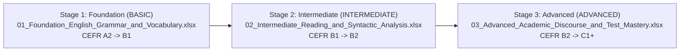

# HanGo English Mastery Pathway: Curriculum Roadmap & Excel Import Suite

> **Department:** Academic English & Pedagogical Development — HanGo Learning Platform  
> **Target Audience:** Vietnamese ESL/EFL learners advancing from Pre-Intermediate (A2/B1) to Elite Academic Fluency (B2/C1, IELTS 7.5+, TOEIC 850+, THPTQG 9.0+)  
> **Course Delivery Format:** Text-driven Deep Learning with In-depth Markdown Lessons, Interactive Quizzes, and Diagnostic Capstone Assessments.

---

## 1. Pedagogical Architecture & Pathway Overview

The **HanGo English Mastery Pathway** is structured into a progressive 3-Stage Continuum. Rather than relying on superficial multiple-choice drill sheets or unstructured video fragments, this pathway delivers **rigorous, text-rich academic instruction** designed to develop syntactic intuition, critical textual deconstruction, and test-taking mastery.



---

## 2. Course-by-Course Specification

### 🟢 Stage 1: Foundation (BASIC / CEFR A2 → B1)
* **File:** [`01_Foundation_English_Grammar_and_Vocabulary.xlsx`](01_Foundation_English_Grammar_and_Vocabulary.xlsx)
* **Course Code:** `ENG_PATHWAY_01_FOUNDATION`
* **Category:** `GRAMMAR` | **Academic Level:** `BASIC`
* **Tuition:** 249,000 VND
* **Pedagogical Focus:**
  - Establishing sentence-level grammatical accuracy.
  - The 5 fundamental English sentence archetypes ($S+V, S+V+O, S+V+C, S+V+IO+DO, S+V+O+OC$).
  - Solving Subject-Verb Agreement traps (intervening prepositional modifiers, indefinite pronouns, collective nouns, compound subjects).
  - Tense vs. Aspect: Present/Past Simple vs. Continuous (stative verbs trap), Present Perfect vs. Past Simple in authentic communication.
* **Assessment Package:**
  - *Section 1 Quiz:* 5 questions on sentence patterns & agreement.
  - *Final Graduation Quiz:* 30 comprehensive multiple-choice questions with detailed pedagogical explanations.

---

### 🟡 Stage 2: Intermediate (INTERMEDIATE / CEFR B1 → B2)
* **File:** [`02_Intermediate_Reading_and_Syntactic_Analysis.xlsx`](02_Intermediate_Reading_and_Syntactic_Analysis.xlsx)
* **Course Code:** `ENG_ACADEMIC_MASTERY_01`
* **Category:** `READING_COMPREHENSION` | **Academic Level:** `INTERMEDIATE`
* **Tuition:** 399,000 VND
* **Pedagogical Focus:**
  - Dual strategic reading modes: Skimming for Gist vs. Micro-Scanning for Specific Empirical Data.
  - Contextual word decoding via 5 context clue archetypes and morphemic analysis (Latin/Greek roots, prefixes, suffixes).
  - Rhetorical discourse patterns (Cause-Effect, Contrast, Problem-Solution) and transitional signposts.
  - Syntactic Stripping: Deconstructing complex academic sentences with nested relative and participial clauses.
  - Stylistic Inversions (Negative adverbial fronting, inverted conditionals) and Impersonal Passive reporting in scientific literature.
  - Authorial tone detection, hedging devices, and paraphrasing mechanics to eliminate exam distractors.
* **Assessment Package:**
  - *Section 1 Mastery Quiz:* 5 questions (Reading Strategies & Contextual Vocabulary).
  - *Section 2 Mastery Quiz:* 5 questions (Syntactic Architecture & Grammar).
  - *Course Graduation Assessment:* 30 high-yield questions covering 12 distinct skill types.

---

### 🔴 Stage 3: Advanced (ADVANCED / CEFR B2 → C1+)
* **File:** [`03_Advanced_Academic_Discourse_and_Test_Mastery.xlsx`](03_Advanced_Academic_Discourse_and_Test_Mastery.xlsx)
* **Course Code:** `ENG_PATHWAY_03_ADVANCED`
* **Category:** `TEST_PREPARATION` | **Academic Level:** `ADVANCED`
* **Tuition:** 499,000 VND
* **Pedagogical Focus:**
  - The Mandative Subjunctive (*insist that S + bare infinitive*) and complex inverted conditionals (*Were/Had/Should*).
  - Cleft Sentences (*It-clefts, Wh-clefts, Reverse clefts*) and Rhetorical Fronting for stylistic prominence and cohesion.
  - Deconstructing ultra-dense academic literature, unpacking heavy nominalizations, and identifying logical fallacies (*Post hoc, Straw man, False dilemma*).
  - High-stakes test psychology: Deconstructing subtle connotation shifts, plausible extrapolations, and subversive attribute traps.
* **Assessment Package:**
  - *Section 1 Quiz:* 5 questions on precision syntax and clefting.
  - *Course Graduation Assessment:* 30 elite questions testing subtle academic inferences, paraphrasing, passive voice, and discourse mechanics.

---

## 3. Directory Content & Verification Status

```
english_learning_pathway/
├── 01_Foundation_English_Grammar_and_Vocabulary.xlsx          (Passed Validation - 35 questions)
├── 02_Intermediate_Reading_and_Syntactic_Analysis.xlsx         (Passed Validation - 40 questions)
├── 03_Advanced_Academic_Discourse_and_Test_Mastery.xlsx        (Passed Validation - 35 questions)
└── PATHWAY_CURRICULUM_ROADMAP.md                              (Curriculum & Import Documentation)
```

All 3 Excel files have passed 100% of automated schema and business validation checks enforced by HanGo's `CourseImportService.java`:
- [x] Required sheets present (`COURSE`, `SYLLABUS`, `QUESTIONS`, `LOOKUP_DATA`, `GUIDE_AND_RULES`).
- [x] Section count $\ge 2$ per course.
- [x] Regular lessons $\ge 2$ per section with rich, multi-paragraph English Markdown content.
- [x] Quizzes $\ge 1$ per section, with matching questions in `QUESTIONS`.
- [x] Final Quiz positioned as the last item of the last section with $\ge 30$ questions.
- [x] Validated Option A/B/C/D mappings, approved Skill Types, and academic explanations.

---

## 4. How to Import the Pathway into HanGo

1. Log in to the HanGo Web App as **Trainer** or **Course Manager**.
2. Navigate to **My Courses** > Click **Import Excel**.
3. Import the files sequentially:
   - Step 1: Upload `01_Foundation_English_Grammar_and_Vocabulary.xlsx`
   - Step 2: Upload `02_Intermediate_Reading_and_Syntactic_Analysis.xlsx`
   - Step 3: Upload `03_Advanced_Academic_Discourse_and_Test_Mastery.xlsx`
4. The system will create all 3 courses in `DRAFT` status, ready for institutional review, publishing, and assignment into the automated AI Learning Pathway!
